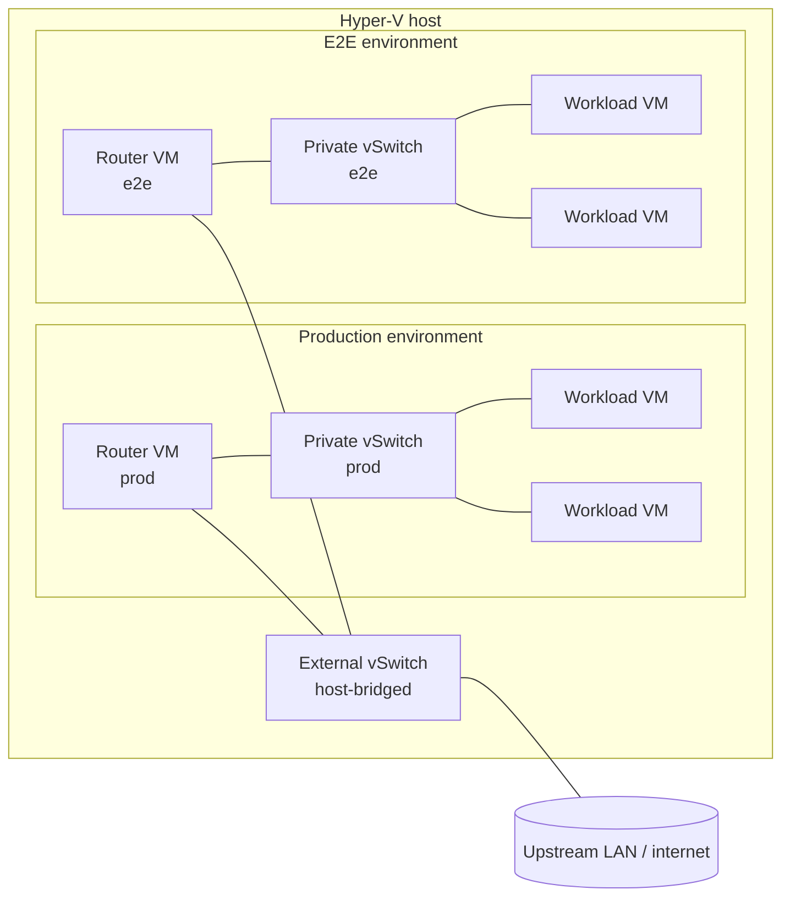

# Infrastructure-VM-Provisioner

> Reusable Windows scripting tooling for automated Hyper-V VM provisioning and removal.

## Index

- [Overview](#overview)
- [Requirements](#requirements)
- [Quick start](#quick-start)
- [Networking](#networking)
- [setup-secrets.ps1](#setup-secretsps1)
  - [Optional: install a JDK](#optional-install-a-jdk)
  - [Removing a JDK](#removing-a-jdk)
  - [JDK list shape (multiple entries)](#jdk-list-shape-multiple-entries)
  - [Optional: install a .NET SDK](#optional-install-a-net-sdk)
  - [Optional: install .NET global tools](#optional-install-net-global-tools)
  - [Optional: copy files to the VM](#optional-copy-files-to-the-vm)
    - [Bulk entries](#bulk-entries)
  - [Optional: set system-wide environment variables](#optional-set-system-wide-environment-variables)
  - [Router VM (kind: router)](#router-vm-kind-router)
- [provision.ps1](#provisionps1)
- [Test-HostNetworkPreflight.ps1](#test-hostnetworkpreflightps1)
- [Get-VmRuntimeDiag.ps1](#get-vmruntimediagps1)
- [start-vms.ps1](#start-vmsps1)
- [ensure-vms-ready.ps1](#ensure-vms-readyps1)
- [deprovision.ps1](#deprovisionps1)
- [Toolchain provisioning via Ansible (Common-Ansible)](#toolchain-provisioning-via-ansible-common-ansible)
  - [Consuming Common-Ansible](#consuming-common-ansible)
  - [Acquire, verify, stage (the integrity gate)](#acquire-verify-stage-the-integrity-gate)
  - [Running the flow](#running-the-flow)
- [CI](#ci)
- [Repo structure](#repo-structure)

---

## Overview

General-purpose, reusable Windows scripting tooling for automated Hyper-V VM
provisioning. Not specific to any single project — intended to be consumed by
other projects that need self-hosted infrastructure.

Automates creation and removal of Hyper-V VMs on Windows 11, with Ubuntu
installed and a default user configured via cloud-init. All parameters are
stored in an AES-256 encrypted local vault scoped to the Windows user account
— nothing sensitive is committed to the repo.

---

## Requirements

PowerShell 7+ (`pwsh`). Windows PowerShell 5.1 is not supported.

---

## Quick start

**Prerequisites:** Windows 11 with Hyper-V enabled, PowerShell 7+, and
Administrator privileges. WSL2 is installed automatically by `provision.ps1`
on first run if not already present (a reboot may be required).
`Common.PowerShell` and `Infrastructure.Secrets` are installed from
PSGallery automatically on first run.

```powershell
# 1. Store config in the local vault (once per machine)
.\hyper-v\ubuntu\setup-secrets.ps1 -ConfigFile C:\private\vm-config.json

# 2. Provision VMs (run as Administrator)
.\hyper-v\ubuntu\provision.ps1

# 3. Bring VMs back up after a reboot (run as Administrator)
.\hyper-v\ubuntu\start-vms.ps1

# 4. Bring the fleet back to ready after a host reboot (run as Administrator)
.\hyper-v\ubuntu\ensure-vms-ready.ps1 -SecretSuffix Production

# 5. Remove VMs when no longer needed (run as Administrator)
.\hyper-v\ubuntu\deprovision.ps1
```

---

## Networking

VMs are organised into **environments**. An environment is one Hyper-V
Private switch (`privateSwitchName`) plus exactly one router VM whose
private NIC carries the environment's gateway IP. Every workload VM in
the environment attaches its only NIC to the same Private switch and
routes its egress through the router VM. Multiple environments can
coexist on one host - each owns an independent subnet and an
independent router VM that MASQUERADEs out the host's shared External
switch.



The host itself is not the gateway anymore. `provision.ps1` no longer
creates a singleton Internal switch, no longer assigns a host vNIC IP,
and no longer registers a `New-NetNat` rule. The host's only role in
the data plane is the External switch the router VMs share. See the
[problem statement](docs/dev/implementation/53%20-%20nat%20router%20vm/problem.md)
for why this matters (Windows allows only one `New-NetNat` to carry
real egress, and production owns that slot).

**Per-environment invariants** (preflight enforces every one):

- Every VM in the JSON declares `privateSwitchName`. VMs sharing a
  value are in the same environment.
- Every environment with workload VMs has **exactly one** router VM in
  the JSON. A router-only batch is allowed (bootstrap path); a
  workload-only batch is rejected.
- Within an environment, all VMs share the same `gateway` and
  `subnetMask`. The workloads' `gateway` equals the router VM's
  `privateIpAddress`.

**Migration from the legacy singleton-NAT topology.** Hosts originally
provisioned under the pre-feature-53 layout had a `VmLAN` Internal
switch with `VmLAN-NAT` registered against it. Both `provision.ps1`
(via `Invoke-NetworkSetup`) and `deprovision.ps1` (via
`Invoke-NetworkTeardown`) idempotently clean up that state: any
`New-NetNat` whose prefix covers an environment's gateway IP is
removed, and any host vNIC carrying the gateway IP is unassigned. The
legacy `VmLAN` switch itself is not torn down by either flow - it is
free to remove with `Remove-VMSwitch VmLAN -Force` once no VMs are
attached.

---

## setup-secrets.ps1

Run once per machine before `provision.ps1`.

```powershell
# Recommended: read config from a file outside the repo
.\setup-secrets.ps1 -ConfigFile C:\private\vm-config.json

# Optional: require a vault-level password on top of Windows user scope
.\setup-secrets.ps1 -ConfigFile C:\private\vm-config.json -RequireVaultPassword
```

Installs `Microsoft.PowerShell.SecretManagement` and
`Microsoft.PowerShell.SecretStore` if missing, registers the `VmProvisioner`
vault, validates the JSON, and stores it as the `VmProvisionerConfig` secret.
Re-running safely updates the stored config.

**Config file format** — a JSON array, one object per VM:

```jsonc
[
  {
    "vmName":            "ubuntu-01-ci",
    "cpuCount":          2,
    "ramGB":             4,
    "diskGB":            40,
    "ubuntuVersion":     "24.04",
    "username":          "u-01-admin",
    "password":          "...",
    "ipAddress":         "192.168.1.101",
    "subnetMask":        "24",
    "gateway":           "10.10.0.1",
    "dns":               "8.8.8.8",
    "vmConfigPath":      "E:\\a_VMs\\Hyper-V\\Config",
    "vhdPath":           "E:\\a_VMs\\Hyper-V\\Disks",
    "privateSwitchName": "PrivateSwitch-Production"
  },
  {
    "vmName":             "router-prod",
    "cpuCount":           1,
    "ramGB":              1,
    "diskGB":             20,
    "ubuntuVersion":      "24.04",
    "username":           "routeradmin",
    "password":           "...",
    "subnetMask":         "24",
    "dns":                "8.8.8.8",
    "vmConfigPath":       "E:\\a_VMs\\Hyper-V\\Config",
    "vhdPath":            "E:\\a_VMs\\Hyper-V\\Disks",
    "privateSwitchName":  "PrivateSwitch-Production",
    "kind":               "router",
    "externalSwitchName":  "ExternalSwitch-Shared",
    "externalAdapterName": "Ethernet",
    "privateIpAddress":    "10.10.0.1"
  }
]
```

A workload VM's `gateway` must equal **its environment's router VM's**
`privateIpAddress` - the workload's egress traffic flows through that
router. The two VMs sit on the same `privateSwitchName`. See
[Networking](#networking) for the full topology and
[Router VM](#router-vm-kind-router) for the router-specific fields.

Router VMs default to a static upstream (`externalDhcp: false`), so
they require `ipAddress` / `gateway` like workloads. Static is the
default because the only validated host topology - Internal + ICS -
keeps a fixed `192.168.137.0/24` subnet across Wi-Fi roams, so a
pinned ext0 is stable while ICS's own DHCP allocator drifts. Workload
VMs always require both fields because their gateway is a config-time
choice (see the table below).

> **Status - DHCP mode is unfinished.** `externalDhcp: true` (the
> bridged-External path) exists in the schema but has **never worked
> end-to-end** and has no E2E coverage - the bridged-Wi-Fi switch it
> targets never reached its upstream gateway (duplicate-IP via shared
> MAC). The config validator **rejects** `externalDhcp: true` outright,
> so it cannot enter the secret JSON or be provisioned. Use the static
> default. See `Assert-RouterVmField`'s `externalDhcp` note for the
> full status.

After first boot, connect via `ssh username@ipAddress`.

| Field           | Type   | Description                                        |
|-----------------|--------|----------------------------------------------------|
| `vmName`        | string | Name in Hyper-V and as the VM's hostname           |
| `cpuCount`      | int    | Number of virtual processors                       |
| `ramGB`         | int    | RAM in GB (static allocation)                      |
| `diskGB`        | int    | OS disk size in GB                                 |
| `ubuntuVersion` | string | Ubuntu release, e.g. `"24.04"`                     |
| `username`      | string | OS user created by cloud-init on first boot. Must NOT be a stock Ubuntu system-group name (e.g. `admin`, `users`, `staff`): `useradd` would collide with the existing group and leave the VM with no login. Validated at config-load. |
| `password`      | string | Password for that user (plain text in vault only)  |
| `ipAddress`     | string | Static IPv4 address inside the VM. **Required** for workload VMs, and for router VMs (static is the only supported router mode; `externalDhcp: true`, which would DHCP-discover the IP instead, is rejected by the validator - see `externalDhcp`). |
| `subnetMask`    | string | CIDR prefix length, e.g. `"24"`. Required on every VM - workloads use it for their NIC; router VMs use it for the priv0 (downstream) NIC even under DHCP. |
| `gateway`       | string | Default gateway for the VM. **Required** for workload VMs (and **must equal** the matching router VM's `privateIpAddress` - preflight enforced). For router VMs, required in the default static mode (`externalDhcp: false`). |
| `dns`           | string | DNS server IP. On workloads this is the resolver (set to the router VM's `privateIpAddress`); on routers this is netplan's nameserver AND dnsmasq's upstream forwarder. **Topology note:** when the host is on Internal+ICS, set router `dns` to the **ICS gateway** (typically `192.168.137.1`), NOT a public resolver like `8.8.8.8` — ICS NAT for outbound UDP/53 to public IPs is unreliable, whereas the ICS gateway's built-in DNS proxy is a local hop. |
| `vmConfigPath`  | string | Windows path where seed ISO is written             |
| `vhdPath`       | string | Windows path where VHDX files are stored           |
| `privateSwitchName`  | string  | Per-environment Hyper-V Private switch this VM attaches to. Required on both VM kinds (workloads attach their only NIC to it; router VMs attach their downstream NIC to it). Created on demand by `Initialize-PrivateSwitch` when absent. |
| `kind`          | string? | Optional. `"workload"` (default) or `"router"`. See [Router VM](#router-vm-kind-router). |
| `externalSwitchName` | string | Required when `kind: router`. Host-bridged Hyper-V switch the router's upstream NIC attaches to; created on demand if absent (see `externalAdapterName`). |
| `externalAdapterName`| string | Required when `kind: router`. Physical NIC the External switch binds to when `Initialize-ExternalSwitch` needs to create it. Ignored at runtime if the switch already exists. Find the name with `Get-NetAdapter`. |
| `externalDhcp`  | bool?   | Optional, defaults to `false` (static). Addressing mode for the router VM's upstream NIC. `false` = static (requires `ipAddress` / `gateway`); `true` = DHCP from whatever LAN the host's External vSwitch is bridged to. **`true` is rejected by the config validator** (the DHCP path is unfinished) - see the Status note above and `Assert-RouterVmField`. Only meaningful when `kind: router`. |
| `privateIpAddress`   | string | Required when `kind: router`. IP the router carries on its private-side NIC; downstream VMs use it as their default gateway and DNS server. Always static - no DHCP path can pre-commit a value workloads can be configured against. |
| `javaDevKit`    | object? | Optional. Installs a JDK system-wide on first boot. Not supported on `kind: router`. See [Optional: install a JDK](#optional-install-a-jdk). |
| `dotnetSdk`     | object? | Optional. Installs a .NET SDK system-wide on first boot. See [Optional: install a .NET SDK](#optional-install-a-net-sdk). |
| `dotnetTools`   | array?  | Optional. Installs .NET global tools system-wide on first boot. Requires `dotnetSdk` on the same VM. See [Optional: install .NET global tools](#optional-install-net-global-tools). |
| `files`         | array?  | Optional. Copies arbitrary host files onto the VM. See [Optional: copy files to the VM](#optional-copy-files-to-the-vm). |
| `envVars`       | object? | Optional. Writes a managed block of system-wide environment variables into `/etc/environment`. See [Optional: set system-wide environment variables](#optional-set-system-wide-environment-variables). |

### Optional: install a JDK

Add a `javaDevKit` object to any VM entry to install a JDK system-wide on
first boot. When absent, no JDK is installed and the rest of provisioning is
unaffected.

```jsonc
{
  "vmName": "dev-01",
  "...":    "...",
  "javaDevKit": {
    "vendor":  "temurin",
    "version": "21"
  }
}
```

| Sub-field   | Type      | Required | Default | Allowed values                                                |
|-------------|-----------|----------|---------|---------------------------------------------------------------|
| `vendor`    | string    | yes      | —       | `temurin` (Adoptium Temurin — currently the only supported vendor). |
| `version`   | string    | yes      | —       | A **string** in one of four granularities (see below).         |

`javaDevKit` is also accepted as `null` or `[]` to **uninstall** any JDK
the reconciler previously installed — see [Removing a JDK](#removing-a-jdk) —
and as a single-element list `[{ vendor, version }]` for forward
compatibility with the multi-version shape; see
[JDK list shape](#jdk-list-shape-multiple-entries).

Version-string granularities — pick the level of pinning that suits you:

| Example         | Meaning                                          |
|-----------------|--------------------------------------------------|
| `"21"`          | Latest GA of feature release 21                  |
| `"21.0"`        | Latest GA on the 21.0 line                       |
| `"21.0.5"`      | Latest build of 21.0.5                           |
| `"21.0.5+11"`   | Exact build, no resolution                       |

`version` must be a JSON string. Numeric values like `21` are rejected so that
`"21.0"` cannot silently degrade to `21` through trailing-zero loss, and so
that `"21.0.5+11"` (not a valid JSON number) follows the same rule as the
other granularities.

At provision time the requested granularity is resolved against the
[Adoptium v3 API](https://api.adoptium.net/q/swagger-ui/) to a concrete build
(for example `"21"` -> `21.0.6+7`) along with its SHA-256 and download URL.
The resolved build is then pinned in a host-side lockfile next to the cached
tarball so subsequent provisioning runs reuse the exact same bytes — no
silent upgrades between runs.

**Cache artifacts** — written into `vhdPath` (same directory as the cached
Ubuntu VHDX):

| File                                                | Purpose                                                                 |
|-----------------------------------------------------|-------------------------------------------------------------------------|
| `jdk-{vendor}-{requestedVersion}-linux-x64.tar.gz`  | The Temurin tarball, keyed by the requested (not resolved) version.     |
| `jdk-{vendor}-{requestedVersion}-linux-x64.lock.json` | Sidecar pin recording `resolvedVersion`, `sha256`, `sourceUrl`, and download timestamp. |
| `dotnet-tool-{id}-{version}.nupkg`                  | A .NET global tool's NuGet package, prefetched once on the host so VMs never contact `nuget.org` directly. Verified against the registration-leaf SHA-512 and the nuget.org repo countersignature before being committed to the cache. |
| `dotnet-tool-{id}-{version}.lock.json`              | Sidecar pin recording `sha512`, `source` URL, and acquisition timestamp. A re-run with a matching SHA short-circuits to a cache hit without re-fetching or re-verifying. |

The cache key uses the **requested** version, so two VMs that both ask for
`"21"` share one cache slot. The lockfile is authoritative on subsequent
runs — the resolver is not re-invoked — so a `"21"` request cannot silently
upgrade to a newer build between provisionings.

To invalidate the pin:

- **Delete the lockfile** to force re-resolution against the live Adoptium
  API on the next run (use this to pull in a newer build for a coarse
  request like `"21"`).
- **Delete only the tarball** to trigger a self-heal redownload of the
  exact build the lockfile pinned to (useful when the cached file is
  corrupt but the pin is still wanted).

Neither file is committed — the cache lives entirely on the host, same
trust model as the cached Ubuntu VHDX.

**On the VM** — after the VM is up and cloud-init has finished, the
post-provisioning orchestrator pushes the cached tarball over its
already-open SSH session via the host file server (the same mechanism
`Infrastructure-GitHubRunners` uses to ship the actions-runner binary).
The reconciler's JDK provider then extracts the tarball into the
install directory via `Infrastructure.HyperV`'s `Expand-VmTarball`
primitive (atomic dir-swap, no intermediate file on the VM disk),
wires up `/usr/local/bin` symlinks for every JDK binary, and writes a
system-wide environment script:

| Location                              | Purpose                                                                          |
|---------------------------------------|----------------------------------------------------------------------------------|
| `/opt/jdk-{vendor}-{resolvedVersion}/` | Install root. Path embeds the *resolved* build so coexisting installs do not collide if the requested version is later bumped. |
| `/etc/profile.d/jdk.sh`               | Exports `JAVA_HOME` and prepends `$JAVA_HOME/bin` to `PATH`. Sourced by every login shell automatically. |

The install runs **out-of-band**, not via cloud-init `runcmd`. cloud-init's
job is to bootstrap the OS; the provisioner installs optional software.
Same pattern as the runner install in Infrastructure-GitHubRunners. This
keeps the seed ISO's lifecycle short (it carries the plaintext admin
password and is detached as soon as SSH is reachable) and avoids putting
cloud-init stage knowledge into the host provisioner.

Because the export script lives under `/etc/profile.d/`, any user account
later created on the VM — including those provisioned by
[Infrastructure-Vm-Users](https://github.com/Klark-Morrigan/Infrastructure-Vm-Users) —
sees `JAVA_HOME` and `java` on `PATH` without any additional configuration
in that repo. This is the deliberate split of responsibilities: the
provisioner owns "software the box needs"; Vm-Users owns identities.

Re-runs are idempotent through the reconciler's manifest-driven diff:
if the on-VM `javaDevKit-<resolvedVersion>.json` manifest already
records the desired version, the reconciler reports it as a no-op and
nothing on the VM is touched.

### Removing a JDK

To remove a previously installed JDK from a long-lived VM without
rebuilding it, set `javaDevKit` to `null` (or an empty array `[]`) on
the same VM entry and re-run `provision.ps1`:

```jsonc
{
  "vmName": "dev-01",
  "...":    "...",
  "javaDevKit": null
}
```

The reconciler treats absence of the field as "this VM has no opinion
about JDKs" (skip) and explicit `null` / `[]` as "ensure none
installed". On the VM, the manifest written at install time
(`/var/lib/infra-provisioner/manifests/javaDevKit-*.json`) drives the
teardown: every install dir, `/usr/local/bin` symlink, and
`/etc/profile.d/jdk.sh` recorded there is removed, then the manifest
itself last so a crash mid-uninstall leaves a recovery anchor for the
next run to replay against.

Once the JDK is gone, the cleanest follow-up is to **delete the field
entirely**. The reconciler then sees nothing to do for `javaDevKit` and
stays a clean no-op.

The host-side tarball cache under `vhdPath` is **not** touched — it is
keyed by `{vendor, requestedVersion}` and may be shared with other VMs
that still want the install.

### JDK list shape (multiple entries)

For forward compatibility with the multi-version contract the reconciler
plans to support, `javaDevKit` also accepts a list:

```jsonc
{
  "javaDevKit": [
    { "vendor": "temurin", "version": "21" }
  ]
}
```

v1 supports one JDK per VM, so the list is capped at one entry. A
longer list fails schema with the observed count. Use the list shape
only when the multi-version surface lands; the scalar form remains the
recommended way to declare a single JDK.

### Optional: install a .NET SDK

Add a `dotnetSdk` object to any VM entry to install a .NET SDK system-wide
on first boot. When absent, no .NET SDK is installed and the rest of
provisioning is unaffected. The provider is registered alongside
`javaDevKit` and shares the same reconciler lifecycle (install on first
provision, no-op on re-runs, removal via `null` / `[]`).

```jsonc
{
  "vmName": "dev-01",
  "...":    "...",
  "dotnetSdk": {
    "channel": "10.0",
    "version": "10.0.100"
  }
}
```

| Sub-field   | Type   | Required | Default | Allowed values                                          |
|-------------|--------|----------|---------|---------------------------------------------------------|
| `channel`   | string | yes      | —       | `<major>.<minor>` (e.g. `"10.0"`). Selects the release-metadata channel. |
| `version`   | string | yes      | —       | A **string** in one of three granularities (see below). |

`dotnetSdk` is also accepted as `null` or `[]` to **uninstall** any .NET
SDK the reconciler previously installed (same `null` / `[]` semantics as
`javaDevKit`) and as a single-element list `[{ channel, version }]` for
forward compatibility with the multi-version shape. v1 supports one
SDK per VM, so a longer list fails schema with the observed count.

The install extracts the tarball into `/opt/dotnet-{resolvedVersion}/`,
writes `/etc/profile.d/dotnet.sh` exporting `DOTNET_ROOT`, `PATH`, and
`DOTNET_CLI_TELEMETRY_OPTOUT=1`, and creates `/usr/local/bin/dotnet` as a
symlink to the driver so non-login shells (cron, systemd, `ssh user@host
cmd`) also resolve `dotnet`. Telemetry is opted out by default — these
VMs are unattended CI runners with no operator to consent.

Version-string granularities — pick the level of pinning that suits you:

| Example       | Meaning                                                    |
|---------------|------------------------------------------------------------|
| `"10"`        | Latest SDK on the channel (major-only)                     |
| `"10.0"`      | Latest SDK on the channel (major.minor)                    |
| `"10.0.100"`  | Exact SDK feature-band build                               |

Both `channel` and `version` must be JSON strings. Numeric values like
`10.0` are rejected so `"10.0"` cannot silently degrade to `10` through
trailing-zero loss — the same rule the `javaDevKit.version` field
enforces.

### Optional: install .NET global tools

Add a `dotnetTools` array to any VM entry to install one or more
[.NET global tools](https://learn.microsoft.com/dotnet/core/tools/global-tools)
system-wide on first boot. The field is opt-in — absent or empty arrays
leave the VM untouched — and **requires `dotnetSdk` on the same VM** (the
SDK is needed to run `dotnet tool install`). Entries install in array
order; a failure on any entry fails the provisioning, same posture as
the JDK and SDK installs.

```jsonc
{
  "vmName": "ci-runner-01",
  "...":    "...",
  "dotnetSdk":   { "channel": "10.0", "version": "10.0.100" },
  "dotnetTools": [
    { "id": "dotnet-reportgenerator-globaltool", "version": "5.4.4" }
  ]
}
```

| Sub-field | Type   | Required | Allowed values                                                                 |
|-----------|--------|----------|--------------------------------------------------------------------------------|
| `id`      | string | yes      | A NuGet package id matching `^[A-Za-z0-9._-]+$`.                               |
| `version` | string | yes      | An **exact NuGet version pin**. No `"latest"`, no floating ranges (`[1.0,2.0)`), no whitespace. Reproducibility takes priority; if a version needs to move, edit the JSON. |

Unknown sub-fields are rejected at schema time to catch silent typos
(`versoin` vs `version`), the same strict-by-design posture
`dotnetSdk` and `javaDevKit` take.

`dotnetTools` is also accepted as `null` or `[]` to **uninstall** any
.NET global tools the reconciler previously installed. `dotnetTools: []`
is allowed regardless of whether `dotnetSdk` is set — "no tools" is a
coherent state on any VM, SDK or not.

### Optional: copy files to the VM

Add a `files` array to any VM entry to copy arbitrary host files onto the
VM after cloud-init finishes. Each entry is a `{ source, target }` pair —
local Windows path on the host, absolute Linux path on the VM.

```jsonc
{
  "vmName": "dev-01",
  "...":    "...",
  "files": [
    { "source": "C:\\jars\\mylib-1.0.jar", "target": "/opt/lib/mylib-1.0.jar" },
    { "source": "C:\\fixtures\\seed.json", "target": "/var/data/seed.json" }
  ]
}
```

| Sub-field | Required | Notes                                                                  |
|-----------|----------|------------------------------------------------------------------------|
| `source`  | yes      | Windows path. **Must exist at validation time** — typos fail before any VM work begins. |
| `target`  | yes      | Absolute Linux path on the VM (must start with `/`). Parent directory is created if absent. |

The copy is performed over the same SSH session and host file server used
by other post-provisioning steps (see [provision.ps1](#provisionps1) step
10). The actual file transfer is delegated to
`Infrastructure.HyperV`'s `Copy-VmFiles` cmdlet — the validator that
backs the schema (`Assert-VmFilesField`) also lives there. Both are
reused by `Infrastructure-Vm-Users` for its own (user-owned) file copies.
Re-runs overwrite the target file with the current host source —
the user's intent is "this file should look like this".

**Ownership model in the provisioner**: every file copied by this step
lands `root:root, 0644`. The provisioner runs *before* user creation, so
no app users exist yet to chown to. Files needing a per-user owner belong
in `Infrastructure-Vm-Users`'s `files` array, which runs after that step
creates the users.

`files` is **purely user data** — no install step (JDK, future Maven, …)
reads from these paths. Each install is self-contained. This keeps the
contract simple: the user owns the target paths and what lives there.

#### Bulk entries

For a directory of related files (a JAR classpath, a fixtures tree, ...),
a bulk entry copies every match of a host wildcard under one VM target
directory without enumerating each file in the config. Single and bulk
entries can be mixed freely in the same `files` array.

```jsonc
{
  "vmName": "ci-01",
  "...":    "...",
  "files": [
    { "pattern": "C:\\jars\\*.jar", "targetDir": "/opt/ci-jars" }
  ]
}
```

| Sub-field              | Required | Default | Notes                                                                                                  |
|------------------------|----------|---------|--------------------------------------------------------------------------------------------------------|
| `pattern`              | yes      | —       | Host-side wildcard accepted by `Get-ChildItem -Path`. Must match at least one file when the transport runs. |
| `targetDir`            | yes      | —       | Absolute Linux directory on the VM (must start with `/`). Created if absent.                            |
| `recurse`              | no       | `false` | Descend into subdirectories of `pattern`'s root.                                                        |
| `preserveRelativePath` | no       | `false` | Mirror the host subtree under `targetDir` instead of flattening every match to its basename. Useful for a Maven-style tree. |

`source` and `pattern` are mutually exclusive on a single entry — mixing
them is a validation error so the intent stays unambiguous. Bulk entries
land `root:root, 0644`, same as single entries, with the same ownership
rationale described above.

Each bulk entry runs as its own `Copy-VmFilesByPattern` call, dispatched
in JSON order alongside any single entries in the same array. Errors
(zero matches, target-path collisions) are reported per entry, before
any SSH I/O happens for that entry — so a misspelled pattern names
itself in the failure instead of being lost in a batched run.

The transport is delegated to `Infrastructure.HyperV`'s
[`Copy-VmFilesByPattern`](https://github.com/Klark-Morrigan/Infrastructure-HyperV/blob/master/Infrastructure.HyperV/Public/FileTransfer/Copy-VmFilesByPattern.ps1) —
see its notes for the exact wildcard semantics (including the zero-match
and target-collision pre-flight errors raised before any SSH I/O).

### Optional: set system-wide environment variables

Add an `envVars` object to any VM entry to write a sentinel-delimited
managed block of `NAME="VALUE"` lines into `/etc/environment`. Unlike
`/etc/profile.d/*.sh` snippets (sourced only by login shells), this file
is read by `pam_env` for every login — including the non-login shells
spawned by systemd-managed services.

```jsonc
{
  "vmName": "ci-01",
  "...":    "...",
  "envVars": {
    "blockName": "ci-01-app",
    "entries": [
      { "name": "FOO_HOME", "value": "/opt/foo" }
    ]
  }
}
```

| Sub-field           | Required | Notes                                                                                                                                                              |
|---------------------|----------|--------------------------------------------------------------------------------------------------------------------------------------------------------------------|
| `blockName`         | yes      | Sentinel name for the managed block (`# BEGIN <blockName>` / `# END <blockName>`). Operator-chosen so multiple consumers (this provisioner, Vm-Users, ...) can coexist. Validated against `^[A-Za-z0-9._ -]+$`, 1-128 chars, no leading / trailing whitespace. |
| `entries`           | yes      | Array of `{ name, value }` pairs. May be empty — see the removal note below.                                                                                       |
| `entries[].name`    | yes      | POSIX identifier (`^[A-Za-z_][A-Za-z0-9_]*$`). Unique across entries.                                                                                              |
| `entries[].value`   | yes      | Non-empty, no `\n` / `\r` / `\0`. Written as `NAME="VALUE"` with `"` and `\` escaped.                                                                              |

Lines outside the managed block — Ubuntu's default `PATH=...`, any
operator additions, other consumers' blocks — are preserved
byte-for-byte across re-runs. The file's ownership and mode stay
`root:root, 0644`, the only mode `pam_env` reliably reads.

Omitting `envVars` on a subsequent run is a **no-op** — the previously
written block stays put. To remove the block explicitly, set
`entries: []` on the same VM entry and re-run `provision.ps1`; the
transport treats an empty array as "remove this managed block". Same
explicit-removal model as the JDK `uninstall` flag.

The transport is delegated to `Infrastructure.HyperV`'s
[`Set-VmEnvironmentVariables`](https://github.com/Klark-Morrigan/Infrastructure-HyperV/blob/master/Infrastructure.HyperV/Public/EnvVars/Set-VmEnvironmentVariables.ps1) —
see its notes for the exact managed-block, atomic-write, and
skip-unchanged semantics.

### Router VM (kind: router)

Set `"kind": "router"` on a VM entry to provision a dual-NIC Linux
gateway instead of a single-NIC workload VM. A router VM replaces the
host's single `New-NetNat` slot (Windows allows only one NetNat to
carry traffic out to the upstream LAN) with a per-environment VM that
MASQUERADEs outbound and forwards DNS, so multiple isolated
environments can each have a real egress without competing for the
host's NAT slot. Background: see
[docs/dev/implementation/53 - nat router vm/problem.md](docs/dev/implementation/53%20-%20nat%20router%20vm/problem.md).

```jsonc
{
  "vmName":             "router-prod",
  "cpuCount":           1,
  "ramGB":              1,
  "diskGB":             20,
  "ubuntuVersion":      "24.04",
  "username":           "routeradmin",
  "password":           "...",
  "ipAddress":          "192.168.137.20",
  "subnetMask":         "24",
  "gateway":            "192.168.137.1",
  "dns":                "192.168.137.1",
  "vmConfigPath":       "E:\\a_VMs\\Hyper-V\\Config",
  "vhdPath":            "E:\\a_VMs\\Hyper-V\\Disks",
  "kind":                "router",
  "externalSwitchName":  "ExternalSwitch-Shared",
  "externalAdapterName": "Ethernet",
  "privateSwitchName":   "PrivateSwitch-Production",
  "privateIpAddress":    "10.10.0.1"
}
```

The upstream NIC defaults to **static** (`externalDhcp: false`), shown
above: a fixed `ipAddress` / `gateway` on the ICS subnet and `dns`
pointing at the ICS gateway (`192.168.137.1`). This is the only
validated topology - ICS owns a fixed `192.168.137.0/24` regardless of
which Wi-Fi the host is on, so the pinned address survives roaming
while ICS's own DHCP allocator does not.

**Config contrast** - static (the default and only usable mode):
`externalDhcp` omitted or set `false`, with `ipAddress` + `gateway`
present (as in the example above). DHCP would be `externalDhcp: true`
with neither field - but that is rejected by the validator (see below).

> **DHCP mode (`externalDhcp: true`) is unfinished and unsupported.**
> It targets a bridged-Wi-Fi / Ethernet External switch (the router
> would lease an IP from the physical LAN, discovered via Hyper-V KVP
> after boot), but that path has **never worked end-to-end** - the
> bridged-Wi-Fi switch never reached its upstream gateway (duplicate-IP
> via shared MAC) - and no E2E scenario exercises it. The config
> validator **rejects `externalDhcp: true`** outright, so it cannot
> enter the secret JSON or be provisioned; the gate lifts when the path
> is validated end-to-end and covered by E2E.

`externalAdapterName` is the host's physical NIC the External switch
will bind to when `Initialize-ExternalSwitch` needs to create it. Run
`Get-NetAdapter` to see the available names on the host. If the
External switch with the configured `externalSwitchName` already
exists, this field is ignored at runtime.

**NIC layout.** Two adapters, both with statically pinned MACs so the
cloud-init netplan's match-by-MAC blocks find their NIC across reboots
and kernel-naming changes:

| Adapter            | Hyper-V switch                  | Guest name (via `set-name`) | Addresses                                                                                       | Role                                           |
|--------------------|---------------------------------|------------------------------|-------------------------------------------------------------------------------------------------|------------------------------------------------|
| `Network Adapter`  | `externalSwitchName` (existing) | `ext0`                       | Static (default): `ipAddress/subnetMask` + default via `gateway` + DNS = `dns`. DHCP (`externalDhcp: true`) is unvalidated. | Upstream egress; MASQUERADE source.            |
| `Private`          | `privateSwitchName` (created)   | `priv0`                      | `privateIpAddress/subnetMask` (always static)                                                   | Downstream gateway / DNS for environment VMs.  |

**Cloud-init payload.** The router seed ISO lands:

- `/etc/netplan/99-router.yaml` — both NICs, match-by-MAC, with
  `set-name: ext0 / priv0`.
- `/etc/sysctl.d/99-router.conf` — `net.ipv4.ip_forward = 1`.
- `/etc/nftables.conf` — `inet filter forward` chain allowing
  `priv0 -> ext0` (new connections) and `ext0 -> priv0`
  (established/related only), plus `ip nat postrouting` with
  `oifname "ext0" masquerade`.
- `/etc/dnsmasq.d/router.conf` — dnsmasq bound to `priv0` and the
  configured `privateIpAddress`, `no-resolv`, upstream resolver =
  the VM's own `dns`.
- `packages: nftables, dnsmasq` — installed via `apt` on first boot
  (the router has real upstream egress as soon as `netplan apply`
  runs, so `apt-get update` works).
- `runcmd:` `netplan apply` → `sysctl --system` →
  `systemctl enable --now nftables.service` →
  `systemctl enable --now dnsmasq.service`, with diagnostic dumps
  before and after `netplan apply` (`/etc/netplan/` listing +
  contents, `netplan get`, `networkctl`, `ip -4 addr`/`route`).
  Order matters: netplan must bind `priv0` before dnsmasq tries to
  listen on it; forwarding must be on before any packet traverses
  the FORWARD chain; the nftables ruleset must be loaded before
  dnsmasq starts serving requests.

**Idempotency.**

- The external switch is ensured (created on demand bound to
  `externalAdapterName` with `-AllowManagementOS:$true` so the host
  keeps its connection; reused if an `External`-type switch with
  that name already exists; rejected if the existing switch is
  `Internal` or `Private`).
- The private switch is ensured (created if absent, reused if a
  `Private`-type switch with that name already exists, rejected if
  the existing switch is `Internal` or `External`).
- Re-running `provision.ps1` against an already-provisioned router VM
  takes the normal "existing VM" path — no destructive re-creation.

**Restrictions.** Router VMs do not accept `javaDevKit`, `dotnetSdk`, or
`dotnetTools` blocks. The router is intentionally minimal — its only
software is `nftables` and `dnsmasq`. Surfacing the rejection at
schema-time keeps a stray toolchain entry from silently flowing
through reconcile and installing a JDK on the gateway.

---

## provision.ps1

Run as Administrator after `setup-secrets.ps1` has stored the config.

```powershell
.\provision.ps1
```

Reads `VmProvisionerConfig` from the vault and for each VM definition:

1. Validates all required fields.
2. Classifies each entry as **new** (no Hyper-V VM with this `vmName`
   exists AND the `ipAddress` is silent), **existing** (Hyper-V VM
   exists AND the `ipAddress` responds — the VM is up), or **skipped**
   (any other combination). New VMs get the full destructive pipeline;
   existing VMs are *reconciled* — only the idempotent additive steps
   (host-side acquisitions and post-provisioning) run, so adding
   `javaDevKit` / `files` / etc. to a VM definition and re-running
   `provision.ps1` pushes the change without re-creating the VM. The
   two skipped cases get a warning explaining why:
   - VM is absent but the IP responds → static-IP conflict with an
     unknown machine.
   - VM exists but the IP does not respond → VM is offline; start it
     and re-run.

   The steps below note which classifications they apply to.
3. **(new VMs only)** Downloads the Ubuntu cloud image (`.vhd.tar.gz`)
   from the Ubuntu CDN into `vhdPath` once per `ubuntuVersion`, converts
   it to `.vhdx`, and caches it. On first download it also patches the
   base image via WSL2 to enable the NoCloud cloud-init datasource
   (required for Hyper-V — the Azure image ships with Azure-only
   datasource config). Subsequent runs reuse the cached, patched base
   image — no re-download or re-patch.
4. **(new VMs only)** Copies the base image to a per-VM disk
   (`{vmName}.vhdx`) and resizes it to `diskGB`.
5. **(new AND existing VMs)** Runs host-side acquisitions for each VM
   via a small per-VM orchestrator (`Invoke-VmAcquisitions`). It
   dispatches one acquirer per opt-in field:
   - **`javaDevKit`** acquires the requested Temurin tarball into
     `vhdPath` (see [Optional: install a JDK](#optional-install-a-jdk)).
     Skipped when `javaDevKit` is `null` or `[]` — the reconciler's
     "ensure none installed" signal needs no tarball.
   - **`dotnetSdk`** acquires the requested .NET SDK tarball into the
     same `vhdPath` cache as JDK tarballs, using the same
     `{software}-{requestedVersion}-linux-x64.tar.gz` + sidecar
     `.lock.json` naming convention (see
     [Optional: install a .NET SDK](#optional-install-a-net-sdk)).
     Skipped when `dotnetSdk` is `null` or `[]` for the same reason.
   - **`dotnetTools`** acquires each requested .NET global tool's
     `.nupkg` from `nuget.org` into the same `vhdPath` cache
     (filenames `dotnet-tool-{id}-{version}.nupkg` and matching
     `.lock.json`). The host verifies SHA-512 and the nuget.org repo
     countersignature before committing bytes to the cache, so VMs
     never contact `nuget.org` directly. Skipped when `dotnetTools`
     is absent, `null`, or `[]`.

   Skipped silently for VMs that have no opt-in fields. Each acquirer is
   idempotent via its on-host lockfile, so a re-run against an already-
   cached artefact is cheap. New acquirers plug in as one dispatch line
   in the orchestrator, not a new step here.
6. **(new VMs only)** Generates a cloud-init seed ISO
   (`{vmName}-seed.iso`) in `vmConfigPath` containing `meta-data` and
   `user-data`. On first boot cloud-init reads the
   ISO to create the OS user, enable SSH, and apply the static IP - no
   interactive installer needed. The static IP is installed via
   `user-data` `write_files`: cloud-init drops the netplan document at
   `/etc/netplan/99-static.yaml` (mode `0600`) and a sibling
   `/etc/cloud/cloud.cfg.d/99-disable-network-config.cfg` containing
   `network: {config: disabled}` so cloud-init's network module never
   rewrites `/etc/netplan/*.yaml` again. A `runcmd: netplan apply`
   activates the config during first boot. Netplan - not cloud-init -
   owns the on-disk file for the life of the VM, so reboots and
   cloud-init re-evaluations cannot revert the static config to DHCP.
   Router VMs (`kind: router`) take the router-seed path instead - see
   [Router VM](#router-vm-kind-router) for the dual-NIC netplan and
   the nftables / dnsmasq / sysctl payload it lands.
7. **(always)** **Host network setup.** Hoisted to fire **before**
   disk acquisition and host-side downloads so a misconfigured host
   fails in seconds instead of after minutes of wasted setup. For
   each router VM in the batch, in dependency order:
   1. **Legacy NetNat / vNIC cleanup** first, so stale state from a
      partially-migrated host cannot falsely fail the preflight's
      IP-collision check.
   2. **External + Private switch ensures** (the preflight's first
      check is "switch exists").
   3. **`Assert-HostNetworkPreflight`** — throws on any of:
      missing/wrong-type switch, host vNIC down or unbound, Internal
      vSwitch sharing MAC with a Wi-Fi adapter (stale config from
      an unfinished External -> Internal+ICS migration), External
      vSwitch bridged to Wi-Fi (guaranteed host-vs-VM IP collision
      via shared MAC at the AP), missing connected route, IP
      collision between host vNIC and any VM on that switch,
      vEthernet's network profile being `Public` (which blocks ICS's
      DNS-In firewall rule and silently breaks VM DNS), or the ICS
      DNS proxy not answering at `192.168.137.1`. The last two are
      **auto-repaired** in the provisioner gate: profile gets
      flipped to `Private`, and ICS sharing is toggled off+on via
      the `HNetCfg` COM API to kick a hung DNS proxy. One repair
      attempt per check; if it doesn't take, surfaces as a clean
      FAIL with the next steps named in the error. See
      [`Test-HostNetworkPreflight.ps1`](#test-hostnetworkpreflightps1)
      for the manual entry point with the same checks.
   4. **Router-IP discovery** for existing routers
      (`Resolve-ExistingRouterIp` — looks up the IP via Hyper-V
      KVP; new-state routers get theirs at step 8's create-vm.ps1
      KVP discovery, then a follow-up portproxy pass closes the
      loop).
   5. **Localhost portproxy** `127.0.0.1:2222 -> <routerIp>:22` so
      WSL-based tools (the Ansible flow) can reach the router VM
      without crossing ICS NAT. Static routers get theirs now; DHCP
      routers get theirs at the end of step 8.
   6. **Workload `_RouterVm` stamping** so step 8's wait-for-SSH
      and step 9's post-provisioning can find the jump host.
8. **(new VMs only)** Creates each VM (Gen 2, static RAM, VHDX from
   step 5), sets Secure Boot to `MicrosoftUEFICertificateAuthority`
   (required for Ubuntu), sets `AutomaticStopAction` to `ShutDown`
   (so a host stop cold-boots the guest rather than the Hyper-V
   default of saving state - a cold boot re-runs the runner's
   enabled systemd unit so it reconnects after a host reboot,
   whereas a resumed save-state leaves the runner offline),
   attaches the seed ISO, connects to its
   `privateSwitchName` (workload VMs) or `externalSwitchName`
   (router VMs), and starts the VM. Router VMs additionally get a
   second NIC on `privateSwitchName`, and both NICs are pinned to
   deterministic MACs that match the seed's netplan blocks. Polls
   port 22 until cloud-init finishes, then detaches and deletes the
   seed ISO. On wait-for-SSH timeout (and on router-side
   reachability-gate timeout for workloads behind a router VM), a
   host-side + best-effort guest-side runtime snapshot is captured
   to `runtime-diag.log` next to `console.log` so a failed run
   leaves forensic data without operator intervention. See
   [`Get-VmRuntimeDiag.ps1`](#get-vmruntimediagps1) for the manual
   entry point and the on-disk layout under
   `<vhdPath>/diagnostics/<vmName>/<timestamp>/`.
9. **(new AND existing VMs)** Runs post-provisioning. Opens one host file server and
    one SSH session per VM, **waits for cloud-init to finish** by
    polling `cloud-init status` every 5s and streaming a dot per
    poll (line wraps every 60 dots = 5 min) so a slow first-boot
    looks like progress, not a hang. Wall-clock cap is 600s. When
    cloud-init terminates with **non-zero exit** (its way of
    reporting a `runcmd` / `write_files` / `packages` failure), the
    provisioner **throws fatally** with a message pointing at the
    `<vhdPath>/diagnostics/<vmName>/<timestamp>/` folder where
    `Invoke-CloudInitDiagnostics` already dropped
    `cloud-init-output.log` + `cloud-init.log` + the network
    snapshot, so the underlying failure is one Read away. Then
    dispatches each enabled step:
    - **`files`** copies host files to declared VM paths (each entry is
      dispatched in JSON order: single entries via `Copy-VmFiles`, bulk
      entries via `Copy-VmFilesByPattern`; see
      [Optional: copy files to the VM](#optional-copy-files-to-the-vm)).
    - **`javaDevKit`** is now reconciler-owned (see the Reconciler
      subsection below) — the JDK provider extracts the prefetched
      Temurin tarball into `/opt/jdk-{vendor}-{resolvedVersion}/`,
      writes `/etc/profile.d/jdk.sh`, wires `/usr/local/bin` symlinks
      for every JDK binary, and records all owned paths in a sidecar
      manifest (see [Optional: install a JDK](#optional-install-a-jdk)).
      Setting the field to `null` or `[]` drives the manifest-based
      removal — see [Removing a JDK](#removing-a-jdk).
    - **`envVars`** writes a sentinel-delimited managed block of
      `NAME="VALUE"` lines into `/etc/environment` via
      `Set-VmEnvironmentVariables` (see
      [Optional: set system-wide environment variables](#optional-set-system-wide-environment-variables)).
      Dispatched after `files` and `javaDevKit` so a value pointing at
      content one of the earlier steps placed is referencing something
      that already exists when the file is rewritten.

    Each step is self-contained — no step consumes files left by another
    step. Adding a new step (e.g. Maven) is a one-function addition with
    one dispatch line in `Invoke-VmPostProvisioning`. Skipped silently
    for VMs that have no opt-in fields. Idempotent on the VM side: the
    JDK install no-ops when its `release` file is already present, file
    copies overwrite with the current host source bytes, and the
    env-vars step skips the SSH write when the desired block already
    matches what is on disk.

    ### Reconciler

    Post-provisioning also runs a toolchain **reconciler** in parallel
    with the legacy `files` / `javaDevKit` / `envVars` branches. For each
    VM the orchestrator:

    1. Calls `Initialize-VmManifestStore` once, creating
       `/var/lib/infra-provisioner/manifests/` (root:root, 0755) — the
       single source of truth for "what is installed by the reconciler
       on this VM".
    2. Calls `Invoke-ToolchainReconciliation` with the array returned by
       `Get-Providers`. Each provider declares the JSON sub-field it
       owns (e.g. `javaDevKit`, `dotnetSdk`) and the four operations
       — `Get-DesiredVersions`, `Get-InstalledVersions`,
       `Install-Version`, `Uninstall-Version` — the orchestrator
       dispatches in JSON-declaration order.

    Registered providers (in dispatch order):

    | Provider              | JSON field    | Notes                                                                                                                                                                                                                                       |
    |-----------------------|---------------|---------------------------------------------------------------------------------------------------------------------------------------------------------------------------------------------------------------------------------------------|
    | `JdkProvider`         | `javaDevKit`  | Manifest-driven install/uninstall of one Temurin JDK per VM.                                                                                                                                                                                |
    | `DotnetSdkProvider`   | `dotnetSdk`   | Manifest-driven install/uninstall of one .NET SDK per VM. Exports `DOTNET_ROOT`, `DOTNET_TOOLS_ROOT`, and sets `DOTNET_CLI_TELEMETRY_OPTOUT=1` via `/etc/profile.d/dotnet.sh`. `PATH` prepends both the SDK install dir and the tools dir.   |
    | `DotnetToolsProvider` | `dotnetTools` | Nested under `DotnetSdkProvider`. Manifest-driven install/uninstall of one or more .NET global tools system-wide under `/usr/local/share/dotnet/tools/`, with per-command symlinks under `/usr/local/bin/`. One manifest per `(id, version)`. |

    See
    [docs/dev/implementation/42 - dotnet sdk/](docs/dev/implementation/42%20-%20dotnet%20sdk/)
    for the full provider contract.

    **Nested providers (hybrid dispatch).** A provider may declare
    a `ParentProvider` field naming another provider's `Name`.
    Nested providers run in the orchestrator's main loop just like
    top-level providers, in `Get-Providers` array order (convention:
    a parent appears before its children). The `ParentProvider`
    field is pure metadata used by the children walker built into
    `Invoke-ToolchainReconciliation`: before a parent provider's
    `Uninstall-Version` runs, the walker reads the parent manifest's
    `children` array (each entry is `{ provider, manifestPath }`)
    and dispatches the matching nested provider's `Uninstall-Version`
    first, so a child install that lives under the parent's install
    dir is torn down before its host directory disappears. Every
    other operation (install, standalone uninstall, diff/NoOp) goes
    through the main loop, including for nested providers — so a
    child install fires even when the parent's diff is a NoOp. A
    child entry that names an unregistered provider produces a
    warning and leaves the child in place rather than blocking the
    parent's removal forever. The first real consumer of this
    contract is `DotnetToolsProvider` (global `dotnet` nuget tools
    nested under `DotnetSdkProvider`) — see
    [feature 43](docs/dev/implementation/43%20-%20dotnet%20nuget/).

    **Guest layout for `dotnetTools`.** Tools install system-wide
    under `/usr/local/share/dotnet/tools/` (the `--tool-path` argument
    to `dotnet tool install`). Each installed tool's commands are
    discovered by parsing `dotnet tool list --tool-path …` output and
    surfaced as symlinks under `/usr/local/bin/{cmd}` so non-login
    shells (sshd command exec, systemd units, cron) find them without
    sourcing `/etc/profile.d/`. Login shells pick the same dir up
    automatically because `DotnetSdkProvider`'s `/etc/profile.d/dotnet.sh`
    prepends `DOTNET_TOOLS_ROOT` to `PATH`.

---

## Test-HostNetworkPreflight.ps1

Run as Administrator to sanity-check the host's Hyper-V networking
before kicking off `provision.ps1`, or after any host networking
change (switch recreate, ICS toggle, Wi-Fi LAN change).

```powershell
.\scripts\Test-HostNetworkPreflight.ps1
```

Thin wrapper around `Assert-HostNetworkPreflight` that
`provision.ps1`'s `Host network preflight` phase already fires automatically as the very first network operation, before any disk acquisition or VM
creation. Surfaces the same checks as a standalone command so the
operator can confirm a clean host without committing to a full
provisioning run.

**Checks (PASS / WARN / FAIL inline; non-zero exit on any FAIL):**

| # | Check | Smoking-gun failure mode it catches |
|---|---|---|
| 1 | External vSwitch exists, recognized SwitchType | Switch missing, or accidentally Private (no upstream egress) |
| 2 | Host vNIC `vEthernet (<switch>)` Up + IPv4 | ICS flipped off, switch torn down without recreate |
| 3 | Switch-type-specific MAC story | **Internal**: vEthernet MAC matches a Wi-Fi NIC -> stale config (forgot to recreate as Internal after External -> ICS migration). **External**: vEthernet MAC matches a Wi-Fi NIC -> Hyper-V is MAC-translating every VM's egress to the host's Wi-Fi MAC, so the AP gives the host vNIC and every VM the same DHCP lease and they collide on the same IP. |
| 4 | Connected route to host vNIC subnet via that vNIC | Route missing -> host routes VM-subnet traffic out the Wi-Fi default gateway by mistake (the "duplicate-IP / SourceAddress=WiFi" symptom). |
| 5 | No IP collision between host vNIC and any VM on the switch | The Wi-Fi External-bridge MAC-sharing smoking gun -> host steals VM traffic via local routing. |
| 6 | vEthernet network profile = Private (Internal switches only) | `Public` blocks ICS's auto-generated DNS-In firewall rule so VM DNS queries silently drop. Auto-repaired when `-AutoRepair` is set (only toggles when current is Public; never redundantly). |
| 7 | ICS DNS proxy answers at `$DnsProbeTarget` | The proxy's known broken state: it answers UDP/53 queries with TCP RSTs. Auto-repaired via `Reset-IcsSharing` (the programmatic equivalent of toggling the WiFi Sharing checkbox), one attempt + one re-probe; failure surfaces as a clean FAIL pointing at `Get-Service SharedAccess` + firewall rules. |

**Parameters:**

| Param | Default | Effect |
|---|---|---|
| `-SwitchName` | `ExternalSwitch-Shared` | The External vSwitch to inspect (matches `secret.json`'s `externalSwitchName`). |
| `-DnsProbeTarget` | `192.168.137.1` | Address the DNS-via-ICS check probes (the host-side ICS gateway IP). |
| `-WanAdapterName` | `Wi-Fi` | WAN side passed to `Reset-IcsSharing` during auto-repair. |
| `-AutoRepair` | off | Opt INTO check 6/7 auto-repair. Default off for the manual entry point because an interactive operator may have other VMs alive that would lose their default route during an ICS toggle. The provisioner gate calls `Assert-HostNetworkPreflight` directly with auto-repair on (no live VMs at preflight time). |

---

## Get-VmRuntimeDiag.ps1

Run as Administrator to capture host-side networking truth plus
(best-effort) inside-VM runtime state for a named VM, written next
to `console.log` under
`<vhdPath>/diagnostics/<vmName>/<timestamp>/runtime-diag.log`.

```powershell
.\scripts\Get-VmRuntimeDiag.ps1 -VmName router-e2e -SecretSuffix 'E2E'
```

Same helper (`Invoke-VmRuntimeDiag`) that fires automatically from
`create-vm.ps1`'s wait-for-SSH and router-side reachability timeout
paths - this script is the manual entry point for probing a VM
without aborting an in-flight run, or for diagnosing VMs that have
drifted IPs / lost connectivity after a successful provision.

**Captures (always; no SSH required):**

- `Get-VM` state, uptime, CPU/memory utilization
- `Get-VMNetworkAdapter` for every NIC: switch, IPs (from Hyper-V
  integration services), MAC, status
- `Get-NetIPConfiguration` for each host vEthernet the VM is
  attached to
- `Get-NetNeighbor` for every IPv4 the VM has held (catches the
  IP-drift case where Hyper-V reports one IP but the host's ARP
  cache shows another)
- `Get-NetRoute` for the /24 derived from each VM IP
- `arp -a` full dump

**Captures (best-effort; only when SSH opens within 30s):**

- `ip -4 addr show` and `ip route` (current netplan state)
- `ss -tln` (what's listening)
- `cat /etc/resolv.conf` + `resolvectl status` (DNS resolution path)
- `sudo nft list ruleset` (router NAT + filter rules)
- `journalctl -u systemd-networkd` excerpt filtered to ext0 / priv0 /
  DHCP / lease / address (catches DHCP-drift via netplan double-apply)
- `journalctl -u cloud-init` excerpt filtered to netplan / network /
  apply / reboot / error (catches cloud-init mid-run reconfigures)

SSH-open failures are logged into the same file rather than thrown,
so the host-side capture always lands.

`SecretSuffix` matches `provision.ps1` / `deprovision.ps1` -
appended to `VmProvisionerConfig` to form the vault entry name.

---

## start-vms.ps1

Run as Administrator after VMs have been created by `provision.ps1` to bring
every VM in `VmProvisionerConfig` back to `Running` after a host reboot, a
manual shutdown, or a Hyper-V "Saved" state caused by a host power event.

```powershell
.\start-vms.ps1
```

Reads the same `VmProvisionerConfig` from the vault and for each VM calls
`Start-VmIfStopped` from
[Infrastructure-HyperV](https://github.com/Klark-Morrigan/Infrastructure-HyperV) —
see that repo for the per-VM state-machine contract (`Off` -> Started,
`Saved` -> Resumed, `Running` -> AlreadyRunning, transient states throw).

**Idempotency** — re-running with no external state change is a true no-op:
every VM reports `AlreadyRunning`, exit code 0, no Hyper-V state change.

**Per-VM failure policy** — a single bad VM (unknown to Hyper-V, in a
transient state, etc.) does not strand the rest of the list. Each failure
is recorded and surfaced after the loop with the upstream reason; the
script exits 1 if any failure was recorded and 0 otherwise. Exit code is
the only programmatic signal — the script does not throw past the loop.

The script does **not** open an SSH session, start the host file server,
or run any post-provisioning step. "Power on" is a distinct concern from
"power on + reachable"; callers who need the latter compose `start-vms.ps1`
with their own `Wait-VmSshReady` loop. Hyper-V's native per-VM
`AutomaticStartAction` covers the auto-start-on-boot case and is
deliberately not what this script does.

---

## ensure-vms-ready.ps1

Run as Administrator to bring an already-provisioned fleet back to
**SSH-ready** after a host reboot. This is the heavier sibling of
`start-vms.ps1`: it powers every VM on (via the same power-on path) and
then waits until each one is actually reachable over SSH.

```powershell
.\hyper-v\ubuntu\ensure-vms-ready.ps1 -SecretSuffix Production
```

**What "ready" means** — powered on, booted, and answering an `SSH-`
banner on port 22. It is *reachability*, not a credentialed login: the
script confirms the SSH daemon is up, not that a given account can log
in. Reachability is delegated to the shared `Wait-VmSshAccessible`
helper that `provision.ps1` uses, so this script and provisioning agree
on the definition.

**Router-first ordering** — VMs are grouped by environment (one Private
switch per environment). Within each environment the **router is readied
before its workloads**: a workload sits on a private switch the host has
no route to, so it is only reachable by tunnelling through a live router
acting as its SSH jump host. A router that fails power-on or never
answers **short-circuits its workloads** — they are reported
`Unreachable (router not ready)` without a wasted tunnel attempt.
Standalone VMs (an environment with no router) are probed directly.
Environments are independent: a dead router in one does not stop another
from being readied.

**Per-VM failure policy** — one bad VM never strands the rest. Power-on
failures, router failures, and per-VM readiness timeouts are recorded and
folded into a final aggregate line
(`Ready: N, Unreachable: M, Power-on failed: K`). The script exits 1 if
any VM is not `Ready` and 0 otherwise; it never throws past the
orchestration loop. The readiness deadline is deliberately shorter than
`provision.ps1`'s first-boot budget — an existing VM is only rebooting,
not installing.

**Idempotent** — re-running against a fleet that is already up reports
every VM `Ready`, exit code 0, and changes no Hyper-V state.

Contrast with `start-vms.ps1`: that script is power-on **only** — the
lighter path for an operator about to RDP. Reach for `ensure-vms-ready.ps1`
when you (or automation) need the fleet actually reachable over SSH.

---

## deprovision.ps1

Run as Administrator to remove VMs that were created by `provision.ps1`.

```powershell
.\deprovision.ps1
```

Reads the same `VmProvisionerConfig` from the vault and for each VM definition:

1. Validates all required fields.
2. Stops the VM if running, then removes it from Hyper-V. If the VM is already
   absent (re-run after a partial failure), the Hyper-V step is skipped and
   only file cleanup is attempted.
3. Deletes the per-VM VHDX (`{vmName}.vhdx`) in `vhdPath`. If Windows VMMS
   still holds a handle after `Remove-VM`, deletion is retried up to 5 times
   with exponential backoff (capped at 30 s) via `Invoke-WithRetry` from
   `Common.PowerShell` using the file-lock retry strategy. If the file is
   still locked after all retries the script throws with the path identified
   — re-running after a few seconds retries the deletion.
4. Deletes the seed ISO (`{vmName}-seed.iso`) in `vmConfigPath` if present.
   `provision.ps1` removes it after first boot, so absence is not an error.
5. Deletes the VM configuration directory (`{vmConfigPath}/{vmName}/`) if
   present, with the same retry logic as the VHDX.

After all VMs are processed:

6. Per environment (one group per unique `privateSwitchName` in the
   config), tears down the network state owned by that environment:
   - Any `New-NetNat` rule whose prefix covers the environment's gateway
     IP is removed (idempotent legacy cleanup carried over from
     feature 53 step 2).
   - Any host vNIC carrying the gateway IP is unassigned (same legacy
     migration story).
   - The Private switch is removed **only when no VMs remain attached**.
     If VMs outside the config are still connected (e.g. provisioned by
     another lifecycle), that switch's removal is skipped and the
     other VMs keep their network.

   The environment's gateway IP is taken from the router VM's
   `privateIpAddress` when one is in the config; otherwise it falls
   back to the first workload VM's `gateway` (covers configs that
   predate the router VM but still describe the singleton-NAT
   topology).

**The base Ubuntu image is not deleted.** It is shared across all VMs of the
same Ubuntu version and is not specific to any single config entry. Delete it
manually from `vhdPath` if it is no longer needed.

---

## Toolchain provisioning via Ansible (Common-Ansible)

An Ansible-driven flow that installs the section-1 toolchains (JDK, .NET SDK,
.NET global tools) onto already-provisioned VMs, using the reusable roles that
live in the [Common-Ansible](https://github.com/Klark-Morrigan/Common-Ansible)
substrate. It is the eventual replacement for this repo's PowerShell toolchain
reconciler (the `javaDevKit` / `dotnetSdk` / `dotnetTools` config fields
documented above); until the cutover criterion is met the reconciler stays the
live path and this flow runs alongside it. The reusable roles are substrate and
stay in Common-Ansible - only the "who gets what, on which box" wiring (the
playbook, the acquire/verify/stage step, and the operator wrappers) lives here,
in the consumer that owns the estate's egress.

The flow lives under `hyper-v/ubuntu/Ansible/`:

- `playbooks/provision-toolchains.yml` - composes the substrate `jdk`,
  `dotnet_sdk`, and `dotnet_tools` roles against every host in the fleet
  inventory.
- `ops/provision-toolchains.sh` - the operator entry point.
- `ops/_stage-toolchain-artifacts.sh` + `ops/Stage-ToolchainArtifacts.ps1` -
  the acquire/verify/stage step (below).
- `ops/_build-extra-vars-Toolchains.sh` - the per-domain extra-vars fragment the
  substrate bridge dispatches to; it threads the host file server URL to the
  roles.

### Consuming Common-Ansible

The roles are not standalone - they read the dispatch bridge's extra-vars and
inventory contract - so roles and bridge are one substrate, consumed together
from a single **sibling checkout** of Common-Ansible under the same parent
directory (`c:\a_Code\Common-Ansible`; override with `COMMON_ANSIBLE_ROOT`).
The wrapper declares this repo's needs to the consumer-agnostic bridge through
its `CA_*` contract: the `VmProvisioner` inventory vault, the `Toolchains` vault
on top of it, the host file server, and `CA_CONSUMER_ROOT` (this repo's
`hyper-v/ubuntu/Ansible/` slice) so the bridge resolves the playbook and the
extra-vars fragment from here while the reusable roles resolve from the sibling.

### Acquire, verify, stage (the integrity gate)

The roles pull their tarballs / packages from the host file server by archive
name and deliberately do **not** verify a checksum at install (they trust the
file server). Integrity therefore lives in this consumer, in
`Stage-ToolchainArtifacts.ps1`, which runs before the file server starts and,
for each desired toolchain:

1. resolves the operator's loose pin (e.g. `21`) against upstream (Adoptium for
   the JDK, the .NET release feed for the SDK, NuGet for tools) into a concrete
   build - reusing this repo's own reconciler resolvers so resolution stays one
   source of truth;
2. downloads the artifact from upstream and **verifies its checksum**, failing
   the whole run (nothing reaches any VM) on a mismatch;
3. stages the verified artifact under the exact archive name the role re-derives
   and pulls by; and
4. writes a per-artifact lockfile pin and a resolved-config document of the
   **concrete** versions.

The concrete versions are the pin: the roles re-resolve on the target, so they
are handed the exact resolved build (`21.0.5+11`, not `21`) as an
`--extra-vars` override, which stops the target picking a newer upstream build
than the one that was verified and staged.

The desired toolchains are read from an interim `Toolchains` vault
(`ToolchainsConfig-<suffix>`) whose shape is the role variables directly:

```json
{
  "jdk_versions": ["21"],
  "dotnet_sdk_versions": [{ "channel": "10.0", "version": "10.0" }],
  "dotnet_tools_tools": [{ "id": "dotnet-reportgenerator-globaltool",
                           "version": "5.4.4" }]
}
```

A later change folds this block into the per-VM `VmProvisionerConfig` secret
(one per-VM source of truth) with a richer three-section taxonomy; the flow
itself is unchanged by that move.

### Running the flow

Requires a WSL controller bootstrapped by Common-Ansible's
`ops/bootstrap-controller`, the local `Toolchains` and `VmProvisioner` vaults
populated, and the Common-Ansible sibling checkout present.

```bash
# From hyper-v/ubuntu/Ansible/ops/, with SECRET_SUFFIX naming the lifecycle:
SECRET_SUFFIX=Production ./provision-toolchains.sh
# Forwarded args reach ansible-playbook unchanged, e.g.:
SECRET_SUFFIX=Production ./provision-toolchains.sh --limit ubuntu-02-ci --check
```

---

## CI

CI runs on pull requests targeting `master` via `.github/workflows/ci.yml`,
which delegates to the shared reusable workflow in
[Common-PowerShell](https://github.com/Klark-Morrigan/Common-PowerShell):

```
Klark-Morrigan/Common-PowerShell/.github/workflows/ci-powershell.yml@master
```

The shared workflow runs `scripts\Run-Tests.ps1` on PowerShell 7.
No additional CI configuration is needed in this repo.

Two more thin workflows lint the YAML and Bash surfaces by delegating to
**Common-Automation**, so the lint config is single-sourced and cannot drift
per repo:

| Workflow | Runs |
|---|---|
| `.github/workflows/ci-yaml.yml` | actionlint, action-validator, yamllint, ansible-lint |
| `.github/workflows/ci-bash.yml` | shellcheck, check-sh-executable, bats |

Each linter auto-skips when its surface is absent. To reproduce CI locally
(Git Bash + Docker), use the main runner. It runs the full lint suite AND the
bats tests - the local equivalent of this repo's `ci-yaml.yml` + `ci-bash.yml`:

```bash
# MAIN entry: full lint suite + bats tests (local ci-yaml.yml + ci-bash.yml).
scripts/run-ci-yaml-and-bash.sh              # or double-click scripts\run-ci-yaml-and-bash.bat
```

To run just one half:

```bash
# Lint half only (shellcheck, actionlint, action-validator, yamllint,
# ansible-lint). Distinct from the Pester runner Run-Tests.ps1; runs no
# PowerShell tests.
scripts/run-lint-yaml-and-bash.sh            # or double-click scripts\run-lint-yaml-and-bash.bat

# Bats test half only.
scripts/run-tests-bash.sh                    # or double-click scripts\run-tests-bash.bat

# Re-stage the +x bit on tracked *.sh files (Windows checkouts drop it,
# tripping the check-sh-executable gate).
scripts/fix-permissions.sh     # or scripts\fix-permissions.bat
```

All three runners are thin shims over Common-Automation's engine, pointed at
this repo via the `COMMON_AUTOMATION_TARGET_REPO` env var, so a sibling
checkout at `..\Common-Automation` is required. `.gitattributes` pins `*.sh`
to LF and `*.bat` to CRLF - Linux CI runners reject CRLF shebangs.

---

## Repo structure

```
Infrastructure-VM-Provisioner/
|- .gitattributes           # Pins *.sh to LF and *.bat to CRLF
|- .github/
|  `- workflows/
|     |- ci.yml             # Delegates to shared ci-powershell.yml in Common-PowerShell
|     |- ci-yaml.yml        # Delegates to Common-Automation reusable ci-yaml.yml
|     `- ci-bash.yml        # Delegates to Common-Automation reusable ci-bash.yml
|- hyper-v/
|  `- ubuntu/
|     |- provision.ps1       # Entry point - orchestrates all provisioning steps
|     |- start-vms.ps1       # Entry point - brings provisioned VMs back to Running
|     |- deprovision.ps1     # Entry point - reverses provision.ps1
|     |- setup-secrets.ps1   # One-time vault setup
|     |- common/
|     |  |- config/
|     |  |  |- ConvertFrom-VmConfigJson.ps1  # JSON parsing and validation; delegates the optional 'files' array to Infrastructure.HyperV's Assert-VmFilesField
|     |  |  |- Assert-JavaDevKitField.ps1    # Validates optional javaDevKit field
|     |  |  |- Get-SanitizedVmDisplay.ps1    # Masks password in diagnostic output
|     |  |  |- Group-VmsByEnvironment.ps1    # Per-environment view: groups VM defs by privateSwitchName and partitions each group into RouterVms / WorkloadVms. Single source of truth shared by preflight, provision step 7, and deprovision teardown.
|     |  |  `- Read-VmProvisionerConfig.ps1  # Shared bootstrap helper: vault read + schema validation, reused by provision / start-vms / deprovision
|     |  |- diag/
|     |  |  |- Get-VmDiagFolder.ps1          # Pure helper: the single source of truth for <vhdPath>/diagnostics/<vmName>/<timestamp>/ - every diag artifact (console.log, cloud-init-*.txt, ssh.log, runtime-diag.log) lands at the same path.
|     |  |  `- Invoke-VmRuntimeDiag.ps1      # Host-side + best-effort guest-side runtime snapshot. Auto-fires from create-vm.ps1's wait-for-SSH and router-side reachability timeout paths. Manual entry point: scripts\Get-VmRuntimeDiag.ps1.
|     |  `- network/
|     |     |- preflight/
|     |     |  |- Assert-HostNetworkPreflight.ps1   # Orchestrator: seven host-side network checks (switch type, vNIC up + IP, MAC story, connected route, host-vs-VM IP collision, vEthernet profile, ICS DNS proxy reachability). The profile + DNS checks delegate to Infrastructure.Network.Windows (Test-HostNetworkProfileSetting / Test-IcsDnsProxyReachable). Throws on FAIL via Assert-PreflightFindings. Gate at provision.ps1 step 4; manual entry: scripts\Test-HostNetworkPreflight.ps1.
|     |     |  |- Assert-PreflightFindings.ps1      # Multi-line throw collector: consolidates every FAIL finding into one operator-facing error.
|     |     |  `- checks/
|     |     |     `- Test-IsCurrentSessionElevated.ps1   # Pure predicate: WindowsPrincipal admin check used by check 0. (The Profile / DNS-reachable / ICS-DNS-proxy / Reset-IcsSharing checks moved to Infrastructure.Network.Windows.)
|     |     |- Assert-WorkloadReachableViaRouter.ps1 # Workload-side reachability gate: SSHs through the router VM jump host to a workload's private IP. Surfaces dead workloads before per-VM dispatch.
|     |     |- Get-VmAdapterIPv4.ps1                # Pure helper: extracts IPv4 from VMNetworkAdapter objects under StrictMode (PSObject.Properties guard + IPv4 anchor regex).
|     |     |- Resolve-ExistingRouterIp.ps1        # Router-IP lookup from existing Hyper-V state when the router is already up (reconcile path).
|     |     `- Remove-LegacySingletonNat.ps1       # Idempotent NetNat + host vNIC cleanup at a given gateway IP. Shared by Invoke-NetworkSetup (provision) and Invoke-NetworkTeardown (deprovision); also exports Test-IpInPrefix.
|     |- up/
|     |  |- config/
|     |  |  |- Assert-EnvironmentConsistency.ps1 # Per-env preflight: shared gateway/subnet, exactly-one router per env, gateway = router's privateIpAddress. Built on Group-VmsByEnvironment.
|     |  |  `- Select-VmsForProvisioning.ps1     # Pre-flight VM-existence and IP-conflict checks; dispatches the per-env preflight to Assert-EnvironmentConsistency before any per-VM classification
|     |  |- disk/
|     |  |  |- Invoke-DiskImageAcquisition.ps1  # Downloads, converts, caches base VHDX
|     |  |  `- Invoke-BaseImagePatch.ps1        # Patches cloud-init datasource via WSL2
|     |  |- jdk/
|     |  |  |- Resolve-AdoptiumRelease.ps1            # Resolves version granularity via Adoptium v3 API
|     |  |  |- Invoke-JdkAcquisition.ps1              # Downloads + verifies tarball, writes lockfile pin
|     |  |  |- Get-JdkBinariesForSymlinking.ps1       # Enumerates the JDK bin/ dir on the VM for /usr/local/bin symlink wiring
|     |  |  |- JdkProvider.Get-DesiredVersions.ps1    # Reconciler op: parses javaDevKit into typed Spec records
|     |  |  |- JdkProvider.Get-InstalledVersions.ps1  # Reconciler op: reads JDK manifests from the on-VM store
|     |  |  |- JdkProvider.Install-Version.ps1        # Reconciler op: extracts tarball, writes profile.d + symlinks, records manifest
|     |  |  |- JdkProvider.Uninstall-Version.ps1      # Reconciler op: manifest-driven teardown of one JDK install
|     |  |  `- Get-JdkProvider.ps1                    # Composes the four ops into an IToolchainProvider object
|     |  |- dotnet/
|     |  |  |- Resolve-DotnetSdkRelease.ps1             # Resolves version granularity via Microsoft's release-metadata feed
|     |  |  |- Invoke-DotnetSdkAcquisition.ps1          # Host-side .NET SDK tarball prefetch + lockfile pin
|     |  |  |- Invoke-DotnetToolAcquisition.ps1         # Host-side .nupkg prefetch with SHA-512 + nuget.org repo-signature verification
|     |  |  |- nuget-trusted-signers.config             # Pinned nuget.org trusted-signers config used by 'dotnet nuget verify'
|     |  |  |- DotnetSdkProvider.Get-DesiredVersions.ps1   # Reconciler op: parses dotnetSdk into a typed Spec
|     |  |  |- DotnetSdkProvider.Get-InstalledVersions.ps1 # Reconciler op: reads SDK manifests from the on-VM store
|     |  |  |- DotnetSdkProvider.Install-Version.ps1       # Reconciler op: extracts tarball, writes profile.d, symlinks, manifest
|     |  |  |- DotnetSdkProvider.Uninstall-Version.ps1     # Reconciler op: manifest-driven teardown of one SDK install
|     |  |  |- Get-VmDotnetToolChildren.ps1             # Predicts child-manifest entries for the SDK manifest's `children` array
|     |  |  |- Get-DotnetSdkProvider.ps1                # Composes the SDK ops into an IToolchainProvider; closes over the derived child-manifest entries
|     |  |  |- DotnetToolsProvider.Get-DesiredVersions.ps1   # Reconciler op: parses dotnetTools into typed Spec records
|     |  |  |- DotnetToolsProvider.Get-InstalledVersions.ps1 # Reconciler op: reads tool manifests from the on-VM store
|     |  |  |- DotnetToolsProvider.Install-Version.ps1       # Reconciler op: stages .nupkg, dotnet tool install, /usr/local/bin symlinks, manifest
|     |  |  |- DotnetToolsProvider.Uninstall-Version.ps1     # Reconciler op: ownership-bounded teardown of one tool install
|     |  |  `- Get-DotnetToolsProvider.ps1              # Composes the tools ops into an IToolchainProvider; sets ParentProvider = 'dotnetSdk'
|     |  |- acquire/
|     |  |  `- Invoke-VmAcquisitions.ps1        # Per-VM host-side acquisition orchestrator; dispatches each per-software acquirer guarded by its opt-in field
|     |  |- post/
|     |  |  |- Invoke-VmPostProvisioning.ps1    # Per-VM transport orchestrator (file server + SSH + cloud-init wait), dispatches steps; throws fatally on cloud-init non-zero exit with a pointer at the diagnostics folder
|     |  |  |- Wait-CloudInitFinished.ps1       # Polls 'cloud-init status' over SSH; streams a dot per poll (line-wraps every 60), returns elapsed/budget/status so the caller stamps a summary line. 600s wall-clock cap.
|     |  |  |- Invoke-VmFilesDispatch.ps1       # Single-vs-bulk router for the 'files' step entries (presence of 'pattern' = bulk). Owns the operator-visible "[files] processing N entry(s)" cadence and the JSON-order contract.
|     |  |  |- Assert-RouterReady.ps1           # Strict post-cloud-init check of a router VM's full state: IPv4 forwarding, nftables + dnsmasq active, MASQUERADE/FORWARD nft rules, priv0 carries the private IP. Fail-fast at provision time.
|     |  |  |- Invoke-CloudInitDiagnostics.ps1  # Captures cloud-init-output.log + cloud-init.log + netplan + reachability into <vhdPath>/diagnostics/<vmName>/<timestamp>/ alongside console.log. Fires on every post-provisioning run, not just failures.
|     |  |  |- Invoke-SerialConsoleCapture.ps1  # Mirrors the VM's serial console to console.log during VM-creation wait.
|     |  |  |- New-DiagnosticSshClientWrapper.ps1 # Wraps the real SshClient with a tee-to-file logger covering the whole post-provisioning phase (writes ssh.log next to console.log).
|     |  |  `- Set-EnvironmentVariables.ps1     # Step: writes a managed block of NAME="VALUE" lines into /etc/environment via Infrastructure.HyperV's Set-VmEnvironmentVariables
|     |  |- network/
|     |  |  `- setup-network.ps1               # Per-env wrapper around Remove-LegacySingletonNat; switch creation lives in Initialize-PrivateSwitch / Initialize-ExternalSwitch
|     |  |- seed/
|     |  |  |- generate-seed-iso.ps1           # Builds cloud-init seed ISO
|     |  |  |- New-StaticNetplanYaml.ps1       # Builds netplan v2 YAML for the VM's static NIC (embedded in user-data write_files)
|     |  |  `- iso.ps1                         # IMAPI2 ISO creation helper
|     |  `- vm/
|     |     `- create-vm.ps1                   # Creates, boots, and polls each VM
|     `- down/
|        |- network/
|        |  `- teardown-network.ps1         # Per-env teardown: delegates legacy NetNat + host IP cleanup to Remove-LegacySingletonNat, then removes the Private switch when empty
|        `- vm/
|           `- remove-vm.ps1               # Stops, removes VM, deletes VHDX and config dir
|- Tests/
|  |- common/
|  |  |- config/             # Unit tests for common/config helpers
|  |  |- diag/               # Unit tests for common/diag helpers
|  |  `- network/            # Unit tests for common/network helpers
|  |- up/
|  |  |- config/             # Unit tests for up/config helpers
|  |  |- disk/               # Unit tests for up/disk
|  |  |- jdk/                # Unit tests for up/jdk
|  |  |- network/            # Unit tests for up/network
|  |  |- seed/               # Unit tests for up/seed
|  |  `- vm/                 # Unit tests for up/vm
|  `- down/
|     |- network/            # Unit tests for down/network
|     `- vm/                 # Unit tests for down/vm
|- scripts/
|  |- Run-Tests.ps1                       # Unit-test runner (delegates to Common-PowerShell)
|  |- Run-IntegrationTests.ps1            # Docker-host integration runner (delegates to Common-PowerShell)
|  |- Run-IntegrationTests-AgainstDockerTarget.ps1  # Docker-target integration runner
|  |- Test-HostNetworkPreflight.ps1       # Manual entry point: host-side network sanity-check (Assert-HostNetworkPreflight)
|  |- Get-VmRuntimeDiag.ps1               # Manual entry point: host + guest runtime diag snapshot (Invoke-VmRuntimeDiag)
|  |- run-ci-yaml-and-bash.sh / run-ci-yaml-and-bash.bat              # MAIN local runner: full lint suite + bats tests (Common-Automation engine)
|  |- run-lint-yaml-and-bash.sh / run-lint-yaml-and-bash.bat          # Lint half only (shellcheck, actionlint, action-validator, yamllint, ansible-lint)
|  |- run-tests-bash.sh / run-tests-bash.bat                          # Bats test half only
|  `- fix-permissions.sh / fix-permissions.bat  # Re-stage +x on tracked *.sh via the shared engine
`- README.md
```

Each scenario follows the `hypervisor/guest-os/` convention. Future scenarios
(e.g. `hyper-v/windows-server/`, `vmware/ubuntu/`) extend the tree without
changing the root structure. Each scenario folder is self-contained — its own
scripts, its own secrets setup, its own README if needed.

**Recommended specs for a self-hosted GitHub Actions runner:**

| Resource | Value  | Reasoning                                                                          |
|----------|--------|------------------------------------------------------------------------------------|
| vCPU     | 2      | Realistic minimum with Docker; stack multiple VMs on a well-resourced host         |
| RAM      | 4 GB   | Leaves headroom for 6–7 VMs on a 64 GB host                                       |
| Disk     | 40 GB  | Covers Ubuntu base (~5 GB), runner agent, Docker image cache, and workspace        |
| OS       | 24.04  | Current LTS; matches the `ubuntu-24.04` GitHub-hosted runner label for parity     |
