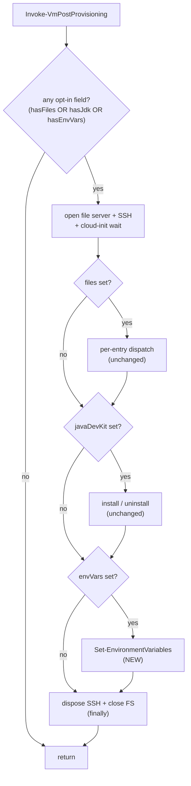
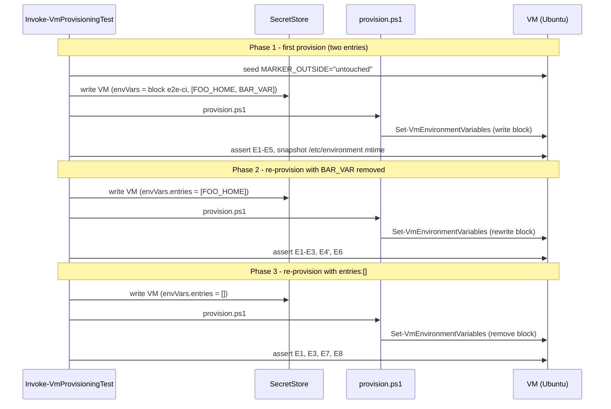

# Plan: System-Wide Environment Variables on a Provisioned VM

See [problem.md](problem.md) for context, schema, and rationale.

## Index

- [Step 1 - Confirm Infrastructure.HyperV dependency floor](#step-1---confirm-infrastructurehyperv-dependency-floor)
- [Step 2 - Validate `envVars` in `ConvertFrom-VmConfigJson`](#step-2---validate-envvars-in-convertfrom-vmconfigjson)
- [Step 3 - Add the `Set-EnvironmentVariables` per-VM step](#step-3---add-the-set-environmentvariables-per-vm-step)
- [Step 4 - Dispatch the new step from `Invoke-VmPostProvisioning`](#step-4---dispatch-the-new-step-from-invoke-vmpostprovisioning)
- [Step 5 - E2E test coverage for the envVars path](#step-5---e2e-test-coverage-for-the-envvars-path)

---

## Step 1 - Confirm Infrastructure.HyperV dependency floor

**Reason:** `Assert-VmEnvVarsField` and `Set-VmEnvironmentVariables` ship in
`Infrastructure.HyperV` v0.7.0. Steps 2-4 import-resolve those names at
provision-time, so the floor must be at least 0.7.0 before any later step
can run on a clean machine. Splitting the version pin from the behavioural
changes keeps diffs focused, mirroring
[07 - ci jars Step 1](../07%20-%20ci%20jars/plan.md#step-1---bump-infrastructurehyperv-dependency-to-the-latest).

**Decisions locked**

- The current floor in
  [Install-ModuleDependencies.ps1](../../../../hyper-v/ubuntu/Install-ModuleDependencies.ps1)
  is already `0.7.0` (set by 07 - ci jars). Read the
  [HyperV psd1](../../../../../Infrastructure-HyperV/Infrastructure.HyperV/Infrastructure.HyperV.psd1)
  `ModuleVersion` at implementation time; if it has advanced past 0.7.0
  bump to that latest, otherwise this step is a no-op confirmation
  commit (recorded in the commit message so the audit trail still shows
  the dependency was reviewed for this feature).
- Keep `-MinimumVersion` (not `RequiredVersion`); same uniform pin style
  as every other module in `Install-ModuleDependencies.ps1`.

**Files**

- [hyper-v/ubuntu/Install-ModuleDependencies.ps1](../../../../hyper-v/ubuntu/Install-ModuleDependencies.ps1) -
  raise the `Invoke-ModuleInstall -ModuleName 'Infrastructure.HyperV'`
  line's `-MinimumVersion` to the current HyperV `ModuleVersion` if it
  has moved past `0.7.0`; otherwise no edit.

**Tests (unit, mocked)**

- No behavioural test - the bootstrap path's pinning is a configuration
  value, not logic. Steps 2-5 exercise the cmdlets it brings in.

**README update**

- None unless the README pins a HyperV version explicitly (it currently
  does not).

---

## Step 2 - Validate `envVars` in `ConvertFrom-VmConfigJson`

**Reason:** The schema is the first line of defence. Wiring
`Assert-VmEnvVarsField` here means a misedited config fails fast on the
host - before any VM work, file server, or SSH session - same shape as
the existing `Assert-JavaDevKitField` / `Assert-VmFilesField` calls per
[problem.md - Validation surface](problem.md#validation-surface). The
upstream validator already owns every rule (blockName format, entry
shape, identifier syntax, duplicate detection), so this step is a
one-line call-site change plus its tests.

**Decisions locked**

- No `-PostEntryValidator` parameter is passed. Reason:
  [problem.md - Validation surface](problem.md#validation-surface)
  states the provisioner has no per-entry policy of its own in v1 -
  every `{ name, value }` pair is opaque, same way bulk-files paths
  are opaque. Re-introducing a hook would invent a surface the
  feature explicitly does not have.
- Call placement: alongside the existing optional-field validators,
  before the default-application block that adds `switchName` /
  `natName`. Reason: validation runs to completion before any field
  is mutated, so a schema error never leaves a half-defaulted VM
  object visible to a later consumer.
- No host-side validation of the values' contents (e.g. "this looks
  like a path that does not exist"). Reason: per
  [problem.md - Out of Scope](problem.md#out-of-scope) values are
  opaque; rejecting plausibly-typed values would re-litigate every
  operator's free-form intent.

**Files**

- [hyper-v/ubuntu/common/config/ConvertFrom-VmConfigJson.ps1](../../../../hyper-v/ubuntu/common/config/ConvertFrom-VmConfigJson.ps1) -
  add one `Assert-VmEnvVarsField -Vm $vm` call after the existing
  `Assert-VmFilesField` call. Extend the optional-field comment so the
  intent ("each validator is no-op when absent, throws when malformed")
  covers the new line too.
- [Tests/common/config/ConvertFrom-VmConfigJson.Tests.ps1](../../../../Tests/common/config/ConvertFrom-VmConfigJson.Tests.ps1) -
  add the call-site cases below; do not duplicate the per-rule shape
  assertions that `Infrastructure-HyperV`'s own validator tests already
  cover.

**Tests (unit, mocked)**

Assertions target only what changes at the call site:

- A config without an `envVars` field parses successfully (regression
  guard: this step is additive).
- A config with a well-formed `envVars` object parses successfully and
  the object is preserved on the returned VM definition (round-trip -
  no fields added or dropped, no defaults applied to entries).
- A config with `envVars.entries: []` parses successfully (empty array
  is a valid intent meaning "remove the managed block" per
  [problem.md - Out of Scope](problem.md#out-of-scope)).
- Negative cases (the upstream validator's responsibility, asserted
  here only to confirm we did opt in by calling it):
  - `envVars` is an array or scalar: throws.
  - `envVars` missing `blockName`: throws.
  - `envVars` missing `entries`: throws.
  - `blockName` violates the format / length rules: throws.
  - Entry with a non-POSIX `name`: throws.
  - Entry with an empty / multi-line `value`: throws.
  - Duplicate entry names: throws.
- Existing valid-config cases (no `envVars` field; `files` only;
  `javaDevKit` only; both) still pass unchanged.

**README update**

- None at this step; the user-facing field is introduced by Step 4's
  README change so the doc lands together with the dispatch wiring
  that actually applies it.

---

## Step 3 - Add the `Set-EnvironmentVariables` per-VM step

**Reason:** Mirrors the self-contained shape of
[Install-Jdk.ps1](../../../../hyper-v/ubuntu/up/post/Install-Jdk.ps1) and
`Uninstall-Jdk.ps1`: the orchestrator owns the SSH lifecycle, the step
owns its inputs (`blockName`, `entries`) pulled from the VM definition
and its single transport call. Landing the wrapper as its own commit
(before Step 4 wires it in) keeps the diff small and lets the unit
tests assert the wrapper's contract in isolation.

**Decisions locked**

- The wrapper takes `$SshClient` and `$Vm` only - no `$Server` parameter.
  Reason: env-var writing does not stage anything host-side; passing
  `$Server` would mislead a future reader into thinking the step uses
  the file server.
- The wrapper throws on failure with `$Vm.vmName` named in the message,
  same convention as `Install-Jdk` / `Uninstall-Jdk` - the orchestrator
  catches nothing and the SSH/file-server `finally` cleanup runs.
- The wrapper is a thin pass-through: read `blockName` and `entries`,
  call `Set-VmEnvironmentVariables`. No defaulting, no transformation
  - the validator already enforced the shape and the transport already
  handles the skip-unchanged optimisation.
- A one-line log (`[envVars] block 'X' (N entries) -> /etc/environment`)
  is emitted before the call so re-run logs stay readable next to the
  existing `[files]` / `[JDK]` lines.

**Files**

- `hyper-v/ubuntu/up/post/Set-EnvironmentVariables.ps1` (new) -
  function `Set-EnvironmentVariables` with the param block
  `(SshClient, Vm)`; reads `$Vm.envVars.blockName` and
  `$Vm.envVars.entries`; calls
  `Set-VmEnvironmentVariables -SshClient $SshClient -Entries $entries -BlockName $blockName`;
  rethrows with the VM name on transport failure.
- [hyper-v/ubuntu/provision.ps1](../../../../hyper-v/ubuntu/provision.ps1) -
  add `. "$PSScriptRoot\up\post\Set-EnvironmentVariables.ps1"` next to
  the existing `Install-Jdk.ps1` / `Uninstall-Jdk.ps1` dot-sources, so
  `Invoke-VmPostProvisioning` (which is dot-sourced after) can
  capture the function reference.
- `Tests/up/post/Set-EnvironmentVariables.Tests.ps1` (new) - new
  Pester file following the
  [Install-Jdk.Tests.ps1](../../../../Tests/up/post/Install-Jdk.Tests.ps1)
  pattern (stub the transport before dot-source, then `Mock` per case).

**Tests (unit, mocked)**

Mock `Set-VmEnvironmentVariables`. Assertions:

- Happy path: given a VM with a valid `envVars` object, the function
  calls `Set-VmEnvironmentVariables` exactly once, passing the
  supplied `SshClient`, `entries` array as-is, and the supplied
  `blockName`.
- Empty entries: `entries: @()` is passed through to the transport
  unchanged (the transport treats it as "remove the block"; the
  wrapper does not second-guess).
- Failure propagation: when `Set-VmEnvironmentVariables` throws, the
  wrapper rethrows a message that names `$Vm.vmName` (so the
  orchestrator's caller sees which VM failed) and preserves the
  inner exception text.
- No file-server interaction: the wrapper has no `$Server` parameter
  and does not call any `*-VmFileServer*` cmdlet (asserted via mock
  expectations on the cmdlets the wrapper must NOT call).

**README update**

- None at this step; the field is documented together with the
  dispatch wiring in Step 4 so the README never describes a field the
  shipped code does not yet act on.

---

## Step 4 - Dispatch the new step from `Invoke-VmPostProvisioning`

**Reason:** Once the validator accepts the field and the wrapper exists,
the orchestrator's job is to detect the field and call the wrapper.
This is the only run-time behavioural change in the provisioning path;
everything before was wiring. Adding the branch as its own commit keeps
the dispatch-table diff isolated from the wrapper diff.

**Decisions locked**

- The new presence predicate is `$hasEnvVars =
  $Vm.PSObject.Properties['envVars']`. Reason: the validator already
  enforced that `envVars`, when present, is a well-formed object with
  an `entries` array. Gating on presence (not on `entries.Count`) lets
  `entries: []` route through to the transport so the operator's
  "remove the block" intent is honoured per
  [problem.md - Out of Scope](problem.md#out-of-scope).
- Dispatch order: `files`, `javaDevKit`, then `envVars`. Reason: env-var
  values may legitimately reference paths the `files` step placed, so
  letting `files` run first means a `FOO_HOME=/opt/foo` value is
  pointing at content that already exists by the time
  `/etc/environment` is rewritten. Order is still stylistic - the
  transport does not read the target paths it writes - but the
  ordering makes log-reading less surprising.
- The branch shares the SSH client opened for the other branches but
  uses no file server. Reason: per
  [problem.md - Post-provisioning dispatch](problem.md#post-provisioning-dispatch)
  the step does not stage anything host-side. Today the file server is
  always opened when any opt-in field is set, because the existing
  steps use it; an `envVars`-only VM still opens it (cost is negligible
  and changing the always-open contract is a separate cleanup).
- Capture the wrapper as a scriptblock local
  (`$setEnvironmentVariables = ${function:Set-EnvironmentVariables}`)
  alongside the existing captures, for the same closure-scope reason
  documented in
  [Invoke-VmPostProvisioning.ps1](../../../../hyper-v/ubuntu/up/post/Invoke-VmPostProvisioning.ps1)
  lines 55-65.

**Files**

- [hyper-v/ubuntu/up/post/Invoke-VmPostProvisioning.ps1](../../../../hyper-v/ubuntu/up/post/Invoke-VmPostProvisioning.ps1) -
  - Add `$hasEnvVars = $Vm.PSObject.Properties['envVars']` next to the
    existing `$hasFiles` / `$hasJdk` predicates.
  - Extend the "any opt-in field" gate to
    `if (-not ($hasFiles -or $hasJdk -or $hasEnvVars)) { return }`.
  - Capture `$setEnvironmentVariables = ${function:Set-EnvironmentVariables}`
    next to the other function captures.
  - Add the dispatch branch after the `$hasJdk` block:
    `if ($hasEnvVars) { & $setEnvironmentVariables -SshClient $sshClient -Vm $vmRef }`.
- [Tests/up/post/Invoke-VmPostProvisioning.Tests.ps1](../../../../Tests/up/post/Invoke-VmPostProvisioning.Tests.ps1) -
  extend dispatch tests for the new branch. Mock the wrapper.
- [README.md](../../../../README.md) - new "Optional: set system-wide
  environment variables" section, sibling to the existing `files` and
  `javaDevKit` sections. One JSON example, the sub-field table from
  [problem.md - New envVars per-VM field](problem.md#new-envvars-per-vm-field),
  a one-line note that lines outside the managed block are preserved
  across re-runs, and a link to the upstream `Set-VmEnvironmentVariables`
  notes for managed-block semantics (so the schema docs do not
  duplicate the transport contract). Place the section after the
  existing `files` section, matching the dispatch order in code.

**Tests (unit, mocked) - `Invoke-VmPostProvisioning.Tests.ps1`**

Mock `Set-EnvironmentVariables`, `Copy-VmFiles`, `Copy-VmFilesByPattern`,
`Install-Jdk`, `Uninstall-Jdk`, `New-VmSshClient`,
`Invoke-WithVmFileServer`, `Invoke-SshClientCommand`. Assertions:

- `envVars` absent: `Set-EnvironmentVariables` NOT called; existing
  branches behave as before (regression guard).
- `envVars` present, no other opt-in fields: `Set-EnvironmentVariables`
  called once with the VM object; the file server / SSH lifecycle
  still runs (matches today's "always-open when any opt-in is set"
  contract).
- `envVars` present alongside `files` and `javaDevKit`: all three
  branches run, in order `files` -> `javaDevKit` -> `envVars`;
  asserted via per-mock call counters or `Should -Invoke -CallNumber`
  so the stylistic order is locked.
- `envVars` with `entries: @()`: branch still runs (routes the
  "remove the block" intent to the transport); the wrapper receives
  the VM object as-is.
- Wrapper throws: exception propagates out of
  `Invoke-VmPostProvisioning`; the SSH client / file server are
  still disposed by the existing `finally` block (covered by the
  current pattern - assertion lives in the existing
  `finally`-test, extended to the new branch).
- No `envVars`, no `files`, no `javaDevKit`: orchestrator returns
  silently without opening SSH or the file server (regression guard).

**Diagram**

**README updates**

- New top-level subsection "Optional: set system-wide environment
  variables" with: one minimal JSON snippet (one entry under one
  `blockName`); the sub-field table from problem.md (blockName,
  entries, name, value); the one-line preservation note; and the
  link to upstream `Set-VmEnvironmentVariables`.
- Provisioning-flow description (wherever the post-provisioning order
  is mentioned) notes the new `envVars` step runs after `files` and
  `javaDevKit` in a parenthetical.
- A one-line note that omitting `envVars` on a re-run is a no-op, and
  that `entries: []` is the explicit way to remove the managed block
  (mirrors the JDK uninstall flag's removal model).

---

## Step 5 - E2E test coverage for the envVars path

**Reason:** Unit tests fix the dispatch logic; only an E2E run proves
the managed block actually lands in `/etc/environment` on a real VM
with the right ownership / mode, that lines outside the block survive,
and that `entries: []` removes the block per
[problem.md - Acceptance Criteria](problem.md#acceptance-criteria).
Managed-block transport behaviour itself is covered by
`Infrastructure-HyperV`'s integration suite; this scenario focuses on
"the provisioner wires it correctly end-to-end".

Always-on (not gated on operator opt-in) so every E2E run validates
the env-vars path.

**Decisions locked**

- **One VM, three phases.** Reason: each acceptance criterion the
  provisioner owns at this layer requires a distinct JSON state -
  "block written", "block updated with one entry removed", "block
  removed via empty entries" - and three phases is the minimum to
  cover them without inventing a per-feature cross-VM dimension.
- **A pre-existing out-of-block line is seeded by cloud-init or by
  phase 1 setup** (e.g. `MARKER_OUTSIDE=untouched` written outside
  the managed block before the first provision run). Reason: lets
  the assertions prove "lines outside the block are preserved
  byte-for-byte" on real infrastructure rather than relying on
  Ubuntu's default `PATH=...` line alone, which is not guaranteed
  across base images.
- **No "two consumers, one file" phase.** Reason: only one consumer
  (the provisioner) writes to `/etc/environment` today; the
  multi-consumer claim is upstream's contract and is already covered
  by the HyperV integration suite. Re-asserting it on the slower
  E2E layer would test something this feature does not affect.

**Files** (live in the Infrastructure-E2E repo, not this one)

- `agent/e2e/vm-provisioning/Invoke-VmProvisioningTest.ps1` -
  - `Invoke-VmProvisioningSetup`: write the VM definition with a
    well-formed `envVars` object (one `blockName`, two entries -
    e.g. `FOO_HOME=/opt/foo`, `BAR_VAR=baz`).
  - `Invoke-VmProvisioningTest`: replace the single-pass block with
    the three-phase sequence below; each phase opens its own SSH
    client, runs its assertions, disconnects.
- `Tests/Invoke-E2EAgentLoop.Tests.ps1` - if any existing unit-level
  mock asserts the shape of the vault entry, extend the expectation
  to include the new `envVars` field.

**Behaviour - phase sequence**

Each assertion throws with a clear, actionable message naming the VM
and the observed value on failure.

| Phase | JSON state | Action | Assertions |
|-------|-----------|--------|------------|
| 1 | One VM, `envVars = { blockName: 'e2e-ci', entries: [FOO_HOME, BAR_VAR] }`; out-of-block sentinel `MARKER_OUTSIDE=untouched` seeded on the VM before `provision.ps1` runs. | `provision.ps1` | **On VM:** E1-E5 (below). |
| 2 | `envVars.entries` reduced to `[FOO_HOME]` (BAR_VAR removed). | `provision.ps1` again | **On VM:** E1, E2, E3 (FOO_HOME still present, BAR_VAR's line gone from the block, MARKER_OUTSIDE untouched), plus E6 (file mtime updated relative to phase 1 - the transport rewrote the block). |
| 3 | `envVars.entries: []` (operator's "remove the block" intent). | `provision.ps1` again | **On VM:** E7 (BEGIN/END markers are gone), E8 (FOO_HOME line is gone), E2/E3 still hold for MARKER_OUTSIDE. |

**Assertion blocks**

VM (phase 1):

- **E1** `/etc/environment` ownership is `root:root`, mode `0644`.
  `bash -c 'stat -c "%U:%G %a" /etc/environment'` produces
  `root:root 644`.
- **E2** Managed block exists between sentinels:
  `grep -c '^# BEGIN e2e-ci$' /etc/environment` is `1`;
  `grep -c '^# END e2e-ci$' /etc/environment` is `1`.
- **E3** Out-of-block line preserved:
  `grep -c '^MARKER_OUTSIDE="untouched"$' /etc/environment` is `1`,
  and the line appears outside the BEGIN / END span (asserted by
  diffing line ranges, not just count, so an accidental rewrite that
  duplicates the line is also caught).
- **E4** Entries present inside the block with the documented quoting:
  `grep -c '^FOO_HOME="/opt/foo"$' /etc/environment` is `1`;
  `grep -c '^BAR_VAR="baz"$' /etc/environment` is `1`; both line
  numbers fall between the BEGIN and END markers.
- **E5** `pam_env` view: open a fresh login shell over SSH
  (`ssh ... 'bash -lc "env"'`) and assert both `FOO_HOME=/opt/foo`
  and `BAR_VAR=baz` appear. This is the user-visible reason the
  feature exists - testing the file alone would miss a
  permission / ownership regression that defeats `pam_env`'s read.

VM (phase 2):

- E1, E2 (block still present), E3 (MARKER_OUTSIDE untouched).
- **E4'** Only FOO_HOME's line is in the block now;
  `grep -c '^BAR_VAR=' /etc/environment` is `0`.
- **E6** `/etc/environment` mtime advanced versus the snapshot taken
  at the end of phase 1 (proves the transport rewrote the file; the
  skip-unchanged optimisation does NOT apply because the desired
  block changed).

VM (phase 3):

- **E7** Markers gone:
  `grep -c '^# BEGIN e2e-ci$' /etc/environment` is `0`;
  `grep -c '^# END e2e-ci$' /etc/environment` is `0`.
- **E8** Block contents gone:
  `grep -c '^FOO_HOME=' /etc/environment` is `0`;
  `grep -c '^BAR_VAR=' /etc/environment` is `0`.
- E1, E3 still hold (file mode unchanged, out-of-block line
  unchanged).

**Tests (no new Pester tests)**

E2E is the test layer. The mock-level unit test in
`Tests/Invoke-E2EAgentLoop.Tests.ps1` continues to cover agent-loop
plumbing without behavioural duplication of these assertions.

**Diagram**

**README update** (Infrastructure-E2E, not this repo)

- Extend the E2E description to mention the three-phase envVars
  scenario: phase 1 writes a managed block of two entries with an
  out-of-block sentinel preserved; phase 2 removes one entry from
  the block; phase 3 removes the block entirely via `entries: []`.
