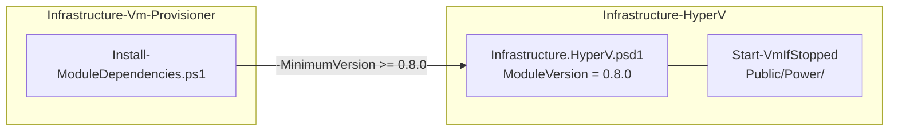
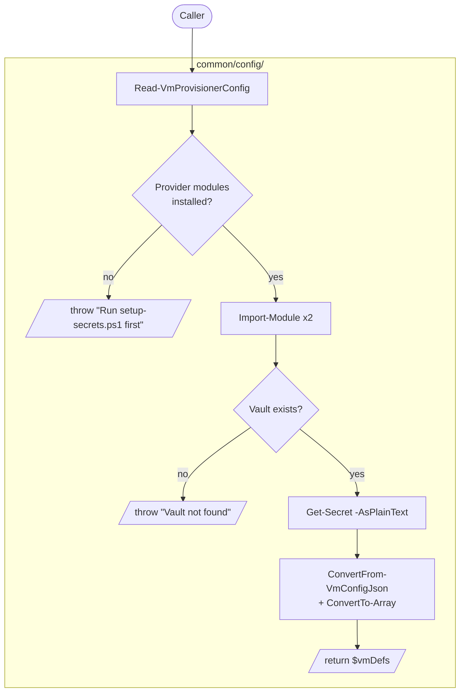
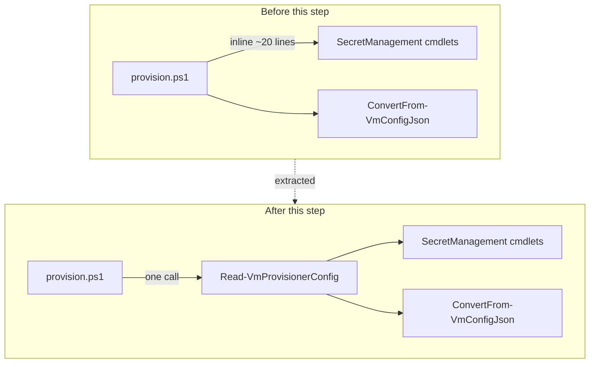
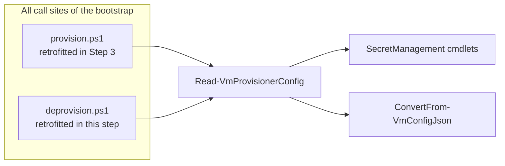
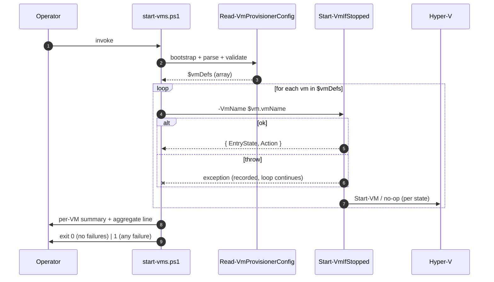

# Plan: Start All Provisioned VMs from the Stored Config

See [problem.md](problem.md) for context, schema, and rationale.

## Index

- [Step 1 - Confirm Infrastructure.HyperV dependency floor](#step-1---confirm-infrastructurehyperv-dependency-floor)
- [Step 2 - Extract `Read-VmProvisionerConfig` shared bootstrap helper](#step-2---extract-read-vmprovisionerconfig-shared-bootstrap-helper)
- [Step 3 - Retrofit `provision.ps1` onto the helper](#step-3---retrofit-provisionps1-onto-the-helper)
- [Step 4 - Retrofit `deprovision.ps1` onto the helper](#step-4---retrofit-deprovisionps1-onto-the-helper)
- [Step 5 - Add `start-vms.ps1` entry-point](#step-5---add-start-vmsps1-entry-point)

---

## Step 1 - Confirm Infrastructure.HyperV dependency floor

**Reason:** `Start-VmIfStopped` ships in `Infrastructure.HyperV`
`v0.8.0`. Step 5 import-resolves it at provision-time, so the floor
must be at least `0.8.0` before that step can run on a clean machine.
Splitting the version pin from the behavioural changes keeps diffs
focused, mirroring
[07 - ci jars Step 1](../07%20-%20ci%20jars/plan.md#step-1---bump-infrastructurehyperv-dependency-to-the-latest)
and
[08 - env vars Step 1](../08%20-%20env%20vars/plan.md#step-1---confirm-infrastructurehyperv-dependency-floor).

**Decisions locked**

- Read the
  [HyperV psd1](../../../../../Infrastructure-HyperV/Infrastructure.HyperV/Infrastructure.HyperV.psd1)
  `ModuleVersion` at implementation time. If it is at `0.8.0` or
  later, raise the floor to that value; if a prior step has already
  pinned it past `0.8.0` this commit is a no-op confirmation, with
  the audit trail captured in the commit message.
- Keep `-MinimumVersion` (not `RequiredVersion`); uniform pin style
  with every other module in `Install-ModuleDependencies.ps1`.

**Files**

- [hyper-v/ubuntu/Install-ModuleDependencies.ps1](../../../../hyper-v/ubuntu/Install-ModuleDependencies.ps1) -
  raise the `Invoke-ModuleInstall -ModuleName 'Infrastructure.HyperV'`
  line's `-MinimumVersion` to the current HyperV `ModuleVersion`
  if it has moved past the existing floor; otherwise no edit.

**Tests (unit, mocked)**

- No behavioural test - the bootstrap path's pinning is a
  configuration value, not logic. Steps 2-5 exercise the cmdlets it
  brings in.

**README update**

- None unless the README pins a HyperV version explicitly (it
  currently does not).

**Mermaid**

---

## Step 2 - Extract `Read-VmProvisionerConfig` shared bootstrap helper

**Reason:** Lands the helper described in
[problem.md - Shared bootstrap helper](problem.md#shared-bootstrap-helper-read-vmprovisionerconfig)
as a standalone file with its own test suite, **before** any caller
is migrated. Sequencing it this way means Steps 3-5 are pure
delegation diffs (each script loses ~25 lines and gains one call),
and a regression introduced by the helper is bisectable to this
commit instead of being entangled with the call-site moves.

**Decisions locked**

- File path:
  `hyper-v/ubuntu/common/config/Read-VmProvisionerConfig.ps1`. Sits
  next to
  [ConvertFrom-VmConfigJson.ps1](../../../../hyper-v/ubuntu/common/config/ConvertFrom-VmConfigJson.ps1)
  so the full "vault -> validated VMs" path lives in one folder.
- Signature: parameterless. The vault name (`VmProvisioner`) and
  secret name (`VmProvisionerConfig`) are constants today and the
  helper preserves that - inventing parameters with no caller would
  be speculative surface.
- Output contract: returns the **array** of validated VM defs
  directly (already `ConvertTo-Array`-collected), so callers write
  `$vmDefs = Read-VmProvisionerConfig` and never have to remember
  the array-collection idiom. Matches what both inline call sites
  do today.
- Error wording: byte-for-byte identical to the strings
  `provision.ps1` produces today. Asserted in the new test suite
  against literal strings, not regex matches, so a future
  whitespace-only edit fails loud.
- Direct dependency on
  `Microsoft.PowerShell.SecretManagement` / `SecretStore` cmdlets
  is preserved at this step. Migrating to
  [Get-InfrastructureSecret](../../../../../Infrastructure-Secrets/Infrastructure.Secrets/Public/Get-InfrastructureSecret.ps1)
  is out of scope per
  [problem.md - Out of Scope](problem.md#out-of-scope) and would
  obscure the extraction diff if bundled here.

**Files**

- `hyper-v/ubuntu/common/config/Read-VmProvisionerConfig.ps1`
  (new) - function `Read-VmProvisionerConfig`; param block empty;
  dot-sources `ConvertFrom-VmConfigJson.ps1` at the top
  (mirroring how other helpers in the folder declare their
  sibling dependencies) so callers do not need to know which
  helpers it stitches together.
- `Tests/common/config/Read-VmProvisionerConfig.Tests.ps1` (new) -
  Pester suite per the matrix below.

**Tests (unit, mocked)**

Mock `Get-Module`, `Import-Module`, `Get-SecretVault`,
`Get-Secret`, and `ConvertFrom-VmConfigJson`. No live SecretStore.

- Missing `Microsoft.PowerShell.SecretManagement` (`Get-Module
  -ListAvailable` returns `$null` for that name): throws the
  literal message
  `"Module 'Microsoft.PowerShell.SecretManagement' is not installed. Run setup-secrets.ps1 first."`.
  Same `It` repeated for `Microsoft.PowerShell.SecretStore`.
- Both provider modules present and importable: `Import-Module`
  invoked exactly once per provider with `-ErrorAction Stop`,
  filtered on `-Name`.
- Missing vault (`Get-SecretVault` returns `$null`): throws the
  literal message
  `"Vault 'VmProvisioner' not found. Run setup-secrets.ps1 first."`.
  `Get-Secret` NOT invoked.
- Vault present, `Get-Secret` invoked exactly once with
  `-Vault 'VmProvisioner' -Name 'VmProvisionerConfig' -AsPlainText
  -ErrorAction Stop` (asserted via `ParameterFilter`).
- Happy path: returned value is what
  `ConvertFrom-VmConfigJson` produced, passed through
  `ConvertTo-Array` so a single-VM config still returns an array
  (locks the unrolling trap; see
  [[feedback-pester5-single-match-count]] for the test-side
  cousin of the same issue).
- `ConvertFrom-VmConfigJson` throwing (invalid JSON or schema
  failure) propagates without wrapping.
- Verbose / informational line `"Reading
  'VmProvisionerConfig' from vault 'VmProvisioner' ..."` and the
  `"[OK] Config validated - N VM definition(s) found."` line
  are emitted exactly once each, asserted via `6>&1` (Information
  stream) or `Write-Host` capture - matching whichever stream the
  inline code uses today, preserving the contract.

**README update**

- None at this step; the helper is internal plumbing and not part
  of the operator-facing surface. The README change lands with
  Step 5 alongside the new entry-point that justifies it.

**Mermaid**

---

## Step 3 - Retrofit `provision.ps1` onto the helper

**Reason:** Migrates the first caller onto the helper landed in
Step 2. Lands as its own commit (not bundled with Step 4 or 5) so
the diff is a pure delete-inline-block + add-one-call - bisectable
in isolation if `provision.ps1` starts misbehaving on a clean host.
The byte-for-byte wording guarantee from
[problem.md - Acceptance Criteria](problem.md#acceptance-criteria)
is asserted by the existing test suite plus the new helper suite -
no new behavioural surface is introduced.

**Decisions locked**

- The replacement is a single
  `$vmDefs = Read-VmProvisionerConfig` line where the inline
  Sections 2 + 3 + 4 used to be (per
  [provision.ps1](../../../../hyper-v/ubuntu/provision.ps1) headers
  today). Comments around the deleted block go away with it - the
  helper's own header comment owns the rationale now.
- Dot-source order: `Read-VmProvisionerConfig.ps1` joins the
  existing `common/config/` dot-source group at the top of
  `provision.ps1`, alphabetised to keep the diff small for future
  additions.
- The vault `$vaultName` / `$secretName` local variables disappear
  - they were only ever used inside the deleted block. No other
  section in `provision.ps1` references them.

**Files**

- [hyper-v/ubuntu/provision.ps1](../../../../hyper-v/ubuntu/provision.ps1) -
  delete the inline "Ensure SecretManagement modules are loaded",
  "Read VmProvisionerConfig from the local vault", and "Parse and
  validate JSON" blocks. Add the
  `Read-VmProvisionerConfig.ps1` dot-source and the one-line call
  in their place. Renumber surrounding comment-block step
  counters if any reference the removed sections by number.
- [Tests/provision.Tests.ps1](../../../../Tests/provision.Tests.ps1) -
  any assertion that spies on `Get-SecretVault` /
  `Get-Secret` / the inline error wording moves to the
  `Read-VmProvisionerConfig` suite landed in Step 2. The
  provision suite mocks `Read-VmProvisionerConfig` with a
  fixture VM-defs array and continues to exercise the
  downstream pipeline (acquisitions, network setup, VM creation,
  post-provisioning) as before.

**Tests (unit, mocked)**

- Existing pass-through cases continue to pass with
  `Read-VmProvisionerConfig` mocked to return the existing
  fixture data - the post-bootstrap behaviour is unchanged.
- `Read-VmProvisionerConfig` is invoked exactly once at the
  top of `provision.ps1` (asserted via `Should -Invoke`).
- `Get-SecretVault` and `Get-Secret` are **not** invoked from
  `provision.ps1`'s own scope - the helper owns them now
  (`Should -Not -Invoke` on each, scoped via `-ModuleName` or
  a dummy mock that fails the test if hit).
- A `Read-VmProvisionerConfig` failure propagates out of
  `provision.ps1` unchanged (the script does not swallow
  bootstrap errors).

**README update**

- None at this step - operator behaviour is unchanged.

**Mermaid**

---

## Step 4 - Retrofit `deprovision.ps1` onto the helper

**Reason:** Same migration as Step 3, applied to the second
caller. Identical pattern, intentionally landed as a separate
commit so an issue specific to the deprovisioning path is
bisectable to this change and does not get blamed on Step 3's
provision diff.

**Decisions locked**

- Same dot-source placement and one-line replacement as Step 3.
- No new test file is added: there is no
  `Tests/deprovision.Tests.ps1` today. If one is added in the
  future it inherits the same "mock the helper, do not spy on
  SecretManagement" rule that Step 3 establishes.

**Files**

- [hyper-v/ubuntu/deprovision.ps1](../../../../hyper-v/ubuntu/deprovision.ps1) -
  delete the inline "Ensure SecretManagement modules are
  loaded", "Read VmProvisionerConfig from the local vault", and
  "Parse and validate JSON" blocks. Add the helper dot-source
  and the one-line call. Section numbering in the surviving
  comments is shifted down accordingly.

**Tests (unit, mocked)**

- No new unit test is added for `deprovision.ps1` itself
  (the suite does not exist today and adding one is a separate
  concern). The bootstrap path is covered end-to-end by the
  `Read-VmProvisionerConfig` suite from Step 2.

**README update**

- None - operator behaviour is unchanged.

**Mermaid**

---

## Step 5 - Add `start-vms.ps1` entry-point

**Reason:** Lands the feature itself. With Steps 1-4 in place the
new script is a thin orchestrator: bootstrap via the helper,
iterate, aggregate failures, exit-code. The per-VM state machine
is owned by
[Start-VmIfStopped](../../../../../Infrastructure-HyperV/Infrastructure.HyperV/Public/Power/Start-VmIfStopped.ps1)
and its
[unit tests](../../../../../Infrastructure-HyperV/Tests/Start-VmIfStopped.Tests.ps1) -
this script tests only what it adds.

**Decisions locked**

- File path: `hyper-v/ubuntu/start-vms.ps1`, at the same level as
  `provision.ps1` / `deprovision.ps1`, so the operator-facing
  surface stays flat.
- Per
  [problem.md - Per-VM failure policy](problem.md#per-vm-failure-policy):
  one `try` / `catch` per VM around the
  `Start-VmIfStopped` call. The catch appends `{ VmName, Reason }`
  to a script-scope `$failed = @()` accumulator and continues to
  the next VM. Initialise with `$failed = @()` outside the loop;
  see [[feedback-pester5-empty-array-mock]] for the reason
  `$failed = if ($x) { ... }` is wrong here.
- Success-bucket accumulator: per-VM transition objects are
  appended to `$transitions = @()`, then bucketed at the end via
  `Group-Object Action` to produce the
  `Started: N, Resumed: M, Already running: K, Failed: F`
  aggregate line. Wrap any `Where-Object` results with `@(...)`
  before reading `.Count`; see
  [[feedback-pester5-single-match-count]].
- Exit code: `exit ($failed.Count -gt 0 ? 1 : 0)` at the bottom of
  the script. The script never `throw`s past the loop.
- No `[CmdletBinding()]` / no parameters in v1. Per
  [problem.md - Out of Scope](problem.md#out-of-scope) the
  parameter surface (e.g. `-VmName` filter) is deliberately
  deferred until a real demand materialises.

**Files**

- `hyper-v/ubuntu/start-vms.ps1` (new) - the script. Structure
  mirrors `provision.ps1`'s top-of-file (synopsis, requires,
  `Set-StrictMode -Version Latest`,
  `$ErrorActionPreference = 'Stop'`,
  `Install-ModuleDependencies.ps1` dot-source,
  `Read-VmProvisionerConfig.ps1` dot-source, then the new logic).
- `Tests/start-vms.Tests.ps1` (new) - Pester suite per the
  matrix below.

**Tests (unit, mocked)**

Mock `Read-VmProvisionerConfig`, `Start-VmIfStopped`, and `exit`.
Stub `Install-ModuleDependencies.ps1` (load nothing) so the test
host does not pay the bootstrap cost.

- Happy path (3 VMs, returned transitions
  `Started` / `Resumed` / `AlreadyRunning`): `Start-VmIfStopped`
  invoked exactly 3 times, one per `$vm.vmName`, in input order;
  per-VM summary lines emitted in order; aggregate line reads
  `Started: 1, Resumed: 1, Already running: 1, Failed: 0`;
  exit code 0.
- Single failure (4 VMs, one `Start-VmIfStopped` call throws):
  the loop completes - the remaining `Start-VmIfStopped` calls
  fire after the failure (`Should -Invoke -Times 4 -Exactly`);
  the failed VM's name + reason is emitted on its own line after
  the per-VM summaries; aggregate line reports
  `Failed: 1`; exit code 1.
- Multiple failures: every failure appears in the output; exit
  code 1; loop still completes.
- All failures (every `Start-VmIfStopped` throws): exit code 1;
  aggregate line reports `Failed: N` with the rest of the buckets
  at 0.
- Single-VM config: aggregate-line bucket math survives the
  single-match unrolling trap (asserted by reading the literal
  output string, not by indexing into a `Group-Object` result).
- Empty config: `Read-VmProvisionerConfig` throws (already covered
  in Step 2 via `ConvertFrom-VmConfigJson`'s empty-array check);
  the script propagates the throw and exits non-zero. No
  `Start-VmIfStopped` call is made.
- No-side-effect contract per
  [problem.md - Acceptance Criteria](problem.md#acceptance-criteria):
  asserted by `Should -Not -Invoke` against any
  `Invoke-WithVmFileServer`, `New-VmSshClient`,
  `Invoke-SshClientCommand`, `Wait-VmSshReady` mock left in
  scope at test time. Pinpoints a future contributor accidentally
  importing the SSH/file-server cmdlets.
- `Read-VmProvisionerConfig` failure (helper itself throws):
  propagates; `Start-VmIfStopped` not invoked.

**README update**

This step ships the operator-facing surface, so the README change
lands here in the same commit.

- [README.md](../../../../README.md) - add a new
  `## start-vms.ps1` section between the existing `## provision.ps1`
  and `## deprovision.ps1` sections, matching the lifecycle order
  an operator hits the scripts in (per
  [problem.md - Acceptance Criteria](problem.md#acceptance-criteria)).
- Section body: one short usage example
  (`.\hyper-v\ubuntu\start-vms.ps1`); one sentence on the
  idempotency contract (re-runs are no-ops); one sentence on the
  per-VM failure policy (one bad VM does not strand the rest,
  exit code 1 surfaces any failure). Links to the
  `Start-VmIfStopped` reference in
  [Infrastructure-HyperV README](../../../../../Infrastructure-HyperV/README.md)
  for state-machine details so this doc does not duplicate the
  transport contract.
- Index update: add a `start-vms.ps1` anchor between the existing
  `provision.ps1` and `deprovision.ps1` Index entries.
- Quick-start block: add a third numbered step between the
  existing `# 2. Provision VMs` and `# 3. Remove VMs when no
  longer needed` lines, e.g. `# 3. Bring VMs back up after a
  reboot` followed by the same one-line example as the main
  section.

**Mermaid**

