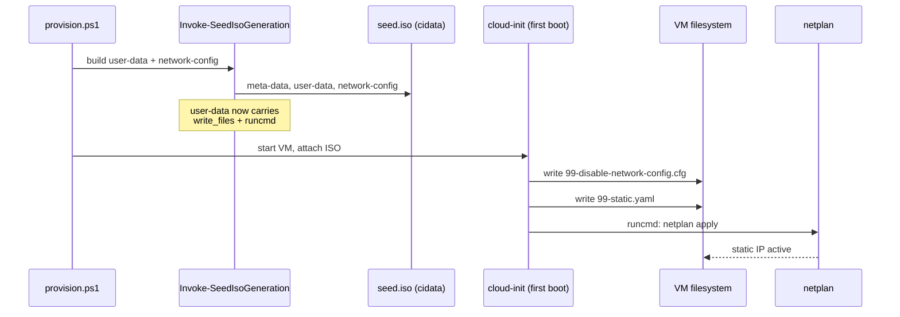
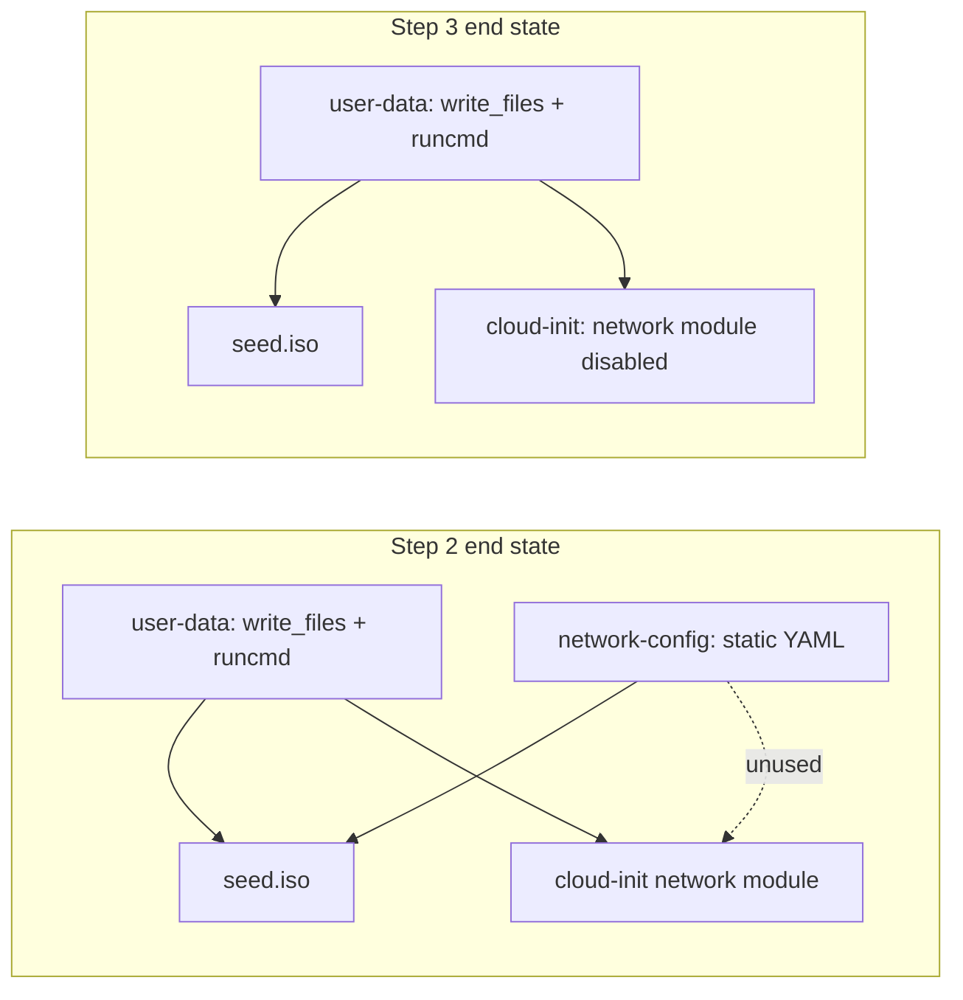
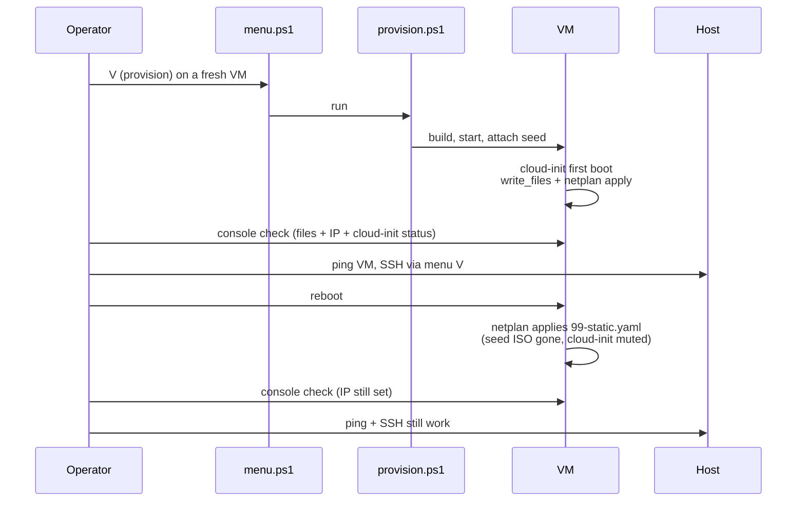

# 40 - Static network config - plan

Background and rationale: see [problem.md](./problem.md).

## Index

- [Step 1 - Extract netplan YAML builder](#step-1---extract-netplan-yaml-builder)
- [Step 2 - Deliver disable flag and static netplan via user-data](#step-2---deliver-disable-flag-and-static-netplan-via-user-data)
- [Step 3 - Drop the seed `network-config` file](#step-3---drop-the-seed-network-config-file)
- [Step 4 - End-to-end verification on a fresh provision](#step-4---end-to-end-verification-on-a-fresh-provision)

---

## Step 1 - Extract netplan YAML builder

**Reason.** The static netplan YAML is currently composed inline in
[`generate-seed-iso.ps1`](../../../../hyper-v/ubuntu/up/seed/generate-seed-iso.ps1)
and used in exactly one place (the seed's `network-config` file).
Step 2 needs the same YAML embedded inside `user-data` as a
`write_files` payload, so the YAML construction must become a single
function with one set of unit tests. This step is a pure refactor -
no behaviour change, no on-disk artefact difference.

**Scope.**

- Add `hyper-v/ubuntu/up/seed/New-StaticNetplanYaml.ps1` exporting
  `New-StaticNetplanYaml -IpAddress -SubnetMask -Gateway -Dns`.
  Returns the v2 netplan YAML string the seed currently inlines
  (match `driver: hv_netvsc`, `dhcp4: false`, address, default
  route via gateway, single nameserver).
- Update `Invoke-SeedIsoGeneration` to call the new function.
- The function lives next to its only caller in `up/seed/` because it
  is a seed-content concern, not a generic helper.

**Tests.**

- `Tests/up/seed/New-StaticNetplanYaml.Tests.ps1` (unit, pure).
- Cases: produces the expected YAML for a representative VM; CIDR is
  composed from `IpAddress/SubnetMask`; only the supplied DNS appears;
  default route uses the supplied gateway; YAML round-trips through
  `ConvertFrom-Yaml` / structural comparison so whitespace drift in
  the template does not silently break the contract.
- Existing `Invoke-SeedIsoGeneration` tests must still pass unchanged
  (proves the refactor is behaviour-preserving).

---

## Step 2 - Deliver disable flag and static netplan via user-data

**Reason.** This is the substantive fix from
[problem.md - What needs to change](./problem.md#what-needs-to-change).
After this step, cloud-init stops owning `/etc/netplan/*.yaml` and
netplan reads a file the provisioner wrote directly. The seed still
runs (user creation, ssh_pwauth, packages) but no longer drives the
network leg.

**Scope.**

- In `Invoke-SeedIsoGeneration`, add a `write_files:` section to the
  `user-data` cloud-config containing two entries:
  1. `/etc/cloud/cloud.cfg.d/99-disable-network-config.cfg`, content
     `network: {config: disabled}`, mode `0644`.
  2. `/etc/netplan/99-static.yaml`, content from
     `New-StaticNetplanYaml` (step 1), mode `0600`. `99-` outranks
     the legacy `50-cloud-init.yaml` so behaviour is deterministic
     even if cloud-init writes one before being silenced.
- Add a `runcmd:` step running `netplan apply` so the static config
  goes live during cloud-init's first-boot run, before SSH polling
  begins.
- `network-config` file in the seed is left in place for now -
  removal happens in step 3 so this step is bounded to "make it work"
  and step 3 is bounded to "remove the now-redundant path".
- `write_files` ordering: cloud-init writes files before running
  modules that consume them; the disable flag landing on disk is what
  prevents the network module from clobbering `99-static.yaml` on any
  subsequent boot.

**Tests.**

- Extend `Tests/up/seed/Invoke-SeedIsoGeneration.Tests.ps1`:
  - `user-data` contains a `write_files` block with both target paths.
  - The disable-config payload is exactly
    `network: {config: disabled}` (string match - cloud-init parses
    this verbatim).
  - The netplan payload equals
    `New-StaticNetplanYaml` output for the same VM (delegated, so the
    YAML shape is tested once in step 1).
  - File modes are `0644` and `0600` respectively.
  - `runcmd` contains a single `netplan apply` entry.
- No new integration tests in this step - integration coverage is the
  scope of step 4.

**Diagram.**

---

## Step 3 - Drop the seed `network-config` file

**Reason.** After step 2, the seed's `network-config` file is dead
code: cloud-init's network module is disabled on first boot by the
write_files-delivered flag, so nothing reads `network-config`
anymore. Keeping it invites future confusion ("which file is
authoritative?") and keeps the inline-YAML path alive as a second
source of truth, defeating the point of the fix.

**Scope.**

- Remove the `network-config` key from the `$Files` hashtable passed
  to `New-SeedIso` in `Invoke-SeedIsoGeneration`.
- Remove the `$networkConfig` block construction.
- `New-StaticNetplanYaml` stays - step 2 still uses it.
- `New-SeedIso` (in [`iso.ps1`](../../../../hyper-v/ubuntu/up/seed/iso.ps1))
  is generic over the file map and needs no change; verify no caller
  hard-codes `network-config`.

**Tests.**

- Update `Tests/up/seed/Invoke-SeedIsoGeneration.Tests.ps1`: the file
  map passed to `New-SeedIso` contains exactly `meta-data` and
  `user-data` (no `network-config`).
- Remove tests that asserted properties of the now-removed
  `network-config` payload.

**Diagram.**

---

## Step 4 - End-to-end verification on a fresh provision

**Reason.** Unit tests in steps 1-3 prove the seed *content* is right.
They cannot prove cloud-init parses it, applies it, and that netplan
brings the interface up - that requires a real provision against the
Hyper-V host. This step is the gate that lets us close feature 40.

**Scope.**

- Pick a disposable VM definition and run
  `hyper-v/ubuntu/deprovision.ps1` (if it exists) then
  `hyper-v/ubuntu/provision.ps1` via the operator menu.
- On the fresh VM, verify at the console:
  - `/etc/cloud/cloud.cfg.d/99-disable-network-config.cfg` exists,
    contains `network: {config: disabled}`.
  - `/etc/netplan/99-static.yaml` exists, mode `0600`, matches the
    `New-StaticNetplanYaml` output for that VM's config.
  - `ip -4 addr show` lists the configured static IP on `eth0`.
  - `cloud-init status` is `done` and exit code 0.
- From the host, `ping` and SSH (via the menu's `V` action) reach the
  VM.
- Reboot the VM, repeat the four VM-side checks - confirms the
  config survives without the seed ISO being consumed again.
- Update `README.md` (Provisioner) with one paragraph under the
  networking section: "static IP is set by a netplan file written
  via cloud-init `write_files`; cloud-init network management is
  disabled by `/etc/cloud/cloud.cfg.d/99-disable-network-config.cfg`."
  Linked from the doc index.

**Tests.**

- This step IS the integration test - executed manually because we
  do not have a clean Hyper-V test harness for full provisions.
- If any check fails, fix in a follow-up commit on the same branch;
  do not declare feature 40 done until the post-reboot checks pass.

**Diagram.**

