# Plan: Declarative Toolchain Reconciliation + .NET SDK

See [problem.md](problem.md) for context, decisions, and acceptance
criteria. This plan turns those decisions into the smallest
committable steps that each carry their own tests.

## Index

- [Shape of the change](#shape-of-the-change)
- [Phase A - Orchestrator skeleton (no providers)](#phase-a---orchestrator-skeleton-no-providers)
  - [Step 1 - Provider interface contract + HyperV dependency pin](#step-1---provider-interface-contract--hyperv-dependency-pin)
  - [Step 2 - Manifest schema and helpers](#step-2---manifest-schema-and-helpers)
  - [Step 3 - Reconciliation diff engine](#step-3---reconciliation-diff-engine)
  - [Step 4 - Reconciliation executor](#step-4---reconciliation-executor)
  - [Step 5 - Wire orchestrator into post-provisioning](#step-5---wire-orchestrator-into-post-provisioning)
- [Phase B - JDK migration onto the orchestrator](#phase-b---jdk-migration-onto-the-orchestrator)
  - [Step 6 - JdkProvider: Get-DesiredVersions](#step-6---jdkprovider-get-desiredversions)
  - [Step 7 - JdkProvider: Get-InstalledVersions](#step-7---jdkprovider-get-installedversions)
  - [Step 8 - JdkProvider: Install-Version](#step-8---jdkprovider-install-version)
  - [Step 9 - JdkProvider: Uninstall-Version](#step-9---jdkprovider-uninstall-version)
  - [Step 10 - Switch dispatch from Install-Jdk to JdkProvider; supersede feature 31](#step-10---switch-dispatch-from-install-jdk-to-jdkprovider-supersede-feature-31)
  - [Step 11 - E2E for reconciler (JDK)](#step-11---e2e-for-reconciler-jdk)
- [Phase C - .NET SDK provider](#phase-c---net-sdk-provider)
  - [Step 12 - Assert-DotnetSdkField validator](#step-12---assert-dotnetsdkfield-validator)
  - [Step 13 - Resolve-DotnetSdkRelease](#step-13---resolve-dotnetsdkrelease)
  - [Step 14 - Invoke-DotnetSdkAcquisition](#step-14---invoke-dotnetsdkacquisition)
  - [Step 15 - Wire prefetch into Invoke-VmAcquisitions](#step-15---wire-prefetch-into-invoke-vmacquisitions)
  - [Step 16 - DotnetSdkProvider: Get-DesiredVersions and Get-InstalledVersions](#step-16---dotnetsdkprovider-get-desiredversions-and-get-installedversions)
  - [Step 17 - DotnetSdkProvider: Install-Version](#step-17---dotnetsdkprovider-install-version)
  - [Step 18 - DotnetSdkProvider: Uninstall-Version](#step-18---dotnetsdkprovider-uninstall-version)
  - [Step 19 - Register DotnetSdkProvider + E2E coverage](#step-19---register-dotnetsdkprovider--e2e-coverage)

The nested-provider walker and its E2E coverage moved to
[43 - dotnet nuget](../43%20-%20dotnet%20nuget/plan.md) (Steps 1-2 there),
where the first real nested provider also lands. This feature ships
the manifest schema with a `children` field that always stays empty.

Per the project's one-version-bump-per-feature rule, the only
manifest edit in this plan is the `Infrastructure.HyperV`
minimum-version bump in Step 1 (to consume the primitives shipped by
feature 14 at `0.9.0`). `Infrastructure-Vm-Provisioner` is a script
repo with no module manifest of its own.

## Shape of the change

A new reconciliation layer in `hyper-v/ubuntu/up/reconciler/` dispatches
each toolchain to its own provider in JSON-declaration order. Providers
implement four operations (`Get-DesiredVersions`,
`Get-InstalledVersions`, `Install-Version`, `Uninstall-Version`).
Discovery uses sidecar manifests under
`/var/lib/infra-provisioner/manifests/` on the VM. Every guest-side
side effect (tarball extract, profile.d write, symlink, dir removal,
process kill) goes through the
`Infrastructure.HyperV` primitives from
[feature 14](../../../../../Infrastructure-HyperV/docs/dev/implementation/14%20-%20vm-install-primitives/problem.md).

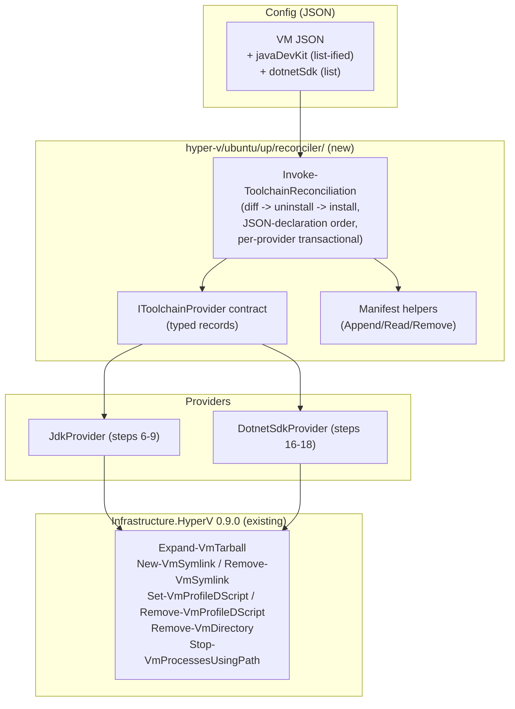
```mermaid
flowchart TD
    subgraph Config ["Config (JSON)"]
        JSON["VM JSON\n+ javaDevKit (list-ified)\n+ dotnetSdk (list)"]
    end

    subgraph Reconciler ["hyper-v/ubuntu/up/reconciler/ (new)"]
        ORCH["Invoke-ToolchainReconciliation\n(diff -> uninstall -> install,\nJSON-declaration order,\nper-provider transactional)"]
        IFACE["IToolchainProvider contract\n(typed records)"]
        MAN["Manifest helpers\n(Append/Read/Remove)"]
    end

    subgraph Providers ["Providers"]
        JDKP["JdkProvider (steps 6-9)"]
        DOTP["DotnetSdkProvider (steps 16-18)"]
    end

    subgraph HyperV ["Infrastructure.HyperV 0.9.0 (existing)"]
        PRIM["Expand-VmTarball\nNew-VmSymlink / Remove-VmSymlink\nSet-VmProfileDScript / Remove-VmProfileDScript\nRemove-VmDirectory\nStop-VmProcessesUsingPath"]
    end

    JSON --> ORCH
    ORCH --> IFACE
    IFACE --> JDKP
    IFACE --> DOTP
    ORCH --> MAN
    JDKP --> PRIM
    DOTP --> PRIM
```

---

## Phase A - Orchestrator skeleton (no providers)

Phase A builds the orchestrator with zero providers wired in. After
Phase A, `provision.ps1` runs end-to-end with the reconciler enabled
but no-op (no providers registered). JDK is still installed by the
legacy `Install-Jdk` path until Phase B switches the dispatch.

## Step 1 - Provider interface contract + HyperV dependency pin

**Reason.** Codifies the four operations every provider must
implement so subsequent steps have a contract to test against. No
behaviour yet, just the shape: typed records for desired specs and
installed records, and a static "this is a provider" assertion the
orchestrator uses to fail loud on a malformed implementation. Lands
first because Steps 2-4 build *against* this contract.

Also bumps the `Infrastructure.HyperV` `-MinimumVersion` pin from
`0.8.0` to `0.9.0` in this same commit, even though no code in
Steps 1-7 actually calls a new HyperV primitive. PSGallery already
resolves `-MinimumVersion '0.8.0'` to whatever the latest published
version is, so the bump is a contract assertion rather than a
runtime gate - but landing it up-front protects unusual install
paths (offline copies, internal mirrors, version-locked CI runners)
from drifting below the floor the rest of the plan requires.

**Files**

- `hyper-v/ubuntu/up/reconciler/Provider-Contract.ps1` (new) -
  doc-style file holding the contract as comments plus a small
  `Assert-ToolchainProvider` helper that throws if a passed-in
  hashtable does not have the four expected function references.
- `Tests/up/reconciler/Provider-Contract.Tests.ps1` (new).
- `hyper-v/ubuntu/Install-ModuleDependencies.ps1` - bump the
  `Infrastructure.HyperV` `-MinimumVersion` from `0.8.0` to `0.9.0`.
- `README.md` - bump the `Infrastructure.HyperV` row in the
  dependencies table to `>= 0.9.0`.

**Behaviour**

- A provider is a `[PSCustomObject]` (or hashtable) with these
  required members:

  | Member | Type | Returns |
  |--------|------|---------|
  | `Name` | string | e.g. `'javaDevKit'`, `'dotnetSdk'` - the JSON field this provider consumes. |
  | `Get-DesiredVersions` | scriptblock `($vmConfig)` | `$null` when the field is absent (skip), `@()` when explicitly empty (ensure none), array of typed spec objects otherwise. |
  | `Get-InstalledVersions` | scriptblock `($sshClient)` | array of typed installed records (`{ Provider, Version, InstallPath, ManifestPath }`). Empty array when nothing is installed. |
  | `Install-Version` | scriptblock `($sshClient, $server, $spec)` | installs one version, writes its manifest. Throws on failure. |
  | `Uninstall-Version` | scriptblock `($sshClient, $installed)` | uninstalls one version using its manifest. Throws on failure. |

- `Assert-ToolchainProvider -Provider $p` throws naming the missing
  member when any required member is absent or has the wrong type.

**Tests (unit)**

- Valid provider object passes the assertion silently.
- Missing each of the five members in turn: one case per member,
  message names the missing one.
- `Name` not a string, scriptblocks not scriptblocks: one case per
  type mismatch.

**Mermaid**

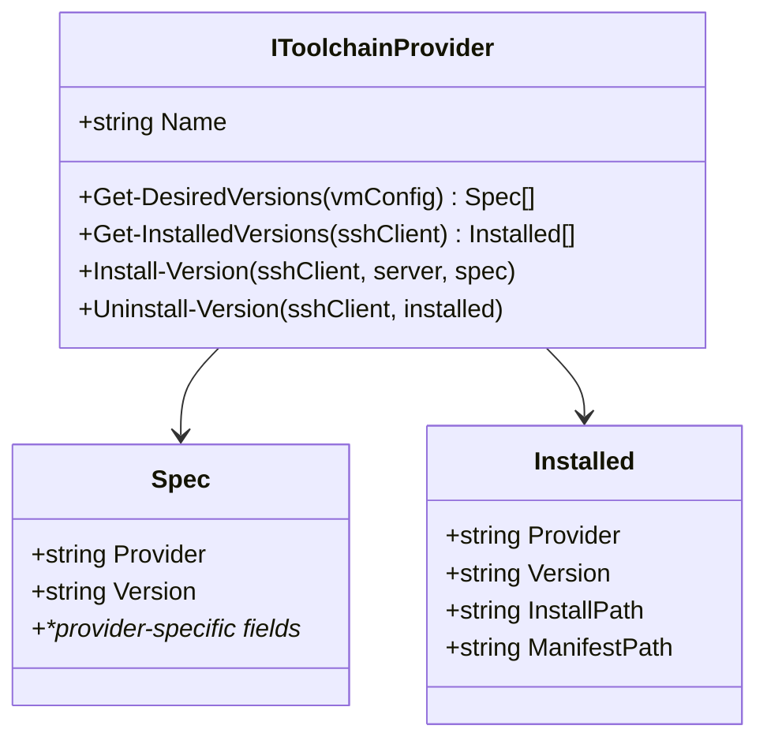
```mermaid
classDiagram
    class IToolchainProvider {
        +string Name
        +Get-DesiredVersions(vmConfig) Spec[]
        +Get-InstalledVersions(sshClient) Installed[]
        +Install-Version(sshClient, server, spec)
        +Uninstall-Version(sshClient, installed)
    }
    class Spec {
        +string Provider
        +string Version
        +*provider-specific fields*
    }
    class Installed {
        +string Provider
        +string Version
        +string InstallPath
        +string ManifestPath
    }
    IToolchainProvider --> Spec
    IToolchainProvider --> Installed
```

**README** No edit yet (the public surface is internal to the
reconciler; it shows up in README at Step 5).

---

## Step 2 - Manifest schema and helpers

**Reason.** Establishes the truth source for "what is installed".
Providers in Phase B and C call these helpers to read and write
manifests; the diff engine in Step 3 calls `Get-InstalledVersions` on
each provider, which in turn calls these helpers. Lands ahead of the
engine so the engine has a real read path to test against.

**Files**

- `hyper-v/ubuntu/up/reconciler/Read-VmManifest.ps1` (new) - reads
  one manifest by path from the VM via
  `Invoke-SshClientCommand`, returns a `PSCustomObject`.
- `hyper-v/ubuntu/up/reconciler/Get-VmManifestsByProvider.ps1`
  (new) - enumerates
  `/var/lib/infra-provisioner/manifests/{provider}-*.json` and
  parses each.
- `hyper-v/ubuntu/up/reconciler/Write-VmManifest.ps1` (new) -
  serialises a manifest object host-side, streams it via
  `Set-VmProfileDScript`-style atomic write through a small bash
  fragment, owner `root:root`, mode `0644`.
- `hyper-v/ubuntu/up/reconciler/Remove-VmManifest.ps1` (new) -
  `rm -f` one manifest file via `Invoke-SshClientCommand`.
- `hyper-v/ubuntu/up/reconciler/Initialize-VmManifestStore.ps1`
  (new) - ensures `/var/lib/infra-provisioner/manifests/` exists
  with `root:root 0755`. Idempotent.
- `Tests/up/reconciler/{Read,Write,Remove,Get-...,Initialize-...}.Tests.ps1` (new).

**Behaviour**

- Manifest schema, v1 (stamped explicitly so future shape changes
  are non-breaking - see problem.md open question 1):

  ```json
  {
    "schemaVersion": 1,
    "provider":            "dotnetSdk",
    "version":             "10.0.100",
    "ownedPaths":          ["/opt/dotnet-10.0.100"],
    "ownedSymlinks":       [{ "path": "/usr/local/bin/dotnet",
                              "target": "/opt/dotnet-10.0.100/dotnet" }],
    "ownedProfileScripts": ["dotnet"],
    "children":            []
  }
  ```

- `Read-VmManifest -SshClient -Path` returns a `PSCustomObject` or
  throws if the file is missing / malformed JSON / wrong
  `schemaVersion`.
- `Get-VmManifestsByProvider -SshClient -Provider` returns
  `@()` when the store is empty or the dir is missing (no throw -
  the absence of installs is a valid state for `Get-InstalledVersions`).
- `Write-VmManifest -SshClient -Manifest` serialises via
  `ConvertTo-Json -Depth 6` host-side and writes atomically (temp +
  `mv`) via a small bash fragment under sudo. Owner `root:root`,
  mode `0644`.
- `Remove-VmManifest -SshClient -Path` is idempotent
  (`rm -f`).
- `Initialize-VmManifestStore` is idempotent and is the only place
  this plan creates `/var/lib/infra-provisioner/`.

**Tests (unit)**

- `Read-VmManifest`: parses a canned JSON, rejects missing
  `schemaVersion`, rejects `schemaVersion != 1`, rejects malformed
  JSON. Mock `Invoke-SshClientCommand` returning the canned text.
- `Get-VmManifestsByProvider`: parses two valid manifests, ignores
  files under the dir that do not match the provider prefix, returns
  `@()` when `ls` exits non-zero with "no such file or directory".
- `Write-VmManifest`: emitted bash contains `mktemp`, the
  host-serialised JSON, `chown root:root`, `chmod 0644`, `mv`. JSON
  is byte-for-byte the result of `ConvertTo-Json -Depth 6` on the
  input.
- `Remove-VmManifest`: emitted bash is `sudo rm -f -- '<path>'`.
- `Initialize-VmManifestStore`: emitted bash is
  `sudo mkdir -p ... && sudo chown root:root ... && sudo chmod 0755 ...`.
  Re-run does not throw.

**Mermaid**

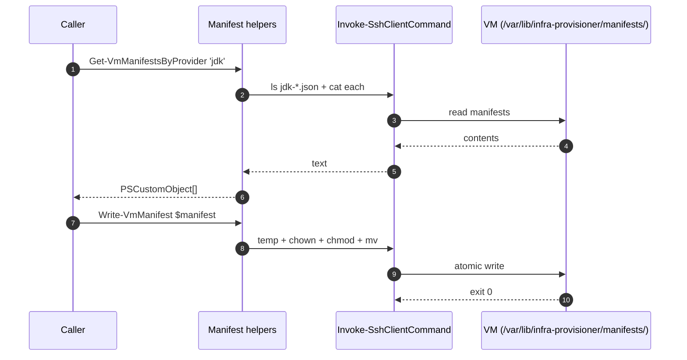
```mermaid
sequenceDiagram
    autonumber
    participant Caller
    participant Helpers as Manifest helpers
    participant SSH as Invoke-SshClientCommand
    participant VM as VM (/var/lib/infra-provisioner/manifests/)

    Caller->>Helpers: Get-VmManifestsByProvider 'jdk'
    Helpers->>SSH: ls jdk-*.json + cat each
    SSH->>VM: read manifests
    VM-->>SSH: contents
    SSH-->>Helpers: text
    Helpers-->>Caller: PSCustomObject[]

    Caller->>Helpers: Write-VmManifest $manifest
    Helpers->>SSH: temp + chown + chmod + mv
    SSH->>VM: atomic write
    VM-->>SSH: exit 0
```

**README** No edit yet (helpers are internal to the reconciler).

---

## Step 3 - Reconciliation diff engine

**Reason.** Computes `{ toUninstall, toInstall, noOp }` for one
provider given its desired and installed sets. Pure function over
typed inputs, so it is independently testable with no SSH, no I/O,
no providers actually wired up. Lands before the executor so the
executor's review is focused on ordering and error handling rather
than on diff correctness.

**Files**

- `hyper-v/ubuntu/up/reconciler/Get-ProvisioningPlan.ps1` (new).
- `Tests/up/reconciler/Get-ProvisioningPlan.Tests.ps1` (new).

**Behaviour**

- Signature:
  `Get-ProvisioningPlan -DesiredVersions -InstalledVersions -ProviderName`.
- `DesiredVersions` of `$null` means "don't touch" - returns
  `{ ToUninstall = @(); ToInstall = @(); NoOp = $InstalledVersions; SkipProvider = $true }`.
- `DesiredVersions` of `@()` means "ensure none" - returns
  `{ ToUninstall = $InstalledVersions; ToInstall = @(); NoOp = @(); SkipProvider = $false }`.
- Otherwise, match by `Version` field:
  - in desired AND installed (same version) -> NoOp
  - in desired only -> ToInstall
  - in installed only -> ToUninstall
- Throws when an installed record has a different `Provider` from
  `-ProviderName` (defensive; the caller should not pass cross-provider
  records).

**Tests (unit)**

Each case asserts the three arrays. No mocks (pure function).

- Desired `$null`: SkipProvider true; all three arrays empty
  (installed pass-through via NoOp).
- Desired `@()`, installed has two records: ToUninstall is those
  two; others empty.
- Desired one, installed empty: ToInstall is that one.
- Desired one matching installed one: NoOp is that one; others
  empty.
- Desired `{10.0.100}`, installed `{10.0.099}`: ToUninstall
  `{10.0.099}`, ToInstall `{10.0.100}`.
- Cross-provider installed record: throws.

**Mermaid**

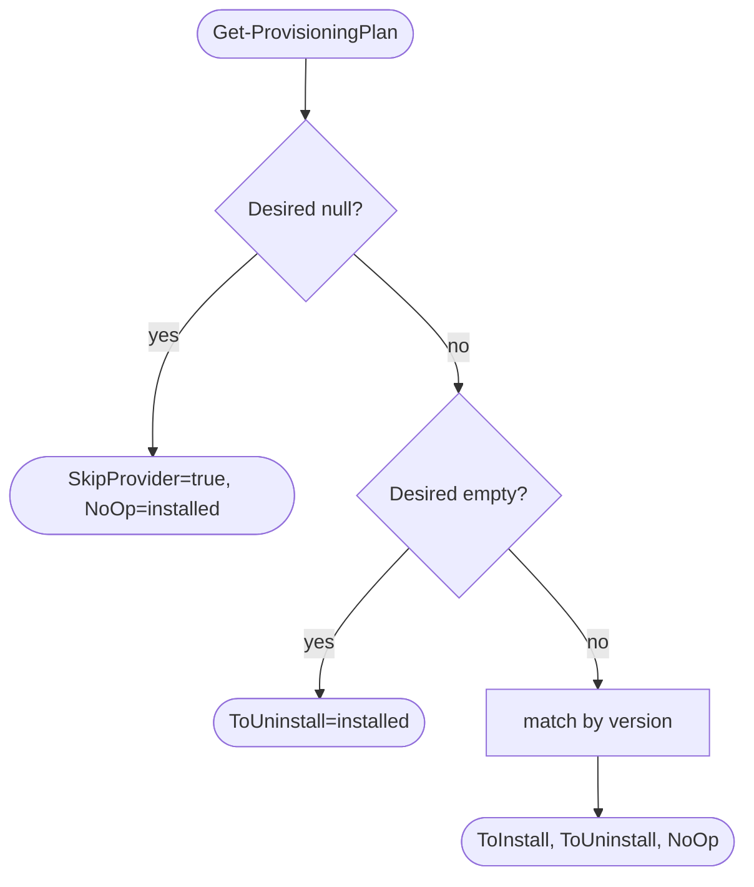
```mermaid
flowchart TD
    Start([Get-ProvisioningPlan]) --> D{Desired null?}
    D -->|yes| Skip(["SkipProvider=true, NoOp=installed"])
    D -->|no| E{Desired empty?}
    E -->|yes| All([ToUninstall=installed])
    E -->|no| Diff[match by version]
    Diff --> Out(["ToInstall, ToUninstall, NoOp"])
```

**README** No edit yet.

---

## Step 4 - Reconciliation executor

**Reason.** Walks the diff for each provider in JSON-declaration
order, executes `Uninstall-Version` then `Install-Version`, captures
per-provider exceptions so one broken toolchain does not block
others, exits non-zero at the end if any provider failed. The
ordering and transactional semantics are the meaningful design
decisions and merit a focused step.

**Files**

- `hyper-v/ubuntu/up/reconciler/Invoke-ToolchainReconciliation.ps1` (new).
- `Tests/up/reconciler/Invoke-ToolchainReconciliation.Tests.ps1` (new).

**Behaviour**

- Signature:
  `Invoke-ToolchainReconciliation -SshClient -Server -Vm -Providers`.
- Walks `$Providers` in array order (the array is built host-side
  from the VM's JSON in declaration order; see Step 5).
- For each provider:
  1. `Assert-ToolchainProvider` it (cheap defence; bad provider
     fails this provider, not the loop).
  2. Compute `desired = Get-DesiredVersions $Vm`.
  3. If `SkipProvider` (desired was `$null`), continue.
  4. Compute `installed = Get-InstalledVersions $SshClient`.
  5. `plan = Get-ProvisioningPlan ...`.
  6. For each `ToUninstall`: `Uninstall-Version $SshClient $installed`.
  7. For each `ToInstall`: `Install-Version $SshClient $Server $spec`.
- Any exception from any step is caught, logged with the provider
  name, recorded in a `$failures` array, and the loop continues to
  the next provider.
- At end: if `$failures` is non-empty, throw an aggregate exception
  naming all failed providers.

**Tests (unit)**

Mock providers as `[PSCustomObject]`s with scriptblock members.
Assert call order and exception aggregation.

- Two providers, both succeed: each `Get-Desired`, `Get-Installed`,
  and their respective `Install` / `Uninstall` calls happen in the
  documented order, providers are visited in array order.
- First provider `Get-DesiredVersions` returns `$null`: that
  provider's `Get-InstalledVersions` is NOT called (assert with
  mock counter).
- First provider's `Install-Version` throws: second provider still
  runs; aggregate exception at end names the first.
- Both providers throw: aggregate exception names both, message
  contains both provider names and both inner messages.
- Uninstalls happen before installs within one provider (assert with
  call-order mock).

**Mermaid**

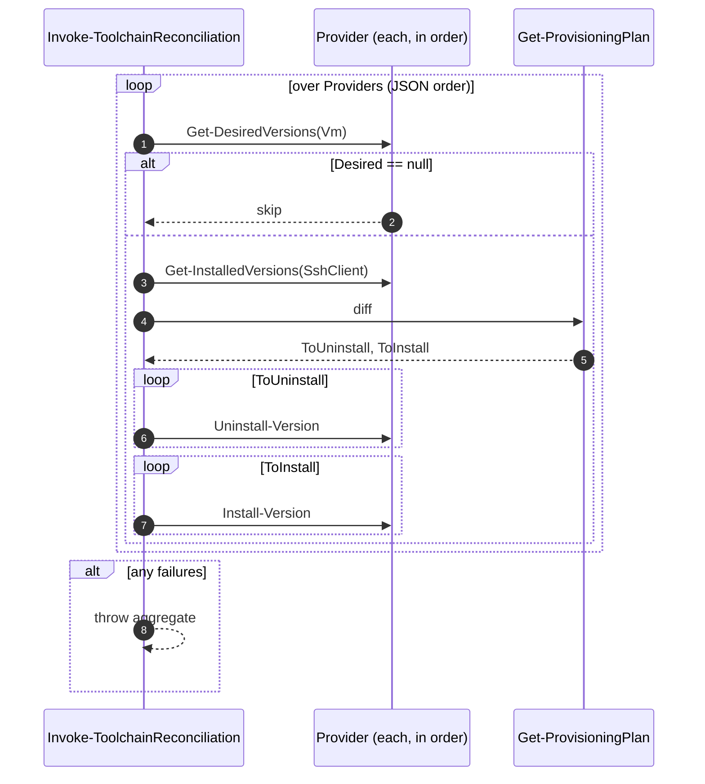
```mermaid
sequenceDiagram
    autonumber
    participant Orch as Invoke-ToolchainReconciliation
    participant P as Provider (each, in order)
    participant Plan as Get-ProvisioningPlan

    loop over Providers (JSON order)
        Orch->>P: Get-DesiredVersions(Vm)
        alt Desired == null
            P-->>Orch: skip
        else
            Orch->>P: Get-InstalledVersions(SshClient)
            Orch->>Plan: diff
            Plan-->>Orch: ToUninstall, ToInstall
            loop ToUninstall
                Orch->>P: Uninstall-Version
            end
            loop ToInstall
                Orch->>P: Install-Version
            end
        end
    end
    alt any failures
        Orch-->>Orch: throw aggregate
    end
```

**README** No edit yet.

---

## Step 5 - Wire orchestrator into post-provisioning

**Reason.** Lands the integration point. After this step
`provision.ps1` end-to-end works exactly as before (no providers
registered yet -> orchestrator is a no-op) but the reconciler call
site exists and the manifest store is initialised on every VM.

**Files**

- `hyper-v/ubuntu/up/post/Invoke-VmPostProvisioning.ps1` - add a
  call to `Initialize-VmManifestStore` near the top of the per-VM
  loop, and a call to `Invoke-ToolchainReconciliation` with an
  empty `$Providers` array near the bottom (just before the
  existing `Install-Jdk` call, which stays for now and is removed in
  Step 10).
- `Tests/up/post/Invoke-VmPostProvisioning.Tests.ps1` - new cases:
  - `Initialize-VmManifestStore` is invoked exactly once per VM
    (mocked).
  - `Invoke-ToolchainReconciliation` is invoked exactly once per VM
    (mocked).
  - With no providers registered, `Install-Jdk` is still invoked
    (regression guard for the parallel path).
- `README.md` - new "Reconciler" subsection under the post-provisioning
  flow, with a forward reference to providers landing in Phase B
  and C.

**Behaviour**

- The orchestrator call accepts an empty `$Providers` array
  silently. After Step 10 the JdkProvider is added; after Step 19
  the DotnetSdkProvider is added.
- Provider registration lives in a single `Get-Providers` helper in
  `hyper-v/ubuntu/up/reconciler/Get-Providers.ps1` (new in this
  step, returns `@()` until later steps populate it).

**Tests (unit)**

- `Get-Providers` returns `@()` in this step (assert by count).
- `Invoke-VmPostProvisioning` end-to-end (mocked) calls
  `Initialize-VmManifestStore` then later `Invoke-ToolchainReconciliation`
  with the array returned by `Get-Providers`.

**Mermaid**

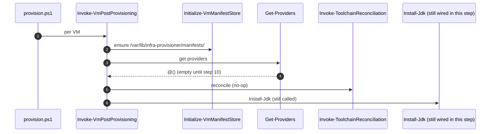
```mermaid
sequenceDiagram
    autonumber
    participant Prov as provision.ps1
    participant Post as Invoke-VmPostProvisioning
    participant Init as Initialize-VmManifestStore
    participant Reg as Get-Providers
    participant Orch as Invoke-ToolchainReconciliation
    participant Legacy as Install-Jdk (still wired in this step)

    Prov->>Post: per VM
    Post->>Init: ensure /var/lib/infra-provisioner/manifests/
    Post->>Reg: get providers
    Reg-->>Post: @() (empty until step 10)
    Post->>Orch: reconcile (no-op)
    Post->>Legacy: Install-Jdk (still called)
```

**README** Adds the Reconciler subsection + the dependency bump.

---

## Phase B - JDK migration onto the orchestrator

After Phase B, `Install-Jdk` and `Uninstall-Jdk` are gone, the JDK is
managed entirely by the reconciler, feature 31 is superseded, and
E2E covers the new path including version-change and "drop the
`javaDevKit` field to uninstall" cases.

## Step 6 - JdkProvider: Get-DesiredVersions

**Reason.** Smallest of the four provider operations - pure parse
of the existing `javaDevKit` JSON field into a typed spec. Lands
first so subsequent provider steps have a real desired-shape to
return / test against.

**Files**

- `hyper-v/ubuntu/up/jdk/JdkProvider.Get-DesiredVersions.ps1` (new).
- `Tests/up/jdk/JdkProvider.Get-DesiredVersions.Tests.ps1` (new).

**Behaviour**

- Accepts the existing scalar shape (`javaDevKit: { vendor, version }`)
  and the new list shape (`javaDevKit: [{ vendor, version }, ...]`).
  Scalar is normalised to a one-element list at this layer so the
  rest of the provider sees one shape.
- Absent field -> `$null` (skip).
- Explicit `null` or `@()` -> `@()` (ensure none).
- Returns array of
  `[PSCustomObject]@{ Provider='javaDevKit'; Vendor; Version }`.
- v1 of the provider constrains the list to length 1 (multi-version
  is out of scope per problem.md). Length > 1 throws with the offending
  count.

**Tests (unit)**

- Absent: returns `$null`.
- Scalar: returns one-element array.
- List of one: returns one-element array.
- Explicit `null` or `@()`: returns empty array.
- List of two: throws with "v1 supports one JDK per VM".

**Mermaid**

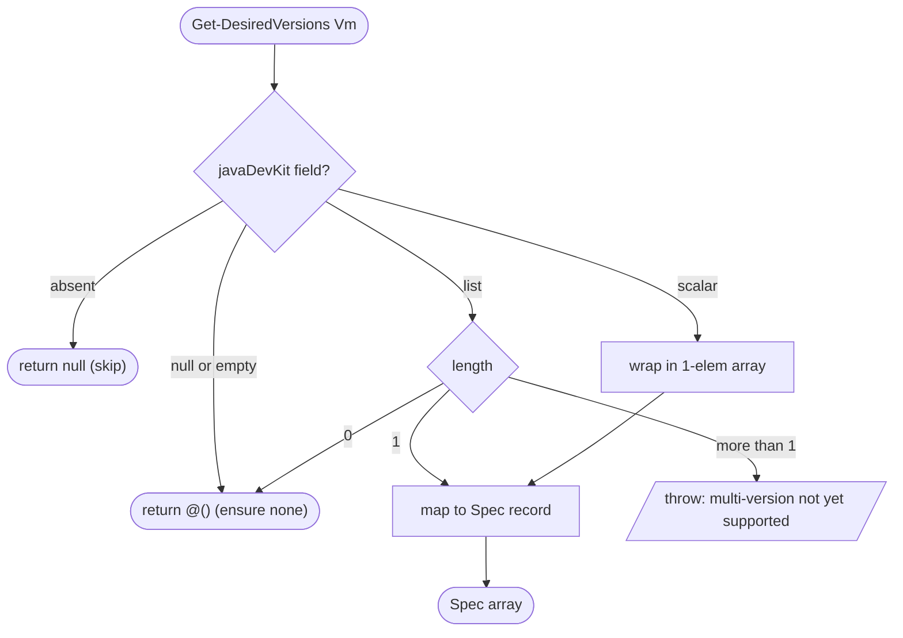
```mermaid
flowchart TD
    Start(["Get-DesiredVersions Vm"]) --> A{javaDevKit field?}
    A -->|absent| Skip(["return null (skip)"])
    A -->|"null or empty"| None(["return @() (ensure none)"])
    A -->|scalar| Wrap["wrap in 1-elem array"]
    A -->|list| L{length}
    L -->|0| None
    L -->|1| Spec["map to Spec record"]
    L -->|"more than 1"| Throw[/"throw: multi-version not yet supported"/]
    Wrap --> Spec
    Spec --> Out(["Spec array"])
```

**README** No edit (provider behaviour visible at Step 10).

---

## Step 7 - JdkProvider: Get-InstalledVersions

**Reason.** Reads manifests written by future JDK installs. Lands
before `Install-Version` so the install step's tests can assert
"the manifest I just wrote round-trips through this function".

**Files**

- `hyper-v/ubuntu/up/jdk/JdkProvider.Get-InstalledVersions.ps1` (new).
- `Tests/up/jdk/JdkProvider.Get-InstalledVersions.Tests.ps1` (new).

**Behaviour**

- Calls
  `Get-VmManifestsByProvider -SshClient $SshClient -Provider 'javaDevKit'`.
- Maps each manifest to
  `[PSCustomObject]@{ Provider; Version; InstallPath; ManifestPath }`.
- `InstallPath` comes from `ownedPaths[0]` (the JDK install dir;
  guaranteed first by the JdkProvider's manifest writer in Step 8).
- Returns `@()` when no manifests exist.

**Tests (unit)**

Mock `Get-VmManifestsByProvider` returning canned manifest objects.

- No manifests: returns `@()`.
- One manifest with one `ownedPath`: returns one record with the
  expected `Version`, `InstallPath`, `ManifestPath`.
- Manifest missing `ownedPaths` or with empty array: throws with the
  manifest path in the message.

**Mermaid**

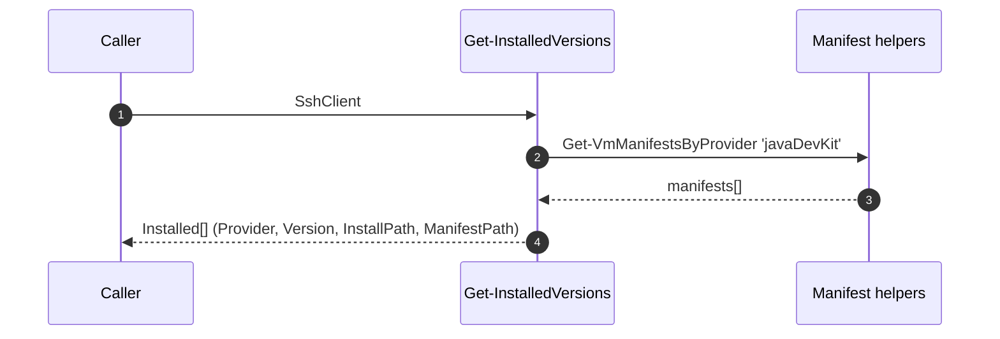
```mermaid
sequenceDiagram
    autonumber
    participant Caller
    participant GIV as Get-InstalledVersions
    participant MH as Manifest helpers

    Caller->>GIV: SshClient
    GIV->>MH: Get-VmManifestsByProvider 'javaDevKit'
    MH-->>GIV: manifests[]
    GIV-->>Caller: Installed[] (Provider, Version, InstallPath, ManifestPath)
```

**README** No edit.

---

## Step 8 - JdkProvider: Install-Version

**Reason.** The composition step - tarball extract + symlinks +
profile.d script + manifest write, all using HyperV 0.9.0 primitives.
Replaces the heredoc currently inside
[Install-Jdk](../../../../hyper-v/ubuntu/up/post/Install-Jdk.ps1).

**Files**

- `hyper-v/ubuntu/up/jdk/JdkProvider.Install-Version.ps1` (new).
- `Tests/up/jdk/JdkProvider.Install-Version.Tests.ps1` (new).

**Behaviour**

Given `$spec = { Provider; Vendor; Version }`:

1. Resolve the cached tarball path (set by
   `Invoke-JdkAcquisition` host-side; today this lives on
   `$Vm._jdkTarballPath`, accessed via a small lookup that this step
   formalises into a parameter).
2. `installDir = "/opt/jdk-$($spec.Vendor)-$($spec.ResolvedVersion)"`.
3. `Expand-VmTarball -SshClient -Server -TarballPath $tarballPath
    -Destination $installDir -StripComponents 1`.
4. `Set-VmProfileDScript -SshClient -Name 'jdk' -Content $jdkSh`
   where `$jdkSh` is the same `JAVA_HOME` / `PATH` content the
   current `Install-Jdk` emits.
5. For each binary in `Get-JdkBinariesForSymlinking`:
   `New-VmSymlink -SshClient -Path "/usr/local/bin/$bin"
    -Target "$installDir/bin/$bin"`.
6. Compose a manifest object:
   ```
   schemaVersion = 1
   provider      = 'javaDevKit'
   version       = $spec.ResolvedVersion
   ownedPaths    = @($installDir)
   ownedSymlinks = @( { path; target } ... )
   ownedProfileScripts = @('jdk')
   children      = @()
   ```
7. `Write-VmManifest -SshClient -Manifest $m` to
   `/var/lib/infra-provisioner/manifests/javaDevKit-$($spec.ResolvedVersion).json`.

**Tests (unit)**

Mock every primitive (`Expand-VmTarball`, `Set-VmProfileDScript`,
`New-VmSymlink`, `Write-VmManifest`).

- All primitives called with the expected arguments, in the expected
  order (extract -> profile.d -> symlinks -> manifest).
- Manifest written last so a crash mid-install does not produce a
  manifest claiming ownership of paths that may not exist.
- A failure in `Expand-VmTarball` causes the rest to NOT run
  (assert with mocks).
- Manifest contents are byte-for-byte the expected JSON.

**Mermaid**

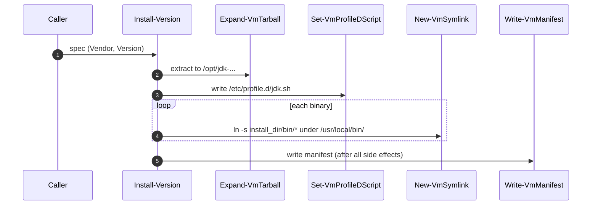
```mermaid
sequenceDiagram
    autonumber
    participant Caller
    participant IV as Install-Version
    participant Tar as Expand-VmTarball
    participant Prof as Set-VmProfileDScript
    participant Sym as New-VmSymlink
    participant Man as Write-VmManifest

    Caller->>IV: spec (Vendor, Version)
    IV->>Tar: extract to /opt/jdk-...
    IV->>Prof: write /etc/profile.d/jdk.sh
    loop each binary
        IV->>Sym: ln -s install_dir/bin/* under /usr/local/bin/
    end
    IV->>Man: write manifest (after all side effects)
```

**README** No edit.

---

## Step 9 - JdkProvider: Uninstall-Version

**Reason.** Mirrors Step 8 on the removal side, using the manifest
as the truth source. Closes the JDK provider's contract.

**Files**

- `hyper-v/ubuntu/up/jdk/JdkProvider.Uninstall-Version.ps1` (new).
- `Tests/up/jdk/JdkProvider.Uninstall-Version.Tests.ps1` (new).

**Behaviour**

Given `$installed = { Provider; Version; InstallPath; ManifestPath }`:

1. `Read-VmManifest -SshClient -Path $installed.ManifestPath`.
2. For each `installDir` in `manifest.ownedPaths`:
   `Stop-VmProcessesUsingPath -SshClient -Path $installDir
    -GraceSeconds 30`. A `StillAlive`-induced exception is logged
   but does not abort the rest of the uninstall (the caller's
   transactional boundary is per-provider, not per-path).
3. For each symlink in `manifest.ownedSymlinks`:
   `Remove-VmSymlink -SshClient -Path $link.path`.
4. For each name in `manifest.ownedProfileScripts`:
   `Remove-VmProfileDScript -SshClient -Name $name`.
5. For each `installDir` in `manifest.ownedPaths`:
   `Remove-VmDirectory -SshClient -Path $installDir`.
6. `Remove-VmManifest -SshClient -Path $installed.ManifestPath`.

**Tests (unit)**

Mock every primitive and `Read-VmManifest`.

- Removal order: processes -> symlinks -> profile.d -> dirs ->
  manifest (manifest last so a crash mid-uninstall leaves the
  manifest claiming ownership of whatever the next run has to clean
  up).
- A `StillAlive` from `Stop-VmProcessesUsingPath` is caught and the
  rest of the uninstall still runs (assert with mocks).
- A failure in `Remove-VmDirectory` propagates and `Remove-VmManifest`
  is NOT called (the manifest is the recovery anchor).
- Manifest with multiple `ownedSymlinks` removes all of them.

**Mermaid**

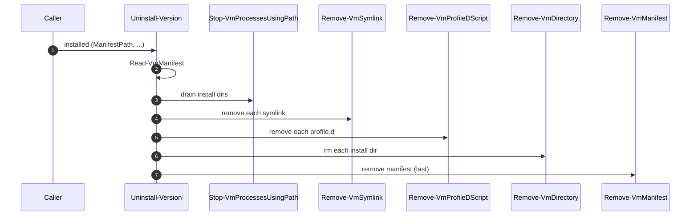
```mermaid
sequenceDiagram
    autonumber
    participant Caller
    participant UV as Uninstall-Version
    participant Stop as Stop-VmProcessesUsingPath
    participant Sym as Remove-VmSymlink
    participant Prof as Remove-VmProfileDScript
    participant Dir as Remove-VmDirectory
    participant Man as Remove-VmManifest

    Caller->>UV: installed (ManifestPath, ...)
    UV->>UV: Read-VmManifest
    UV->>Stop: drain install dirs
    UV->>Sym: remove each symlink
    UV->>Prof: remove each profile.d
    UV->>Dir: rm each install dir
    UV->>Man: remove manifest (last)
```

**README** No edit.

---

## Step 10 - Switch dispatch from Install-Jdk to JdkProvider; supersede feature 31

**Reason.** Cuts over and deletes the legacy heredoc-based install.
Also drops the `uninstall` flag introduced by feature 31 because
"set `javaDevKit` to `null` or `@()`" expresses the same intent under
the reconciler. One step covers all the schema and dispatch changes
because they are tightly coupled (changing the schema without changing
dispatch leaves the field unused; changing dispatch without changing
the schema leaves the flag silently ignored).

**Files**

- `hyper-v/ubuntu/up/reconciler/Get-Providers.ps1` - returns
  `@( <JdkProvider PSCustomObject> )` now.
- `hyper-v/ubuntu/up/jdk/Get-JdkProvider.ps1` (new) - composes the
  four scriptblocks from Steps 6-9 into a single provider object.
- `hyper-v/ubuntu/up/post/Invoke-VmPostProvisioning.ps1` - remove
  the direct `Install-Jdk` and `Uninstall-Jdk` calls.
- `hyper-v/ubuntu/up/post/Install-Jdk.ps1` (delete).
- `hyper-v/ubuntu/up/post/Uninstall-Jdk.ps1` (delete).
- `hyper-v/ubuntu/common/config/Assert-JavaDevKitField.ps1` - remove
  the `uninstall` sub-field from the allowed set; accept the new
  list shape alongside the scalar (the scalar must keep working for
  pre-existing VM JSON).
- `Tests/up/post/Install-Jdk.Tests.ps1` (delete).
- `Tests/up/post/Uninstall-Jdk.Tests.ps1` (delete).
- `Tests/common/config/Assert-JavaDevKitField.Tests.ps1` - drop the
  `uninstall` cases; add list-shape cases.
- `docs/dev/implementation/31 - jdk uninstall flag/problem.md` -
  prepend a "SUPERSEDED by [42 - dotnet sdk]" notice and a one-line
  pointer; preserve the body for history.
- `README.md` - the JDK section drops the uninstall-flag rows;
  document the new "drop the field" removal semantic; add a row to
  the Reconciler subsection saying "JDK is the first registered
  provider".

**Behaviour**

- Pre-Step-10 VM JSON with `{ javaDevKit: { vendor, version,
  uninstall: true } }` becomes a schema error after this step.
  Operators must migrate to "remove the field" or
  `"javaDevKit": null`. The README migration row documents this
  one-time break.

**Tests (unit)**

- `Get-Providers` returns one provider; its `Name` is `'javaDevKit'`;
  the four scriptblocks pass `Assert-ToolchainProvider`.
- `Invoke-VmPostProvisioning` no longer calls anything named
  `Install-Jdk` (mocked / inspected for absence).
- `Assert-JavaDevKitField` rejects `uninstall` sub-field with a
  message naming feature 42 as the new removal mechanism.

**Mermaid**

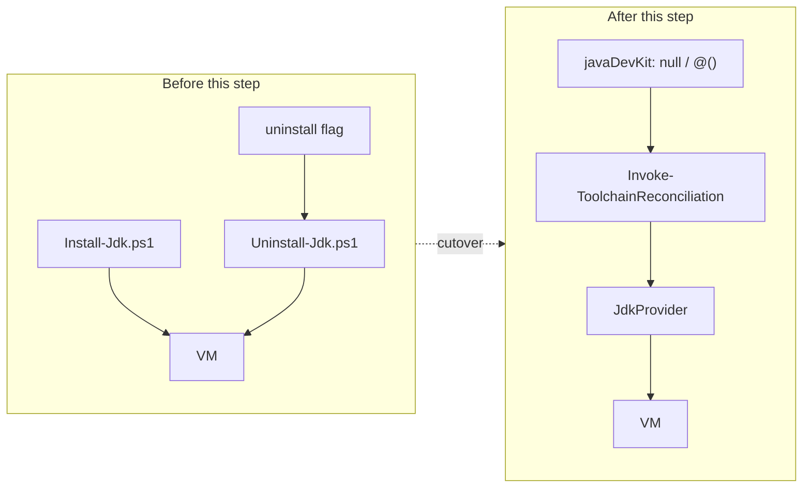
```mermaid
flowchart LR
    subgraph Before ["Before this step"]
        IJB[Install-Jdk.ps1] --> VMB[VM]
        UJB[Uninstall-Jdk.ps1] --> VMB
        F31B[uninstall flag] --> UJB
    end
    subgraph After ["After this step"]
        OR[Invoke-ToolchainReconciliation] --> JP[JdkProvider]
        JP --> VM[VM]
        JSON["javaDevKit: null / @()"] --> OR
    end
    Before -.->|cutover| After
```

**README** As noted above.

---

## Step 11 - E2E for reconciler (JDK)

**Reason.** Existing E2E only covered install. The new reconciler
adds three behaviours that need live verification on real VMs:
no-op idempotence, version change, and removal-on-empty / absent.

**Files**

- `Infrastructure-E2E/agent/e2e/vm-provisioning/Invoke-JdkInstallAssertions.ps1` -
  add post-install manifest-presence check (`stat
  /var/lib/infra-provisioner/manifests/javaDevKit-*.json`).
- `Infrastructure-E2E/agent/e2e/vm-provisioning/Invoke-JdkUninstallAssertions.ps1` -
  rewrite: instead of asserting "the uninstall flag worked", assert
  "the JDK is gone after the field is dropped from JSON". Manifest
  must also be gone.
- `Infrastructure-E2E/agent/e2e/vm-provisioning/Invoke-JdkVersionChangeAssertions.ps1`
  (new) - assert that re-provisioning with a different `version`
  removes the old `/opt/jdk-*` and installs the new one; manifest
  swaps; symlinks point at the new dir.
- `Infrastructure-E2E/agent/e2e/vm-provisioning/Invoke-JdkNoopAssertions.ps1`
  (new) - re-provision with the same `version`; assert no side
  effects (mtime of install dir, profile.d script, manifest
  unchanged).

**Behaviour**

E2E scenarios, sequenced through the existing provisioning harness
(mapped onto three phases - the harness keeps the existing
phase / VM2-witness shape, with each phase running 1 or 2 provisions):

1. Install: `javaDevKit: { vendor: 'temurin', version: '21' }`
   -> install dir present, manifest present (phase 1, first provision).
2. No-op: re-provision with the same JSON -> JDK install dir, profile.d
   and manifest mtimes unchanged (phase 1, second provision).
3. Version change: bump to `'17'` (then back to `'21'` in phase 3a)
   -> old dir gone, new dir present, manifest swapped, /usr/local/bin/java
   symlink repointed.
4. Remove via null: `javaDevKit: null` -> install dir, profile.d,
   manifest all gone (phase 2a). Implementation note: dropping the
   field entirely means "skip this provider" (see
   `Get-JdkDesiredVersions`); explicit null / `@()` is the
   "ensure none" signal, so the E2E uses null in phase 2a and `@()`
   in phase 3b to exercise both ensure-none shapes.
5. Remove via empty: `javaDevKit: @()` -> same end state as (4)
   via the array shape (phase 3b).
6. Reinstall after removal: re-add `javaDevKit` post-removal ->
   install dir reappears, fresh manifest (phase 2b).

**Tests (E2E)** As enumerated above. Each scenario is its own
`Describe` block in the agent.

**Mermaid**

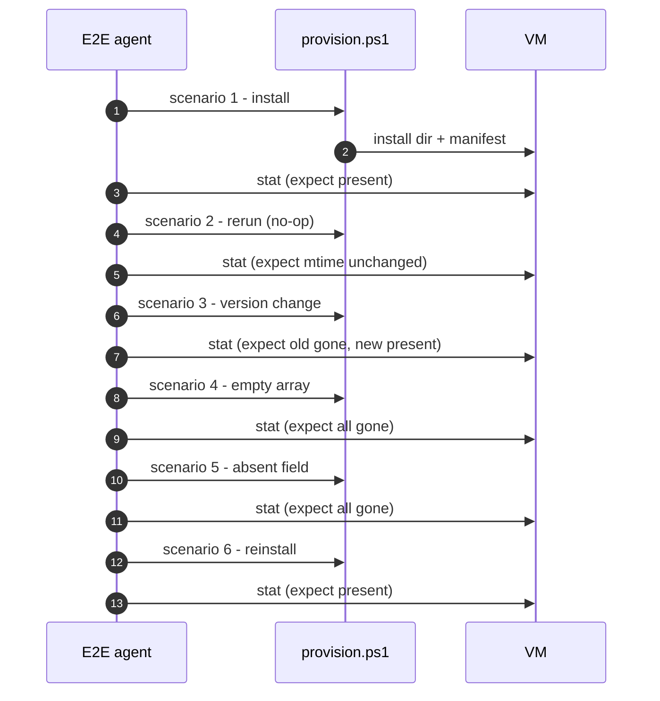
```mermaid
sequenceDiagram
    autonumber
    participant E2E as E2E agent
    participant Prov as provision.ps1
    participant VM as VM

    E2E->>Prov: scenario 1 - install
    Prov->>VM: install dir + manifest
    E2E->>VM: stat (expect present)
    E2E->>Prov: scenario 2 - rerun (no-op)
    E2E->>VM: stat (expect mtime unchanged)
    E2E->>Prov: scenario 3 - version change
    E2E->>VM: stat (expect old gone, new present)
    E2E->>Prov: scenario 4 - empty array
    E2E->>VM: stat (expect all gone)
    E2E->>Prov: scenario 5 - absent field
    E2E->>VM: stat (expect all gone)
    E2E->>Prov: scenario 6 - reinstall
    E2E->>VM: stat (expect present)
```

**README** Add the new removal-via-spec contract to the README JDK
section if not already done in Step 10.

---

## Phase C - .NET SDK provider

After Phase C, `dotnetSdk` is a fully reconciled toolchain on the same
footing as `javaDevKit`.

## Step 12 - Assert-DotnetSdkField validator

**Reason.** Smallest .NET piece - pure schema validation. Lands
first so subsequent steps can rely on validated inputs.

**Files**

- `hyper-v/ubuntu/common/config/Assert-DotnetSdkField.ps1` (new).
- `hyper-v/ubuntu/common/config/ConvertFrom-VmConfigJson.ps1` -
  dot-source + call the new validator in the per-VM loop.
- `Tests/common/config/Assert-DotnetSdkField.Tests.ps1` (new).
- `Tests/common/config/ConvertFrom-VmConfigJson.Tests.ps1` - one
  new wiring case (mock the new validator).

**Behaviour**

- Absent: silent return.
- Scalar `{ channel, version }` or list `[{ channel, version }, ...]`.
- Empty list / explicit `null` allowed (= ensure none).
- Sub-fields:
  - `channel`: required string matching `^\d+\.\d+$` (e.g. `'10.0'`).
  - `version`: required string. Three accepted granularities:
    `^\d+$`, `^\d+\.\d+$`, `^\d+\.\d+\.\d+$`. Numeric values rejected
    (JSON quirk: `10.0` parses as `10`).
- Unknown sub-fields throw (strict).
- v1 of the provider constrains the list to length 1 - enforced here
  with the same message style as `Assert-JavaDevKitField`.

**Tests (unit)** Same matrix as `Assert-JavaDevKitField`: absent,
present-valid (each granularity), missing channel, missing version,
wrong type, regex mismatch, unknown sub-field, list of two.

**Mermaid**

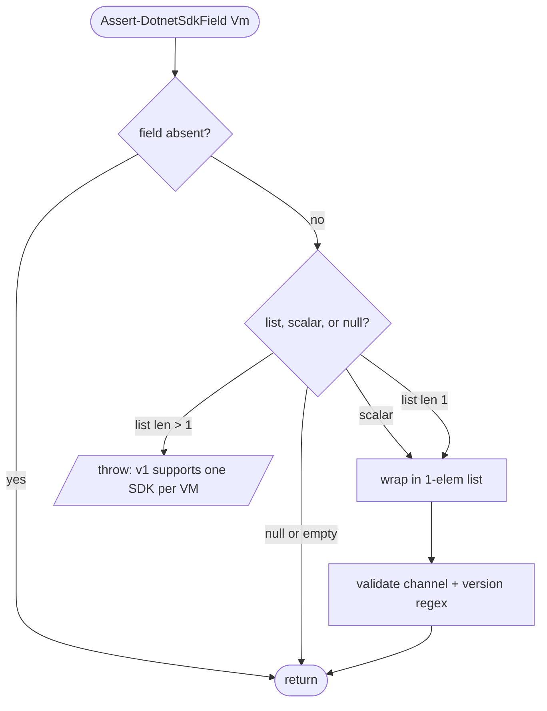
```mermaid
flowchart TD
    Start(["Assert-DotnetSdkField Vm"]) --> A{field absent?}
    A -->|yes| Done([return])
    A -->|no| L{list, scalar, or null?}
    L -->|"null or empty"| Done
    L -->|scalar| Norm["wrap in 1-elem list"]
    L -->|"list len 1"| Norm
    L -->|"list len > 1"| Throw[/"throw: v1 supports one SDK per VM"/]
    Norm --> SubFields["validate channel + version regex"]
    SubFields --> Done
```

**README** Add a `dotnetSdk` row to the VM JSON schema table; add
the "Optional: install a .NET SDK" subsection with the three
version-string granularities and one example.

---

## Step 13 - Resolve-DotnetSdkRelease

**Reason.** Translates a granularity (`'10'`, `'10.0'`, or
`'10.0.100'`) into `{ resolvedVersion, sha512, downloadUrl }` via
Microsoft's release metadata. Pure helper, isolated so it is
unit-testable without network.

**Files**

- `hyper-v/ubuntu/up/dotnet/Resolve-DotnetSdkRelease.ps1` (new).
- `Tests/up/dotnet/Resolve-DotnetSdkRelease.Tests.ps1` (new) -
  fixture JSON checked in under `Tests/up/dotnet/fixtures/`.

**Behaviour**

- Signature:
  `Resolve-DotnetSdkRelease -Channel -RequestedVersion`.
- Fetches
  `https://builds.dotnet.microsoft.com/dotnet/release-metadata/<channel>/releases.json`
  via `Invoke-RestMethod`.
- `'10'` or `'10.0'`: returns the entry under `latest-sdk`.
- `'10.0.100'`: scans `releases[].sdks[]` for an exact match, throws
  with a list of available versions if not found.
- Returns
  `[PSCustomObject]@{ ResolvedVersion; Sha512; DownloadUrl; SourceUrl }`
  where `DownloadUrl` is the linux-x64 SDK download URL.
- A `Invoke-RestMethod` failure surfaces with the channel URL in the
  message.

**Tests (unit)** Mock `Invoke-RestMethod` with the fixture JSON.

- `'10'`: returns the latest SDK.
- `'10.0'`: same.
- `'10.0.100'` present in fixture: returns it.
- `'10.0.999'` absent in fixture: throws with available list.
- Network failure: surfaces with channel URL.

**Mermaid**

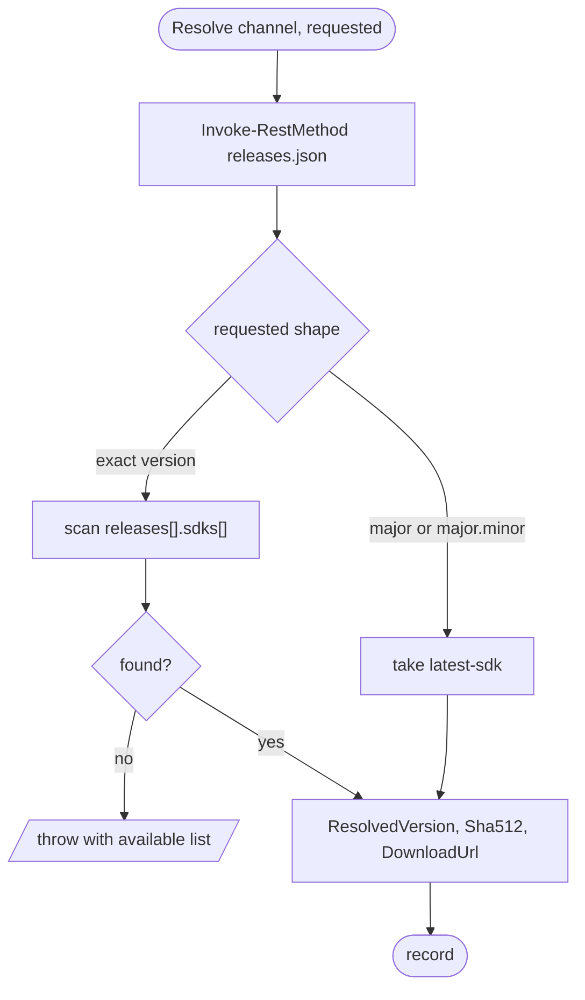
```mermaid
flowchart TD
    Start(["Resolve channel, requested"]) --> Fetch["Invoke-RestMethod releases.json"]
    Fetch --> Granularity{requested shape}
    Granularity -->|"major or major.minor"| Latest["take latest-sdk"]
    Granularity -->|"exact version"| Scan["scan releases[].sdks[]"]
    Scan --> Match{found?}
    Match -->|no| Throw[/"throw with available list"/]
    Match -->|yes| Build["ResolvedVersion, Sha512, DownloadUrl"]
    Latest --> Build
    Build --> Out([record])
```

**README** No edit.

---

## Step 14 - Invoke-DotnetSdkAcquisition

**Reason.** Host-side prefetch: download, SHA-512 verify, lockfile.
Mirrors `Invoke-JdkAcquisition`'s shape so the prefetch dispatcher
in Step 15 can call both with parallel signatures.

**Files**

- `hyper-v/ubuntu/up/dotnet/Invoke-DotnetSdkAcquisition.ps1` (new).
- `Tests/up/dotnet/Invoke-DotnetSdkAcquisition.Tests.ps1` (new).

**Behaviour**

- Signature: `Invoke-DotnetSdkAcquisition -Vm -CacheDir`.
- Reads `$Vm.dotnetSdk` (validated by Step 12), normalises to a
  list, takes the single entry.
- Cache file: `<cacheDir>/dotnet-sdk-<resolvedVersion>-linux-x64.tar.gz`.
- Lockfile:
  `<cacheDir>/dotnet-sdk-<requestedVersion>-linux-x64.lock.json`
  recording `{ resolvedVersion, sha512, sourceUrl, downloadedUtc }`.
- If lockfile present and matches the cached tarball SHA-512: skip
  resolution and download.
- Otherwise: `Resolve-DotnetSdkRelease` -> download via
  `Invoke-WebRequest` -> verify SHA-512 -> write tarball + lockfile.
- Mismatched SHA-512 re-downloads (one retry; second mismatch
  throws).
- Side effects on `$Vm`: populates
  `$Vm._dotnetSdkTarballPath` and `$Vm._dotnetSdkResolvedVersion`
  (mirrors how `Invoke-JdkAcquisition` populates `_jdkTarballPath`
  / `_jdkResolvedVersion`).

**Tests (unit)** Mock `Resolve-DotnetSdkRelease`,
`Invoke-WebRequest`, and `Get-FileHash`.

- Cache miss: full resolve + download + verify + write tarball +
  write lockfile.
- Cache hit (lockfile + tarball match): no resolve, no download,
  `_dotnetSdkTarballPath` populated from cache.
- Cache hit but tarball SHA mismatch: re-download once; second
  mismatch throws.
- Empty / null `dotnetSdk`: returns silently (the reconciler handles
  removal; nothing to prefetch).

**Mermaid**

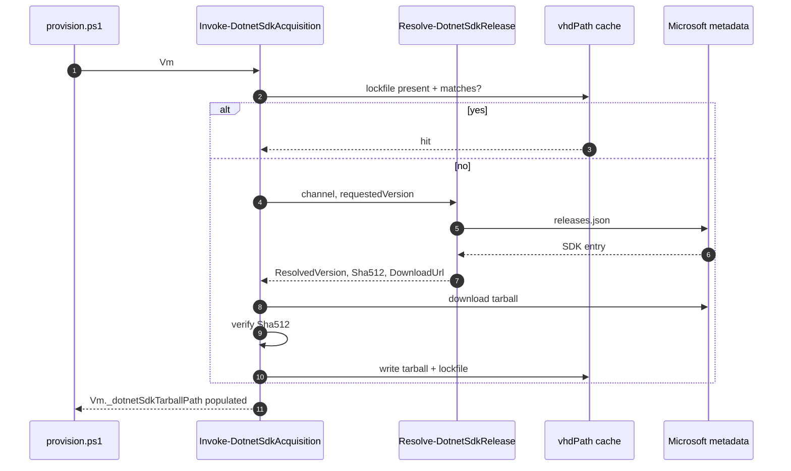
```mermaid
sequenceDiagram
    autonumber
    participant Prov as provision.ps1
    participant Acq as Invoke-DotnetSdkAcquisition
    participant Resolver as Resolve-DotnetSdkRelease
    participant Cache as vhdPath cache
    participant MS as Microsoft metadata

    Prov->>Acq: Vm
    Acq->>Cache: lockfile present + matches?
    alt yes
        Cache-->>Acq: hit
    else no
        Acq->>Resolver: channel, requestedVersion
        Resolver->>MS: releases.json
        MS-->>Resolver: SDK entry
        Resolver-->>Acq: ResolvedVersion, Sha512, DownloadUrl
        Acq->>MS: download tarball
        Acq->>Acq: verify Sha512
        Acq->>Cache: write tarball + lockfile
    end
    Acq-->>Prov: Vm._dotnetSdkTarballPath populated
```

**README** No edit.

---

## Step 15 - Wire prefetch into Invoke-VmAcquisitions

**Reason.** Lands the dispatcher edit so `provision.ps1` actually
calls the new acquisition. After this step, host-side cache fills on
provision, but nothing on the VM changes yet - the provider that
consumes the cached tarball lands in Steps 16-18.

**Files**

- `hyper-v/ubuntu/up/acquire/Invoke-VmAcquisitions.ps1` - add
  `Invoke-DotnetSdkAcquisition` to the per-VM dispatch behind the
  `$Vm.dotnetSdk` opt-in guard, parallel to the existing JDK
  branch.
- `Tests/up/acquire/Invoke-VmAcquisitions.Tests.ps1` - new cases:
  - VM with `dotnetSdk` set: new function is called.
  - VM without: new function is NOT called.

**Tests (unit)** As above. Mock both acquisitions and assert call
presence / absence based on field presence.

**Mermaid**

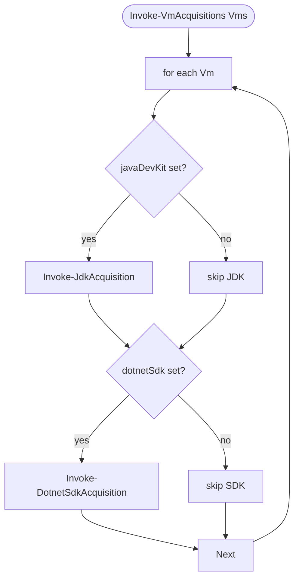
```mermaid
flowchart TD
    Start([Invoke-VmAcquisitions Vms]) --> Loop[for each Vm]
    Loop --> J{javaDevKit set?}
    J -->|yes| JA[Invoke-JdkAcquisition]
    J -->|no| Skip1[skip JDK]
    JA --> D{dotnetSdk set?}
    Skip1 --> D
    D -->|yes| DA[Invoke-DotnetSdkAcquisition]
    D -->|no| Skip2[skip SDK]
    DA --> Next
    Skip2 --> Next
    Next --> Loop
```

**README** Note in the prefetch section that .NET SDK tarballs join
JDK tarballs in the `vhdPath` cache; same naming + lockfile
convention.

---

## Step 16 - DotnetSdkProvider: Get-DesiredVersions and Get-InstalledVersions

**Reason.** Two pure-parse operations that pair naturally - the
desired side reads JSON, the installed side reads manifests. Same
shape as JDK Steps 6-7 combined into one step because each is
smaller (no JDK-style vendor field) and they have no dependency
between them.

**Files**

- `hyper-v/ubuntu/up/dotnet/DotnetSdkProvider.Get-DesiredVersions.ps1` (new).
- `hyper-v/ubuntu/up/dotnet/DotnetSdkProvider.Get-InstalledVersions.ps1` (new).
- `Tests/up/dotnet/DotnetSdkProvider.Get-DesiredVersions.Tests.ps1` (new).
- `Tests/up/dotnet/DotnetSdkProvider.Get-InstalledVersions.Tests.ps1` (new).

**Behaviour**

- `Get-DesiredVersions`: parses `$Vm.dotnetSdk` (validated by Step
  12), returns `$null` when absent, `@()` when null/empty, array of
  `[PSCustomObject]@{ Provider='dotnetSdk'; Channel; RequestedVersion;
   ResolvedVersion; TarballPath }` otherwise. `ResolvedVersion` and
  `TarballPath` come from the `_dotnetSdk*` fields populated by
  Step 14.
- `Get-InstalledVersions`: same shape as JDK Step 7, scoped to
  provider `'dotnetSdk'`.

**Tests (unit)** Mirror JDK Steps 6-7's matrices.

**Mermaid**

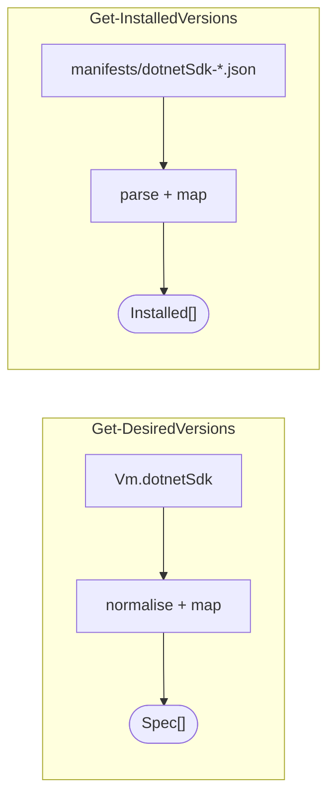
```mermaid
flowchart LR
    subgraph Desired ["Get-DesiredVersions"]
        D1["Vm.dotnetSdk"] --> D2["normalise + map"] --> D3(["Spec[]"])
    end
    subgraph Installed ["Get-InstalledVersions"]
        I1["manifests/dotnetSdk-*.json"] --> I2["parse + map"] --> I3(["Installed[]"])
    end
```

**README** No edit.

---

## Step 17 - DotnetSdkProvider: Install-Version

**Reason.** Composition step, parallel to JDK Step 8. Lands on its
own so the .NET-specific decisions (`DOTNET_ROOT`, single binary
symlink rather than per-bin) get a focused review.

**Files**

- `hyper-v/ubuntu/up/dotnet/DotnetSdkProvider.Install-Version.ps1` (new).
- `Tests/up/dotnet/DotnetSdkProvider.Install-Version.Tests.ps1` (new).

**Behaviour**

Given `$spec`:

1. `installDir = "/opt/dotnet-$($spec.ResolvedVersion)"`.
2. `Expand-VmTarball -SshClient -Server -TarballPath
    $spec.TarballPath -Destination $installDir -StripComponents 0`
   (the dotnet SDK tarball does not wrap its root in a single dir).
3. `Set-VmProfileDScript -SshClient -Name 'dotnet' -Content $dotnetSh`
   where `$dotnetSh` exports:
   - `DOTNET_ROOT=<installDir>`
   - `PATH=$DOTNET_ROOT:$PATH`
   - `DOTNET_CLI_TELEMETRY_OPTOUT=1` (problem.md open question 3
     decision: yes by default for unattended CI VMs).
4. `New-VmSymlink -SshClient -Path /usr/local/bin/dotnet
    -Target "$installDir/dotnet"` (single binary; the SDK's other
    tools live under `dotnet` and are reachable via `dotnet <verb>`).
5. Compose manifest, `Write-VmManifest`.

**Tests (unit)** Same shape as JDK Step 8. Additionally:

- `profile.d/dotnet.sh` contains `DOTNET_CLI_TELEMETRY_OPTOUT=1`.
- Manifest's `ownedSymlinks` has exactly one entry pointing at
  `/usr/local/bin/dotnet`.

**Mermaid**

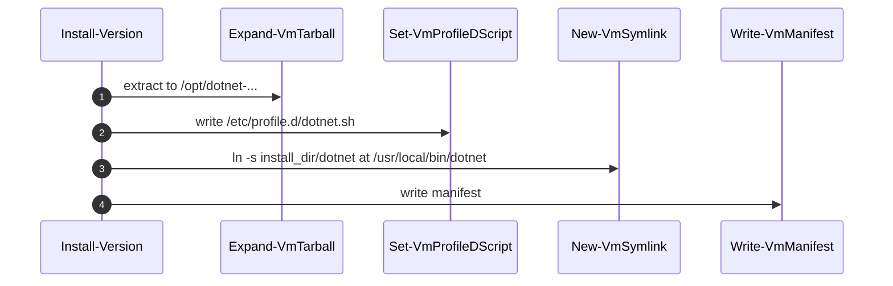
```mermaid
sequenceDiagram
    autonumber
    participant IV as Install-Version
    participant Tar as Expand-VmTarball
    participant Prof as Set-VmProfileDScript
    participant Sym as New-VmSymlink
    participant Man as Write-VmManifest

    IV->>Tar: extract to /opt/dotnet-...
    IV->>Prof: write /etc/profile.d/dotnet.sh
    IV->>Sym: ln -s install_dir/dotnet at /usr/local/bin/dotnet
    IV->>Man: write manifest
```

**README** Note the env vars exported by the profile.d script.

---

## Step 18 - DotnetSdkProvider: Uninstall-Version

**Reason.** Mirrors Step 17. Same shape as JDK Step 9.

**Files**

- `hyper-v/ubuntu/up/dotnet/DotnetSdkProvider.Uninstall-Version.ps1` (new).
- `Tests/up/dotnet/DotnetSdkProvider.Uninstall-Version.Tests.ps1` (new).

**Behaviour** Identical algorithm to JDK Step 9 (Stop processes,
remove symlinks, remove profile.d, remove dirs, remove manifest).

**Tests (unit)** Mirror JDK Step 9.

**Mermaid**

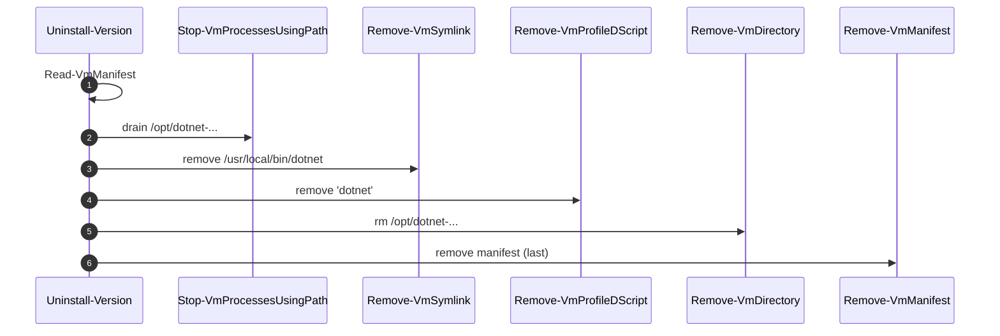
```mermaid
sequenceDiagram
    autonumber
    participant UV as Uninstall-Version
    participant Stop as Stop-VmProcessesUsingPath
    participant Sym as Remove-VmSymlink
    participant Prof as Remove-VmProfileDScript
    participant Dir as Remove-VmDirectory
    participant Man as Remove-VmManifest

    UV->>UV: Read-VmManifest
    UV->>Stop: drain /opt/dotnet-...
    UV->>Sym: remove /usr/local/bin/dotnet
    UV->>Prof: remove 'dotnet'
    UV->>Dir: rm /opt/dotnet-...
    UV->>Man: remove manifest (last)
```

**README** No edit.

---

## Step 19 - Register DotnetSdkProvider + E2E coverage

**Reason.** Cutover step: registers the provider in `Get-Providers`,
adds the `dotnetSdk` row to README's reconciler section, and brings
up the live verification matrix on real VMs.

**Files**

- `hyper-v/ubuntu/up/reconciler/Get-Providers.ps1` - append the
  `DotnetSdkProvider` (composed by a new
  `hyper-v/ubuntu/up/dotnet/Get-DotnetSdkProvider.ps1`).
- `hyper-v/ubuntu/up/dotnet/Get-DotnetSdkProvider.ps1` (new).
- `Infrastructure-E2E/agent/e2e/vm-provisioning/Invoke-DotnetSdkInstallAssertions.ps1` (new).
- `Infrastructure-E2E/agent/e2e/vm-provisioning/Invoke-DotnetSdkUninstallAssertions.ps1` (new).
- `Infrastructure-E2E/agent/e2e/vm-provisioning/Invoke-DotnetSdkVersionChangeAssertions.ps1` (new).
- `Infrastructure-E2E/agent/e2e/vm-provisioning/Invoke-DotnetSdkNoopAssertions.ps1` (new).
- `README.md` - mention `dotnetSdk` as the second registered
  provider; document the env vars set on the VM (`DOTNET_ROOT`,
  telemetry opt-out).

**Tests (E2E)** Mirror the JDK matrix from Step 11: install, no-op,
version change, remove via empty, remove via absent, reinstall.
Add one .NET-specific assertion: `dotnet --version` on the VM
returns the resolved version.

**Mermaid**

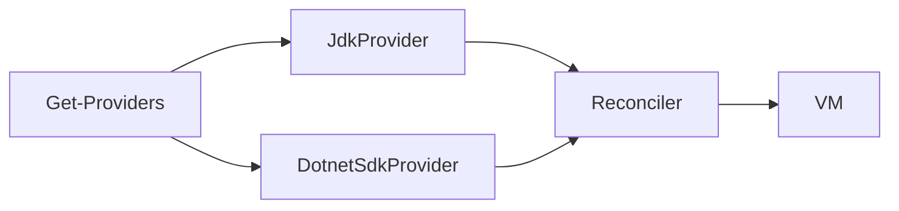
```mermaid
flowchart LR
    GP[Get-Providers] --> JP[JdkProvider]
    GP --> DP[DotnetSdkProvider]
    JP --> R[Reconciler]
    DP --> R
    R --> VM[VM]
```

**README** As above.

The nested-provider walker that allows future toolchains (e.g.
`dotnetTools` from feature 43) to slot under `dotnetSdk` is not built
in this feature - it lands as Steps 1-2 of
[43 - dotnet nuget](../43%20-%20dotnet%20nuget/plan.md) where the
first real consumer exists. The manifest schema's `children` field
(written in Step 2) stays empty for every install produced by this
feature.
