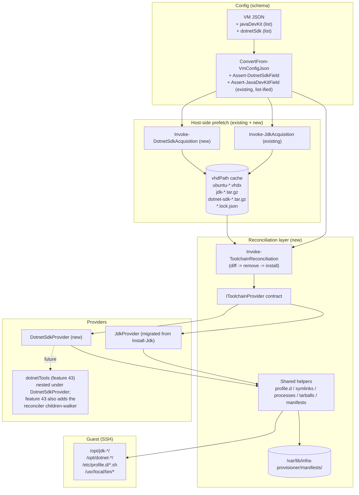
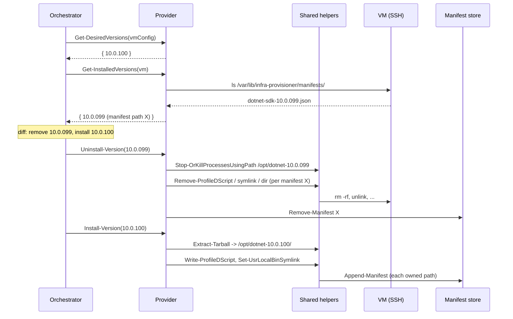

# Problem: Declarative Toolchain Reconciliation + .NET SDK

## Index

- [For Laymen](#for-laymen)
- [Context](#context)
- [What Is Changing](#what-is-changing)
  - [Declarative model: JSON is the desired state](#declarative-model-json-is-the-desired-state)
  - [Reconciliation orchestrator](#reconciliation-orchestrator)
  - [Provider interface (typed)](#provider-interface-typed)
  - [Nested providers](#nested-providers)
  - [Sidecar manifests](#sidecar-manifests)
  - [Shared side-effect helpers](#shared-side-effect-helpers)
  - [Process handling during uninstall](#process-handling-during-uninstall)
  - [Absent vs empty: two different intents](#absent-vs-empty-two-different-intents)
  - [JDK migrated onto the orchestrator](#jdk-migrated-onto-the-orchestrator)
  - [.NET SDK provider](#net-sdk-provider)
  - [Version-string granularity (.NET SDK)](#version-string-granularity-net-sdk)
  - [Host-side prefetch and cache (.NET SDK)](#host-side-prefetch-and-cache-net-sdk)
- [Why Now](#why-now)
- [Affected Components](#affected-components)
- [Out of Scope](#out-of-scope)

---

## For Laymen

We want the JSON file that describes a VM to be the single source of
truth for what software is on it. If `dotnetSdk` is in the JSON, the
.NET SDK gets installed. If it disappears from the JSON, the SDK gets
removed on the next provisioning run. Same idea for the JDK and any
future toolchain. This feature builds the small reconciliation engine
that makes that work, migrates the existing JDK install onto it, and
adds .NET SDK as the second consumer.

---

## Context

Two existing features established the install half of this pattern:

- [20 - java dev kit](../20%20-%20java%20dev%20kit/problem.md): host-side
  Temurin prefetch + guest-side extraction into
  `/opt/jdk-{vendor}-{version}/`, with `/etc/profile.d/jdk.sh` and
  `/usr/local/bin/` symlinks.
- [31 - jdk uninstall flag](../31%20-%20jdk%20uninstall%20flag/problem.md):
  per-VM opt-in to uninstall the JDK on the next provision run.

`31` is **superseded** by this feature. Uninstall becomes a natural
consequence of the spec: a JDK that is no longer in the JSON is no
longer on the VM. No flag needed.

Downstream motivation: `Common-DotNet`'s reusable workflow
`ci-dotnet.yml` asserts `dotnet --version` at the top of every job and
fails fast when the SDK is missing. The SynergyOps .NET CI rollout is
blocked until runner VMs ship with the SDK baked in. The same workflow
is expected to grow a coverage step that depends on a global nuget
tool (ReportGenerator), tracked in [43 - dotnet nuget](../43%20-%20dotnet%20nuget/problem.md);
the reconciliation design here must leave a clean extension point for
that tool to drop in as a nested provider under the SDK.

---

## What Is Changing

### Declarative model: JSON is the desired state

A VM definition's toolchain blocks (`javaDevKit`, `dotnetSdk`, ...) are
read as **desired state**. The provisioner reconciles the VM to match:

| Spec entry vs VM state | Action |
|------------------------|--------|
| In spec, not on VM | Install |
| In spec, on VM, matching version | No-op |
| In spec, on VM, different version | Uninstall old, install new |
| Not in spec, on VM | Uninstall (orphan removal) |
| Not in spec, not on VM | No-op |

Removals happen **before** installs, so re-pinning a version frees disk
and clears shared paths (symlinks, `profile.d`) before the new version
claims them.

### Reconciliation orchestrator

A new layer dispatches each toolchain to its own provider and walks
them in **JSON-declaration order** (so an operator can sequence
dependencies by ordering the fields, e.g. SDK before tools).

Per-provider execution is transactional: if one provider fails its
reconcile, the orchestrator still runs the rest, then exits non-zero.
This avoids one broken toolchain blocking unrelated ones from
reaching desired state.

The orchestrator runs as one of the steps inside
[Invoke-VmPostProvisioning](../../../../hyper-v/ubuntu/up/post/Invoke-VmPostProvisioning.ps1) -
not a separate phase, just another step in the existing per-VM loop.
The first registered provider (JDK) replaces the current ad-hoc
`Install-Jdk` dispatch; the existing non-toolchain post steps
(`Copy-VmFiles`, `Set-VmEnvironmentVariables`, etc.) keep running
alongside it.

### Provider interface (typed)

Each toolchain implements four operations:

| Operation | Returns / Effect |
|-----------|------------------|
| `Get-DesiredVersions($vmConfig)` | Set of typed version specs, parsed from JSON. Absent field -> `$null` (skip); empty list -> `@()` (ensure none). |
| `Get-InstalledVersions($vm)` | Set of typed records `{ id, version, installPath, manifestPath }` discovered on the VM. |
| `Install-Version($vm, $spec)` | Install one version. Writes a manifest as it goes. |
| `Uninstall-Version($vm, $installed)` | Uninstall one version. Reads its manifest for owned paths. |

The diff is computed by the orchestrator against the two typed sets, so
providers never write diff logic.

### Nested providers

Some toolchains install items **under** another toolchain. .NET global
nuget tools are the canonical case: they require an SDK to be present
and they live inside that SDK's install dir. The interface supports a
**parent context** passed to nested providers:

| Aspect | Behaviour |
|--------|-----------|
| Discovery | Nested provider scopes its `Get-InstalledVersions` under the parent install path / parent manifest's `children` list. |
| Lifecycle | If the parent version is uninstalled, its children are uninstalled first (child manifests walked from the parent's `children` array). |
| Failure | A child failure does not roll back the parent install; it surfaces as a non-zero exit alongside any other failures. |

This feature ships **neither the nested-provider contract nor the
walker** - both move forward to [43 - dotnet nuget](../43%20-%20dotnet%20nuget/problem.md),
where the first real consumer exists to exercise them. What this
feature does ship is the manifest schema with a `children` field
(always empty until 43 lands), so that 43's walker has a stable
on-disk shape to read.

### Sidecar manifests

Each install writes a manifest at
`/var/lib/infra-provisioner/manifests/{provider}-{version}.json`
recording every path that install owns. Uninstall reads the manifest
rather than re-deriving paths from convention.

```json
{
  "schemaVersion": 1,
  "provider":            "dotnetSdk",
  "version":             "10.0.100",
  "ownedPaths":          ["/opt/dotnet-10.0.100"],
  "ownedSymlinks":       [{ "path": "/usr/local/bin/dotnet",
                            "target": "/opt/dotnet-10.0.100/dotnet" }],
  "ownedProfileScripts": ["/etc/profile.d/dotnet.sh"],
  "children":            []
}
```

`schemaVersion: 1` is stamped on every manifest so a future shape
change can be detected and migrated rather than silently mis-parsed.
The store itself (`/var/lib/infra-provisioner/`) is `root:root 0755`;
manifest files are `root:root 0644` - they are not secret and any user
on the VM may read them to discover what is installed.

Why a manifest and not pure convention:

- **Shared paths**: `/usr/local/bin/dotnet` and
  `/etc/profile.d/dotnet.sh` are not per-version. Without a record,
  uninstalling 10.0.100 while 10.0.102 is also installed cannot tell
  whether to remove the symlink, repoint it, or leave it alone.
- **Layout drift**: a future provider rev that renames the profile
  script must still uninstall installs that wrote the old name.
- **Partial install recovery**: the manifest is appended to
  incrementally, so a crashed install leaves a partial manifest the
  next reconcile can use to clean up.

A convention-based glob (`/opt/dotnet-*/`) remains as a safety net for
manifests lost to disk corruption, but it is not the primary source of
truth.

### Shared side-effect helpers

Providers compose helpers from a common library; per-provider code is
configuration, not bespoke shell scripts. The helpers split across two
repos by their level of abstraction:

**Generic Linux-over-SSH primitives, in `Infrastructure-HyperV`**
(see [Infrastructure-HyperV/14 - vm-install-primitives](../../../../../Infrastructure-HyperV/docs/dev/implementation/14%20-%20vm-install-primitives/problem.md)):

- `Expand-VmTarball -SshClient -Server -TarballPath -Destination` (streams
  via the existing host file server, extracts under sudo, SHA-256
  marker for skip-unchanged)
- `New-VmSymlink -SshClient -Path -Target` / `Remove-VmSymlink -SshClient -Path`
- `Set-VmProfileDScript -SshClient -Name -Content` / `Remove-VmProfileDScript -SshClient -Name`
- `Remove-VmDirectory -SshClient -Path` (allowlisted parent dirs only)
- `Stop-VmProcessesUsingPath -SshClient -Path -GraceSeconds`

These primitives collapse the existing ad-hoc SSH heredocs in
[Install-Jdk](../../../../hyper-v/ubuntu/up/post/Install-Jdk.ps1)
and
[Uninstall-Jdk](../../../../hyper-v/ubuntu/up/post/Uninstall-Jdk.ps1).
The JDK migration step is therefore both "adopt the orchestrator" and
"swap the heredocs for primitive calls" in one move. Adopting
`Stop-VmProcessesUsingPath` closes a latent bug in `Uninstall-Jdk`,
which today does `rm -rf` without checking whether `java` is running.

These are generic Linux operations with no notion of toolchains or
manifests, so they belong next to the existing
[Invoke-SshClientCommand](../../../../../Infrastructure-HyperV/Infrastructure.HyperV/Public/Ssh/Invoke-SshClientCommand.ps1),
[Set-VmEnvironmentVariables](../../../../../Infrastructure-HyperV/Infrastructure.HyperV/Public/EnvVars/Set-VmEnvironmentVariables.ps1),
and `Invoke-WithVmFileServer` primitives.

**Provisioner-specific helpers, in this repo:**

- `Append-Manifest`, `Read-Manifest`, `Remove-Manifest` - the manifest
  schema is a provisioner concept.
- The orchestrator (`Invoke-ToolchainReconciliation`).
- The provider interface and its concrete implementations
  (`JdkProvider`, `DotnetSdkProvider`).

Cross-repo dependency: this feature requires the Infrastructure-HyperV
primitives feature to ship first. The plan sequences them accordingly.

A provider's "what it owns" is therefore declarative: a list of helper
calls, each of which records its outcome in the manifest.

### Process handling during uninstall

Uninstall must handle the case where the toolchain's binaries are in
use (a runner job is executing `dotnet test`). The shared helper does:

1. `lsof`-equivalent scan to find PIDs holding files under the install
   path.
2. `SIGTERM` and wait up to a grace window for processes to exit.
3. `SIGKILL` any survivors.
4. Proceed with file removal.

**Actions runner coordination is out of scope.** If a runner is mid-job
when reconcile runs, the job dies. The recommendation (documented in
README) is to drain the runner via `Infrastructure-GitHubRunners` before
re-provisioning. Provisioner does not learn about runner state.

### Absent vs empty: two different intents

| JSON | Meaning |
|------|---------|
| Field omitted | Don't touch this toolchain. Existing installs stay; missing installs stay missing. |
| `"dotnetSdk": null` or `"dotnetSdk": []` | Ensure none of this toolchain is installed. Orphans removed. |
| `"dotnetSdk": { ... }` (single) or `[{ ... }, { ... }]` (list) | Reconcile to this exact set. |

The list form is the multi-version case. v1 of each provider may
constrain the list to length 1 if multi-version is not yet supported;
the orchestrator does not care.

### JDK migrated onto the orchestrator

The JDK install path
([Install-Jdk.ps1](../../../../hyper-v/ubuntu/up/post/Install-Jdk.ps1))
is rewritten as a provider. The old standalone code is deleted once
E2E covers the new path. Manifests are written for new installs only:
**any VM provisioned before this feature must be reprovisioned from
scratch** (no legacy adoption code).

[31 - jdk uninstall flag](../31%20-%20jdk%20uninstall%20flag/problem.md)
is marked superseded; its `uninstall` field is removed from the schema.
Removal is now expressed by deleting the `javaDevKit` block (or setting
it to `null` / `[]`).

### .NET SDK provider

The original feature scope - install a .NET SDK on the VM - lands as
the second provider built on the orchestrator. JSON shape:

```json
{
  "vmName": "ci-runner-01",
  "...":    "...",
  "dotnetSdk": {
    "channel": "10.0",
    "version": "10.0.100"
  }
}
```

| Sub-field | Allowed values (initial scope) | Notes |
|-----------|--------------------------------|-------|
| `channel` | `"10.0"`, `"9.0"`, `"8.0"`, ... | Microsoft "channel" string; selects the `releases.json` to query. Required. |
| `version` | See [granularity table](#version-string-granularity-net-sdk) | String only. Numeric `10` is rejected to avoid JSON quirks turning `10.0` into `10`. |

Guest-side layout owned by the provider's manifest:

| Element | Path |
|---------|------|
| Install root | `/opt/dotnet-{resolvedVersion}/` |
| `PATH` / `DOTNET_ROOT` script | `/etc/profile.d/dotnet.sh` |
| Non-login `PATH` symlink | `/usr/local/bin/dotnet -> /opt/dotnet-{resolvedVersion}/dotnet` |
| Telemetry | `DOTNET_CLI_TELEMETRY_OPTOUT=1` exported in `profile.d` script (unattended CI VMs) |

### Version-string granularity (.NET SDK)

| User writes | Meaning | Resolution behaviour |
|-------------|---------|----------------------|
| `"10"` | Latest GA SDK on the `10.0` channel | `releases.json` -> `latest-sdk` |
| `"10.0"` | Same as above | Same query, kept for symmetry with JDK granularity |
| `"10.0.100"` | Exact SDK | No resolution; SDK entry looked up directly |

Resolution happens **at prefetch time** (host has internet). The
resolved exact version, SHA-512, and tarball URL come from Microsoft's
official release metadata
(`https://builds.dotnet.microsoft.com/dotnet/release-metadata/{channel}/releases.json`).
The resolved version is recorded in a lockfile next to the cached
tarball so a re-provision without internet uses the same artifact and
two VMs requesting `"10"` on the same day get the same build.

### Host-side prefetch and cache (.NET SDK)

| Aspect | Decision |
|--------|----------|
| Cache directory | Same `vhdPath` dir already used by `Invoke-DiskImageAcquisition` and `Invoke-JdkAcquisition`. |
| File naming | `dotnet-sdk-{resolvedVersion}-linux-x64.tar.gz` |
| Lockfile | `dotnet-sdk-{requestedVersion}-linux-x64.lock.json` recording `{ resolvedVersion, sha512, sourceUrl, downloadedUtc }`. |
| Checksum | SHA-512 from `releases.json` verified after download. Mismatched tarballs are re-downloaded. |
| Architecture | `linux-x64` hardcoded in v1. |
| Reuse across VMs | Two VMs requesting the same `{channel, requestedVersion}` share one tarball and one lockfile. |

New module: `up/dotnet/Invoke-DotnetSdkAcquisition.ps1`, dispatched by
[Invoke-VmAcquisitions.ps1](../../../../hyper-v/ubuntu/up/acquire/Invoke-VmAcquisitions.ps1)
behind the `dotnetSdk` opt-in guard.

---

## Why Now

- `Common-DotNet`'s `ci-dotnet.yml` will fail every consumer's CI until
  the SDK is baked into the runner image, blocking the SynergyOps .NET
  CI rollout.
- The JDK feature has matured the host-prefetch + out-of-band-install
  pattern. The next consumer would otherwise copy/paste it; instead we
  promote it to a shared layer and pay the refactor cost once.
- Feature [31 - jdk uninstall flag](../31%20-%20jdk%20uninstall%20flag/problem.md)
  hinted at a flag-per-toolchain proliferation; declarative
  reconciliation kills the entire category of "uninstall flag"
  features.
- Coverage tooling ([43 - dotnet nuget](../43%20-%20dotnet%20nuget/problem.md))
  will drop in as a nested provider under `dotnetSdk`. The nesting
  contract and reconciler walker land with 43 itself, not here -
  what this feature owes 43 is the manifest schema with a `children`
  field so 43's walker has a stable shape to read.

---

## Affected Components



Reconciliation sequence for one provider on one VM:



---

## Out of Scope

- Architectures other than `linux-x64`. ARM/aarch64 VMs are not
  produced by this repo.
- Runtime-only .NET installs (no SDK). The field is named `dotnetSdk`
  deliberately.
- Global nuget tools / coverage report generator. Designed for as a
  nested provider here; implemented in [43 - dotnet nuget](../43%20-%20dotnet%20nuget/problem.md).
- APT-based install via Microsoft package repo. Rejected: needs VM
  internet at install time and pulls in unrelated apt churn.
- Legacy install adoption. VMs provisioned before this feature must be
  reprovisioned from scratch; no synthetic-manifest fallback path.
- Actions runner coordination. The provisioner does not know about
  runner jobs; uninstall will kill an in-flight `dotnet`/`java` process
  if one is using the install dir. Drain runners before re-provisioning.
- Multi-SDK on one VM. The orchestrator supports it via list-valued
  config; the .NET SDK provider in v1 constrains the list to length 1.
  Lifting that is a one-line provider change later.
