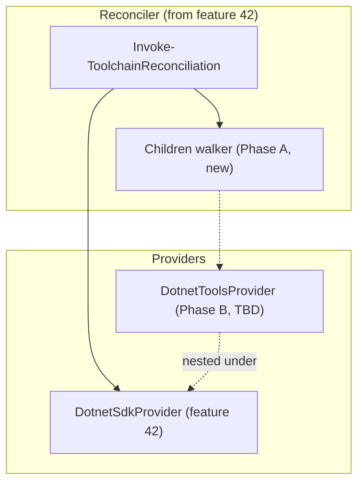
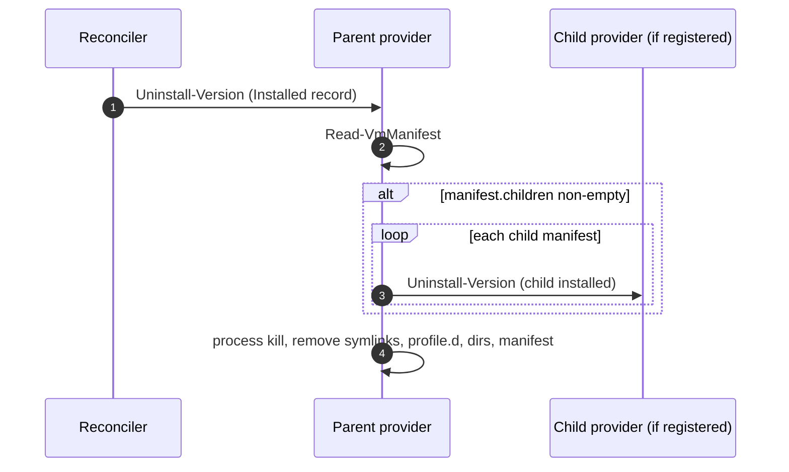
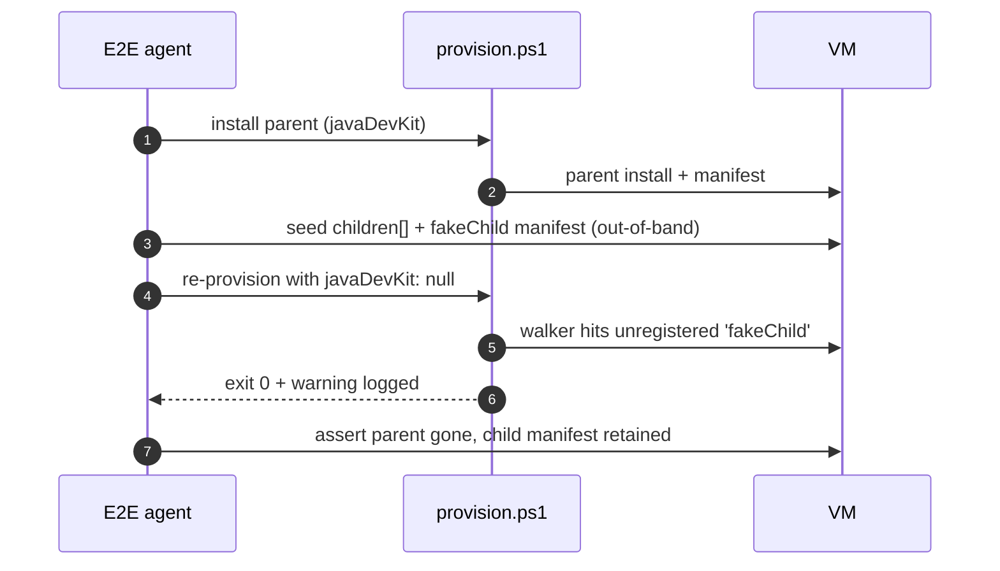
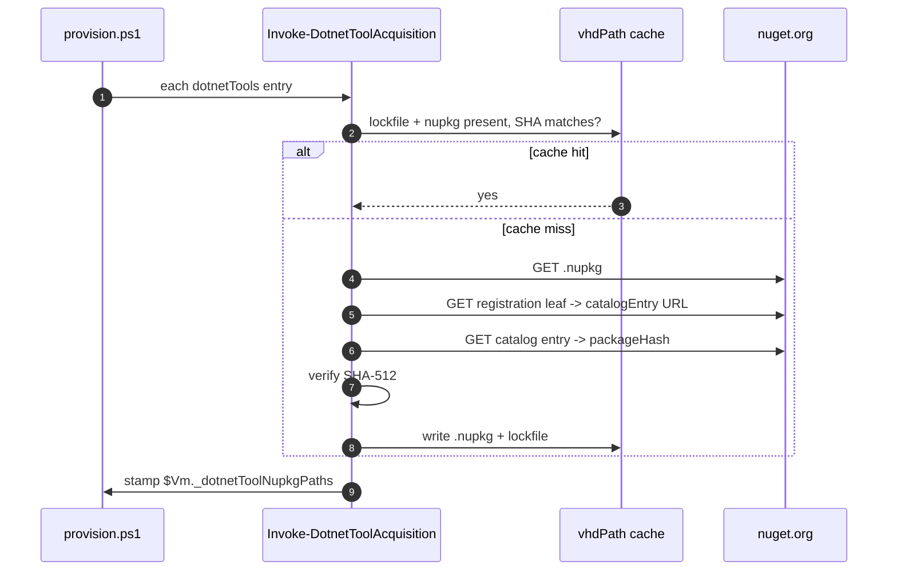
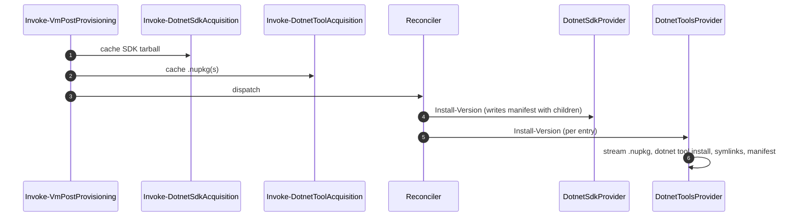
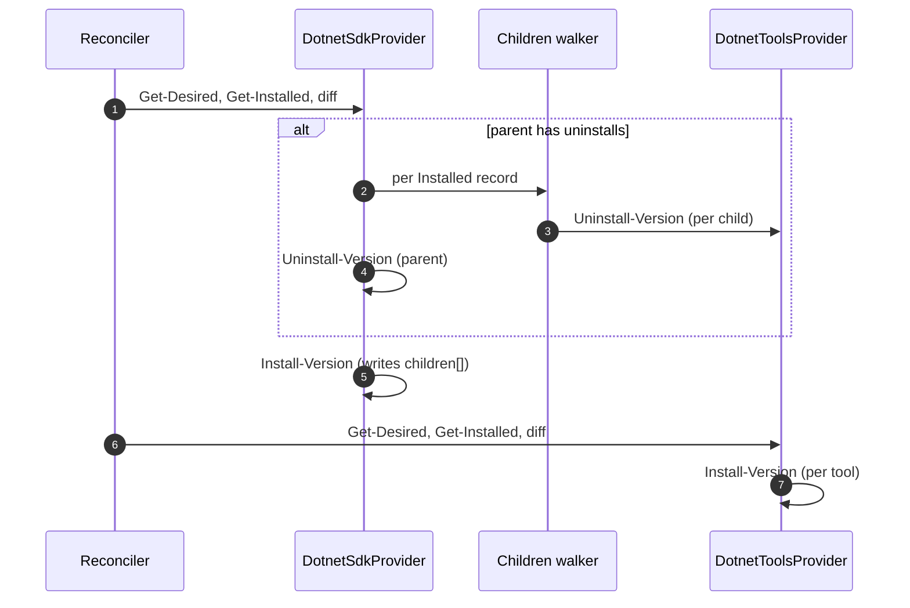
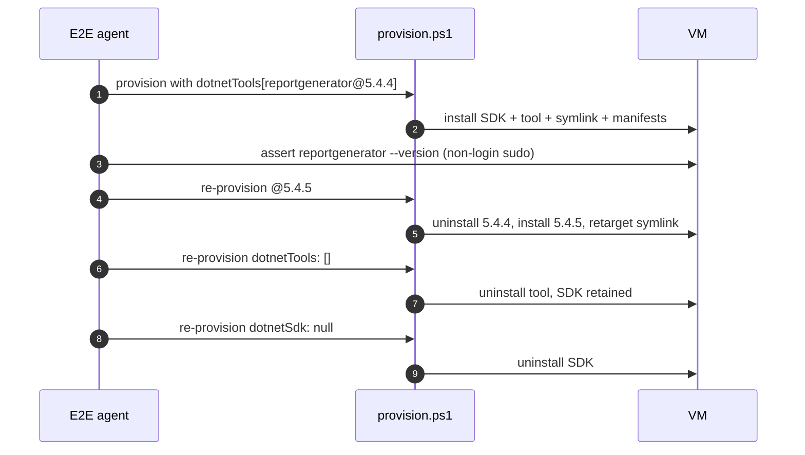

# Plan: Optional .NET Global Tool Installation (from NuGet)

See [problem.md](problem.md) for context, decisions, and acceptance
criteria. This plan turns those decisions into the smallest
committable steps that each carry their own tests.

## Index

- [Shape of the change](#shape-of-the-change)
- [Phase A - Nested-provider plumbing in the reconciler](#phase-a---nested-provider-plumbing-in-the-reconciler)
  - [Step 1 - Manifest `children` walker + nested-provider contract docs](#step-1---manifest-children-walker--nested-provider-contract-docs)
  - [Step 2 - E2E for unregistered-child fallback](#step-2---e2e-for-unregistered-child-fallback)
- [Phase B - DotnetToolsProvider](#phase-b---dotnettoolsprovider)
  - [Step 3 - `dotnetTools` schema + `Assert-DotnetToolsField`](#step-3---dotnettools-schema--assert-dotnettoolsfield)
  - [Step 4 - Host-side `.nupkg` acquirer with repo-signature verification](#step-4---host-side-nupkg-acquirer-with-repo-signature-verification)
  - [Step 5 - `DotnetToolsProvider.*` operations (guest-side install / uninstall)](#step-5---dotnettoolsproviderx-operations-guest-side-install--uninstall)
  - [Step 6A - Provider composition, nested registration, and dispatcher wiring](#step-6a---provider-composition-nested-registration-and-dispatcher-wiring)
  - [Step 6B - Reconciler dispatch for nested-provider installs](#step-6b---reconciler-dispatch-for-nested-provider-installs)
  - [Step 7 - E2E: happy-path nested-provider scenario for `reportgenerator`](#step-7---e2e-happy-path-nested-provider-scenario-for-reportgenerator)

## Shape of the change

The reconciler from [42 - dotnet sdk](../42%20-%20dotnet%20sdk/plan.md)
already dispatches per-toolchain providers and writes manifests with
an (empty) `children` array. This feature first lights up the
nested-provider contract on top of that plumbing (Phase A), then
ships the first real nested provider for .NET global tools (Phase B,
to be planned).

Phase A used to live in feature 42 as Phase D, but was moved here
because the walker is unobservable without a real nested provider to
exercise it - landing both together keeps the contract and its first
consumer in the same review.



---

## Phase A - Nested-provider plumbing in the reconciler

> **Status: landed in [feature 42](../42%20-%20dotnet%20sdk/plan.md#done-in-this-feature-but-scoped-for-feature-43).**
> Both steps below shipped alongside feature 42's commits. Phase B is
> the only remaining work on this feature.

Phase A makes the reconciler aware of nested children and ships E2E
for the one branch the happy-path nested-provider tests in Phase B
will not exercise. After Phase A the walker is wired but does nothing
visible until Phase B registers `DotnetToolsProvider`.

## Step 1 - Manifest `children` walker + nested-provider contract docs

> **Status: landed early in
> [feature 42](../42%20-%20dotnet%20sdk/plan.md#done-in-this-feature-but-scoped-for-feature-43).**
> The walker, the `ParentProvider` contract field, and the unit tests
> all shipped alongside feature 42's commits because the reconciler
> files were already open for editing there. The contract and
> rationale below remain the source of truth - Phase B should read
> them when registering its first nested provider, and reviewers can
> compare the implementation in feature 42 against this spec.

**Reason.** The manifest schema (from feature 42 Step 2) already has
`children`, but the walker is a no-op until a nested provider
exists. This step adds the walker logic and documents the contract
so the `DotnetToolsProvider` in Phase B drops in without re-touching
the reconciler.

**Files**

- `hyper-v/ubuntu/up/reconciler/Invoke-ToolchainReconciliation.ps1` -
  when uninstalling a record whose manifest's `children` array is
  non-empty, walk each child manifest and remove it via the
  registered child provider's `Uninstall-Version` before removing
  the parent.
- `hyper-v/ubuntu/up/reconciler/Get-Providers.ps1` - extend to
  support an optional `ParentProvider` field on a provider object,
  so a nested provider can declare which parent's lifecycle gates
  its own.
- `Tests/up/reconciler/Invoke-ToolchainReconciliation.Tests.ps1` -
  new cases:
  - Manifest with empty `children`: walker is a no-op.
  - Manifest with one child whose provider is registered: child's
    `Uninstall-Version` runs before parent's.
  - Manifest with one child whose provider is NOT registered:
    walker logs a warning and proceeds (the alternative - throwing -
    would leave the parent installed forever once its child
    provider is removed; the warning is the lesser evil).
- `docs/dev/implementation/43 - dotnet nuget/problem.md` - update the
  nested-provider expectation to reference this implementation
  landing point.
- `README.md` - add the nested-provider contract to the Reconciler
  subsection as a short paragraph with a forward link to the
  Phase B provider.

**Behaviour** As above; no behaviour-bearing public surface beyond
the walker.

**Tests (unit)** As enumerated.

**Mermaid**



**README** As above.

---

## Step 2 - E2E for unregistered-child fallback

> **Status: landed early in
> [feature 42](../42%20-%20dotnet%20sdk/plan.md#done-in-this-feature-but-scoped-for-feature-43).**
> The unregistered-child E2E harness shipped with Step 1's walker so
> the branch had live coverage from day one. The scenario below
> remains the contract documentation; the implementation lives in
> `Infrastructure-E2E/agent/e2e/vm-provisioning/`.

**Reason.** Step 1's walker has a "child provider not registered ->
warn and proceed" branch that the happy-path nested-provider E2E in
Phase B cannot exercise, because real cases will always register
both parent and child. The branch covers a real operational scenario
- a provider is removed from `Get-Providers` (deprecated, renamed,
feature reverted) but long-lived VMs still carry manifests that
reference it - so it needs live coverage rather than unit-only
coverage. One synthetic fixture is the smallest way to guard it on
real VMs.

Happy-path nested-provider E2E (parent+child both registered,
install / uninstall / version-change) is out of scope here and
lands with Phase B's `DotnetToolsProvider`.

**Files**

- `Infrastructure-E2E/agent/e2e/vm-provisioning/Invoke-NestedProviderUnregisteredChildAssertions.ps1`
  (new).
- `Infrastructure-E2E/agent/e2e/vm-provisioning/fixtures/nested-unregistered-child/parent-manifest.json`
  (new) - hand-written parent manifest whose `children` array names a
  provider that is not in `Get-Providers`. Used by the assertion script
  to seed the VM before the second provision.
- `README.md` - one-line pointer in the Reconciler subsection noting
  that the unregistered-child fallback is E2E-covered (so Phase B
  reviewers know not to duplicate it).

**Behaviour**

E2E scenario, three provisions on one VM:

1. **Install parent.** Provision with a `javaDevKit` entry (the
   smallest existing provider). Assert install dir and parent
   manifest present.
2. **Seed synthetic child reference.** Out-of-band (via the agent's
   existing SSH client), append a `children` entry to the parent
   manifest pointing at
   `/var/lib/infra-provisioner/manifests/fakeChild-1.0.0.json`, and
   write that child manifest from the fixture. The fixture's
   `provider` field names something never registered (e.g.
   `'fakeChild'`).
3. **Trigger uninstall.** Re-provision with `javaDevKit: null` to
   drive the parent uninstall through the walker.
4. **Assert.**
   - Provisioning exits 0 (the warn-and-continue branch did not
     escalate to a failure).
   - Provisioning log contains a warning naming `fakeChild` and the
     child manifest path.
   - Parent install dir, parent manifest, profile.d, symlinks all
     gone (parent uninstall completed after the walker returned).
   - Child manifest file is still present on disk (the walker has no
     authority to remove a manifest whose provider it cannot dispatch
     to; leaving it lets a future re-registration clean it up).

**Tests (E2E)** As enumerated above. Single `Describe` block in the
agent.

**Mermaid**



**README** As above.

---

## Phase B - DotnetToolsProvider

Phase B is the original scope of this feature: the host-side
acquirer for `.nupkg` files, the guest-side `dotnet tool install`
dispatch, the `Assert-DotnetToolsField` validator, and the
`DotnetToolsProvider` that composes them.

See [problem.md](problem.md) for the design decisions Phase B
implements: Option B (host-prefetched `.nupkg` + `--add-source`
install), nuget.org repo-countersignature verification, system-wide
`--tool-path /usr/local/share/dotnet/tools/`, per-tool
`/usr/local/bin/` symlinks derived from `dotnet tool list`, and
exact-version pins only.

Each step is independently committable. Steps 3-6B form the install
spine; Step 7 is the live coverage that proves the spine. README
updates land alongside each step's code change, so there is no
separate documentation step at the end.

---

## Step 3 - `dotnetTools` schema + `Assert-DotnetToolsField`

**Reason.** The reconciler can only dispatch what the parsed VM
object actually exposes. Landing the validator first keeps every
later step honest: malformed input fails at parse time rather than
deep inside the acquirer or on the VM. Mirrors the
`Assert-DotnetSdkField` precedent so the two validators read as a
pair.

**Files**

- `hyper-v/ubuntu/common/config/Assert-DotnetToolsField.ps1` (new) -
  validates the optional `dotnetTools` field:
  - Absent / `null` / empty array: returns silently.
  - Otherwise: array of objects; each entry must have exactly two
    fields, `id` (non-empty string matching the NuGet id grammar:
    `^[A-Za-z0-9._-]+$`) and `version` (non-empty string; exact pin,
    no `latest`, no floating ranges, no whitespace).
  - Unknown sub-fields throw, matching the strict-by-design posture
    of `Assert-DotnetSdkField`.
  - Cross-field: if `dotnetTools` is non-empty and `dotnetSdk` is
    absent / empty / `null`, throw with a message that names both
    fields ("dotnetTools requires dotnetSdk on the same VM"). The
    cross-field check lives here because both fields are siblings of
    the VM object the validator already receives.
- `hyper-v/ubuntu/common/config/ConvertFrom-VmConfigJson.ps1` - wire
  the new validator into the existing per-VM assertion loop,
  immediately after `Assert-DotnetSdkField` so the cross-field error
  is reported after both fields have been individually validated.
- `Tests/common/config/Assert-DotnetToolsField.Tests.ps1` (new):
  - Absent / `null` / empty array: no-op.
  - One valid entry: passes.
  - Two valid entries: passes; ordering preserved.
  - Missing `id` / missing `version`: throws naming the missing field.
  - Unknown sub-field: throws naming the offending key.
  - `version` containing whitespace, `"latest"`, or a floating range
    (`[1.0,2.0)`): throws.
  - `id` violating the NuGet id grammar: throws.
  - `dotnetTools` non-empty without `dotnetSdk`: throws naming both
    fields.
  - `dotnetTools` empty with `dotnetSdk` absent: passes (ensure-none
    on both is a valid state).
- `Tests/common/config/ConvertFrom-VmConfigJson.Tests.ps1` - one
  passing fixture (VM with one `dotnetSdk` and one `dotnetTools`
  entry) and one failing fixture (cross-field error). The detailed
  shape coverage lives in the dedicated assertion tests above.

**Behaviour** Pure validation; no I/O, no SSH, no side effects.

**Tests (unit)** As enumerated.

**README** Add the new optional field to the VM-definition section
of `README.md`, with the example block from `problem.md`. Note that
the field is opt-in and requires `dotnetSdk` on the same VM.

---

## Step 4 - Host-side `.nupkg` acquirer with SHA-512 verification

**Reason.** The host is the only machine that talks to `nuget.org`;
every VM consumes pre-verified bytes from the cache. This step
delivers the acquirer in isolation so its failure modes (network,
SHA mismatch) can be unit-covered against a mocked HTTP surface
before any VM-side code depends on it.

**Files**

- `hyper-v/ubuntu/up/dotnet/Invoke-DotnetToolAcquisition.ps1` (new) -
  per `dotnetTools` entry:
  1. Compute cache paths:
     `${CacheDir}/dotnet-tool-{id}-{version}.nupkg` and
     `${CacheDir}/dotnet-tool-{id}-{version}.lock.json`.
  2. If both exist and the lockfile's recorded SHA-512 matches the
     `.nupkg` on disk, return cache-hit state. Otherwise re-fetch.
  3. Fetch `https://www.nuget.org/api/v2/package/{id}/{version}` -
     follow redirects, write to a temp file under `${CacheDir}`.
  4. Fetch the registration leaf metadata
     (`https://api.nuget.org/v3/registration5-semver1/{id-lower}/{version}.json`)
     and read its `packageHash` / `packageHashAlgorithm` (SHA-512).
     Throw if either is missing.
  5. Verify the temp file's SHA-512 against the registration hash.
     Throw with both hashes on mismatch.
  6. Atomically rename the temp file into the final cache path and
     write the lockfile:
     ```json
     {
       "id":            "{id}",
       "version":       "{version}",
       "nupkg":         "dotnet-tool-{id}-{version}.nupkg",
       "sha512":        "{hex}",
       "source":        "https://www.nuget.org/api/v2/package/...",
       "acquiredAt":    "ISO-8601 UTC"
     }
     ```
  7. Stamp `$Vm._dotnetToolNupkgPaths` (hashtable: `{id}@{version}` ->
     absolute `.nupkg` path) via `Add-Member`, append-style across
     entries. The reconciler's provider reads these paths the same
     way the SDK provider reads `$Vm._dotnetSdkTarballPath`.
- `Tests/up/dotnet/Invoke-DotnetToolAcquisition.Tests.ps1` (new):
  - Cache hit (lockfile + `.nupkg` SHA match): no HTTP calls; state
    stamped correctly.
  - Cache miss happy path: HTTP mocked to return a fixture nupkg and
    catalog entry; lockfile written.
  - SHA-512 mismatch: throws; no lockfile written; temp file removed.
  - Catalog entry missing `packageHash`: throws with a diagnostic
    naming the package.
  - Registration leaf missing the `catalogEntry` URL: throws without
    making the second HTTP call.
  - Stamping is additive across multiple entries (one VM, two tools).

**Behaviour** All work is on the host. No SSH. The script is safe to
call when `dotnetTools` is absent / empty (early return, same shape
as `Invoke-DotnetSdkAcquisition`).

**Tests (unit)** As enumerated; HTTP is mocked.

**Mermaid**



**README** Extend the host-side cache subsection of `README.md` to
list the new `dotnet-tool-*.nupkg` / `*.lock.json` artefacts
alongside the SDK tarball.

---

## Step 5 - `DotnetToolsProvider.*` operations (guest-side install / uninstall)

**Reason.** With validated config and cached bytes in hand, this
step is the per-VM behaviour: read desired tools, observe installed
tools, install one entry, uninstall one entry. Splitting the four
operation files (matching the JDK / SDK providers) keeps each unit
test surface small.

**Files**

- `hyper-v/ubuntu/up/dotnet/DotnetToolsProvider.Get-DesiredVersions.ps1`
  (new) - reads `$VmConfig.dotnetTools` and returns one Spec per
  entry. Spec carries: `Name` (`'{id}@{version}'`), `Id`, `Version`,
  `NupkgPath` (from `$Vm._dotnetToolNupkgPaths`). Empty / absent
  field returns `@()`, in the `return ,@()` form so it does not unroll
  to `$null` through a call-operator closure.
- `hyper-v/ubuntu/up/dotnet/DotnetToolsProvider.Get-InstalledVersions.ps1`
  (new) - SSH-side: lists
  `/var/lib/infra-provisioner/manifests/dotnetTool-*.json` and
  returns one record per parsed manifest. Each record carries `Id`,
  `Version`, `ManifestPath`, and the list of `/usr/local/bin/`
  symlinks recorded in the manifest (used by Uninstall-Version to
  know what to remove). **Manifest is the sole source of truth** -
  the operation never reads `dotnet tool list`, `.store/`, or
  `/usr/local/bin/` to enumerate; see problem.md's
  [Ownership boundary](../../implementation/43%20-%20dotnet%20nuget/problem.md#ownership-boundary---what-the-provider-does-and-does-not-touch).
- `hyper-v/ubuntu/up/dotnet/DotnetToolsProvider.Install-Version.ps1`
  (new) - given Spec + SshClient + Server:
  1. Stream the cached `.nupkg` via the existing host file server +
     SSH path to a per-VM staging dir
     (`/var/lib/infra-provisioner/staging/dotnet-tools/{id}@{version}/`).
     Reuse the same helper `Install-DotnetSdkVersion` uses for the
     SDK tarball.
  2. Run `dotnet tool install {id} --tool-path
     /usr/local/share/dotnet/tools --add-source <staging-dir>
     --version {version} --ignore-failed-sources`. Capture stdout +
     stderr; non-zero exit throws.
  3. Enumerate the just-installed command name(s) via
     `dotnet tool list --tool-path /usr/local/share/dotnet/tools`,
     filter to the matching `{id}` row, parse the `Commands` column.
  4. For each command name, create / overwrite
     `/usr/local/bin/{cmd}` as a symlink to
     `/usr/local/share/dotnet/tools/{cmd}`. Idempotent: existing
     symlink with the same target is left alone.
  5. Write
     `/var/lib/infra-provisioner/manifests/dotnetTool-{id}-{version}.json`
     - schema: `{ provider: 'dotnetTools', id, version, commands:
     [...], symlinks: [...], parentProvider: 'dotnetSdk',
     installedAt }`. The `parentProvider` field is what Phase A's
     walker reads when uninstalling the parent SDK (the SDK's
     manifest's `children` array is updated by Step 6 below).
  6. Wipe the staging dir.
- `hyper-v/ubuntu/up/dotnet/DotnetToolsProvider.Uninstall-Version.ps1`
  (new) - given Installed record + SshClient:
  1. Remove each recorded `/usr/local/bin/{cmd}` symlink **only if**
     the existing entry is a symlink AND its target resolves into
     `/usr/local/share/dotnet/tools/`. Any other state (regular
     file, symlink to elsewhere, missing entry) is logged and
     skipped - never delete a file whose provenance the manifest
     does not vouch for. See problem.md's
     [Ownership boundary](../../implementation/43%20-%20dotnet%20nuget/problem.md#ownership-boundary---what-the-provider-does-and-does-not-touch).
  2. `dotnet tool uninstall {id} --tool-path
     /usr/local/share/dotnet/tools`. Non-zero exit logs but does not
     throw if the tool was already absent (the symlink and manifest
     cleanup are the load-bearing parts; `dotnet tool uninstall`
     just frees the `.store` slot).
  3. Remove the manifest file.
- `Tests/up/dotnet/DotnetToolsProvider.*.Tests.ps1` (four files,
  one per operation):
  - `Get-DesiredVersions`: empty / one / two entries; ordering
    preserved; throws if `_dotnetToolNupkgPaths` is missing a key
    that `dotnetTools` references (this means Step 4 was skipped -
    fail loud).
  - `Get-InstalledVersions`: zero / one / two manifests; malformed
    manifest is logged and skipped (don't poison the reconciler).
  - `Install-Version`: streams the nupkg, runs the install with the
    expected argument vector, parses `tool list` output, writes the
    expected symlinks, writes the manifest. SSH client and shell
    invocations are mocked.
  - `Uninstall-Version`: removes symlinks only when they point at
    our tools dir; tolerates `dotnet tool uninstall` returning
    non-zero with "not installed" stderr; removes the manifest.

**Behaviour** All guest-side state lives under
`/usr/local/share/dotnet/tools/`,
`/usr/local/bin/`, and
`/var/lib/infra-provisioner/manifests/`. Nothing under any user's
`$HOME`.

**Tests (unit)** As enumerated.

---

## Step 6A - Provider composition, nested registration, and dispatcher wiring

**Reason.** Steps 3-5 ship the parts in isolation; this step is
where they become reachable through the reconciler. Mirrors
`Get-DotnetSdkProvider` in shape but additionally sets the
`ParentProvider` field that Phase A's walker keys off.

**Files**

- `hyper-v/ubuntu/up/dotnet/Get-DotnetToolsProvider.ps1` (new) -
  composes the four operation scriptblocks into one
  `IToolchainProvider` pscustomobject:
  ```
  Name             = 'dotnetTools'
  ParentProvider   = 'dotnetSdk'
  Get-DesiredVersions / Get-InstalledVersions /
  Install-Version    / Uninstall-Version  (closures over helpers)
  ```
  Closure construction follows the same `GetNewClosure()` +
  call-operator pattern as `Get-DotnetSdkProvider.ps1`.
- `hyper-v/ubuntu/up/reconciler/Get-Providers.ps1` - append
  `Get-DotnetToolsProvider -Vm $Vm` after `Get-DotnetSdkProvider`.
  Comment block updated to drop the "v1 ships zero nested
  providers" caveat and name `dotnetTools` as the first real nested
  provider.
- `hyper-v/ubuntu/up/dotnet/DotnetSdkProvider.Install-Version.ps1` -
  when writing the SDK manifest, populate the `children` array with
  the absolute manifest paths for any `dotnetTool-*.json` the
  reconciler will also be writing this run. Accepts a new
  `-ChildEntries` parameter so the helper that derives them stays
  out of this file.
- `hyper-v/ubuntu/up/dotnet/Get-VmDotnetToolChildren.ps1` (new) -
  small helper that reads `$Vm.dotnetTools` and returns the
  `{ provider, manifestPath }` records the walker expects. Lives
  in the SDK provider's directory (not the tools provider's) so
  the parent-knows-children dependency direction is visible from
  the layout; one function per file matches the convention used
  by every other provider operation.
- `hyper-v/ubuntu/up/acquire/Invoke-VmAcquisitions.ps1` - call
  `Invoke-DotnetToolAcquisition -Vm $Vm -CacheDir $Vm.vhdPath`
  immediately after `Invoke-DotnetSdkAcquisition`, guarded by the
  same absent / null / [] opt-in pattern the SDK branch uses.
  `Invoke-VmAcquisitions` is the host-side prefetch orchestrator
  (no SSH, no VM transport), which matches the tool acquirer's
  pure-host nature; pairing it with its SDK sibling here keeps the
  two acquirers in one place. Acquisition order does not matter to
  the reconciler (it dispatches by manifest order), but the SDK
  must be cached before tools because the walker reads SDK
  manifest children to know what to expect.
- `hyper-v/ubuntu/up/dotnet/Update-DotnetProfileD.ps1` (new helper,
  or extend the existing SDK profile.d writer) - extend
  `/etc/profile.d/dotnet.sh` to also prepend
  `/usr/local/share/dotnet/tools/` to `PATH`. One profile file, one
  source of truth; the writer is invoked from
  `DotnetSdkProvider.Install-Version` so the tools-PATH entry is
  always in lockstep with the SDK install (the SDK install is a
  hard prerequisite for the tools install anyway).
- `Tests/up/dotnet/Get-DotnetToolsProvider.Tests.ps1` (new) -
  asserts the returned object has all four operations, `Name =
  'dotnetTools'`, and `ParentProvider = 'dotnetSdk'`.
- `Tests/up/reconciler/Get-Providers.Tests.ps1` - extend to assert
  `dotnetTools` is present in the returned array and has the
  expected `ParentProvider`.
- `Tests/up/dotnet/DotnetSdkProvider.Install-Version.Tests.ps1` -
  extend with one new case: VM with two `dotnetTools` entries writes
  an SDK manifest whose `children` array references the two child
  manifest paths in declaration order.

**Behaviour** End-to-end inside one provision: acquirer caches
`.nupkg`(s) -> reconciler installs SDK -> reconciler walks
`dotnetTools` array via the nested-provider branch -> each tool
installs from the cached nupkg.

**Tests (unit)** As enumerated.

**Mermaid**



**README** Update the Providers subsection with `dotnetTools` and
its `ParentProvider` link to `dotnetSdk`. Note the
`/usr/local/share/dotnet/tools/` + `/usr/local/bin/` topology in
the Guest layout subsection.

---

## Step 6B - Reconciler dispatch for nested-provider installs

**Reason.** Step 6A wired the `DotnetToolsProvider` factory and the
`ParentProvider` field, but the reconciler still partitions nested
providers out of the top-level loop - the children walker dispatches
them only for uninstall. That leaves `Install-DotnetToolVersion` with
no caller in real provision runs, so Step 7's E2E cannot exercise the
tool install path. This step closes that gap.

**Design choice (hybrid dispatch).** Nested providers run in the main
reconciler loop just like top-level providers; the existing uninstall
walker stays in place for the parent-uninstall ordering case. The
`ParentProvider` field becomes pure metadata - the reconciler uses it
only to look up the walker target by Name, not to gate dispatch.
Provider array order (set in `Get-Providers`) is the operator-visible
dispatch order, with the convention that a parent appears before its
children.

Alternatives considered and rejected:

- *Install-side symmetric walker (fires after parent's
  Install-Version).* Breaks the "child version-change while parent
  is NoOp" case - if the parent's diff says NoOp, no Install-Version
  fires, so the walker never runs and the child stays stuck on the
  old version.
- *Topological reorder of all providers, remove walker entirely.*
  The per-provider uninstall-then-install boundary is no longer
  aligned with the per-iteration boundary; a child whose parent is
  being torn down would still see the parent dir mid-iteration.
  Significant orchestrator refactor.
- *Fold child dispatch into `DotnetSdkProvider.Install-Version`.*
  Tightly couples parent to child, loses the generic nested-provider
  contract, and shares the NoOp-parent problem with the symmetric
  walker.

Scenario trace for the chosen path:

- **Parent NoOp + child new version**: parent's diff is NoOp, walker
  quiet. Child's iteration: uninstall old, install new.
- **Parent new version + child stays**: parent's uninstall fires the
  walker -> child removed first -> parent reinstalls (children array
  repopulated from operator config). Child's iteration: desired =
  same pin, installed = empty (walker removed it) -> install fires.
- **Both uninstall**: walker runs during parent's iteration and
  uninstalls the child; parent uninstalls. Child's iteration sees
  desired = empty, installed = empty -> NoOp (no double uninstall).
- **Both install fresh**: parent installs SDK (children array
  pre-populated). Child's iteration: desired = pin, installed =
  empty -> install fires.

**Files**

- `hyper-v/ubuntu/up/reconciler/Invoke-ToolchainReconciliation.ps1` -
  remove the `topLevelProviders` / `nestedProvidersByName` partition;
  the main loop now iterates ALL providers in the supplied order.
  Build `$nestedProvidersByName` from the same providers list (still
  keyed by Name) so the children walker keeps its O(1) lookup.
  Refresh the function header docstring (Phase D notes) to name the
  new dispatch contract.
- `hyper-v/ubuntu/up/reconciler/Get-Providers.ps1` - comment-block
  refresh only: drop the "nested providers are NOT dispatched in the
  top-level loop" claim, replace with "parent appears before children
  in array order; the walker still gates child removal during parent
  uninstall".
- `Tests/up/reconciler/Invoke-ToolchainReconciliation.Tests.ps1` -
  the existing `children walker (Phase D nested providers)` Context's
  first test asserts `dotnetTools.Install-Version (UNEXPECTED)` is
  never logged. Flip that assertion: nested providers MUST run in
  the main loop. The updated case asserts:
  - Parent's `Get-DesiredVersions` / `Get-InstalledVersions` /
    `Install-Version` / `Uninstall-Version` fire in expected order.
  - Walker fires on parent uninstall (existing assertion stays).
  - Child's `Get-DesiredVersions` and `Install-Version` ALSO fire
    AFTER the parent's iteration completes.
  Add two new cases:
  - Parent NoOp, child new version: walker quiet, child install
    fires.
  - Both uninstall: walker fires during parent iteration; child
    iteration sees empty installed (walker removed manifest) and
    takes the NoOp branch (no double `Uninstall-Version`).

**Behaviour** Single dispatch path for all providers. Uninstall
walker remains the only path that fires `Uninstall-Version` ahead of
the parent's own uninstall.

**Tests (unit)** As enumerated; no new files, two updated files.

**Mermaid**



**README** Update the Reconciler subsection of
`hyper-v/ubuntu/README.md`'s nested-provider paragraph to name the
hybrid dispatch: nested providers run in the main loop like any
other provider; the walker stays for parent-uninstall ordering only.

---

## Step 7 - E2E: happy-path nested-provider scenario for `reportgenerator`

**Reason.** Phase A Step 2 covered the unregistered-child fallback;
this step covers the inverse - parent + child both registered, full
install / change / uninstall lifecycle - against a real VM and a
real `nuget.org` round-trip. Uses `dotnet-reportgenerator-globaltool`
because it is the concrete driver named in problem.md and the only
tool the `Common-DotNet` CI workflow requires today.

**Files**

- `Infrastructure-E2E/agent/e2e/vm-provisioning/Invoke-DotnetToolsAssertions.ps1`
  (new) - single `Describe` covering one VM across four provisions.
- `Infrastructure-E2E/agent/e2e/vm-provisioning/fixtures/dotnet-tools-reportgenerator/vm.json`
  (new) - VM definition with `dotnetSdk` pinned to feature 42's
  default and `dotnetTools: [{ id: "dotnet-reportgenerator-globaltool",
  version: "5.4.4" }]`.

**Behaviour** (four provisions, one VM):

1. **Install tool.** Provision with the fixture. Assert:
   - `/usr/local/share/dotnet/tools/.store/dotnet-reportgenerator-globaltool/5.4.4/`
     exists.
   - `/usr/local/bin/reportgenerator` is a symlink into the tools dir.
   - `reportgenerator --version` printed by `sudo -u runner
     /usr/local/bin/reportgenerator --version` exits 0 and prints
     `5.4.4`. The non-login `sudo -u` invocation is the
     load-bearing part - it proves the symlink-on-PATH path works
     for systemd units, which the login-shell-only profile.d path
     would not.
   - Parent SDK manifest's `children` array references the
     `dotnetTool-...-5.4.4.json` manifest.
2. **Version change.** Re-provision with `version: "5.4.5"` (or
   whichever pin is one minor newer at the time the E2E lands).
   Assert: old `.store/.../5.4.4/` gone, new `.../5.4.5/` present,
   symlink retargeted, manifest replaced, parent SDK manifest's
   `children` updated.
3. **Tools removed, SDK retained.** Re-provision with `dotnetTools:
   []`. Assert: tool gone (store dir + symlink + manifest); SDK
   still present; SDK manifest's `children` array is empty.
4. **SDK removed (regression guard for the walker).** Re-provision
   with `dotnetSdk: null`. Assert: SDK gone via the parent's normal
   uninstall path. (No nested-walker traversal expected because
   Step 3 already removed the child, but the assertion exists so a
   future regression that leaves orphan child manifests behind
   fails this scenario.)

**Tests (E2E)** As enumerated above.

**Mermaid**



**README** One-line pointer in the Reconciler subsection that the
happy-path nested-provider lifecycle is covered by
`Invoke-DotnetToolsAssertions`. Also update
`docs/dev/implementation/42 - dotnet sdk/plan.md`'s "Done in this
feature but scoped for feature 43" forward link so it points at
feature 43's merged commits rather than the open plan.
