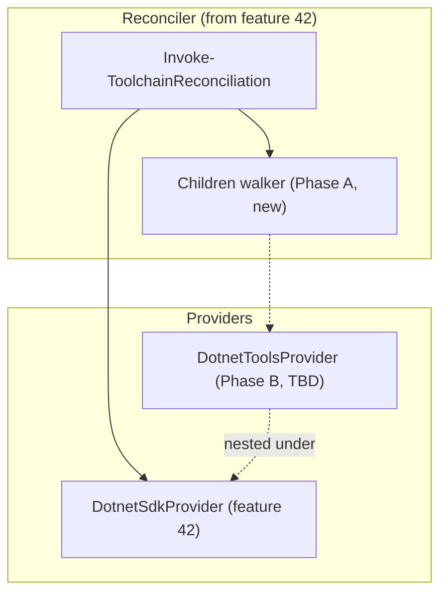
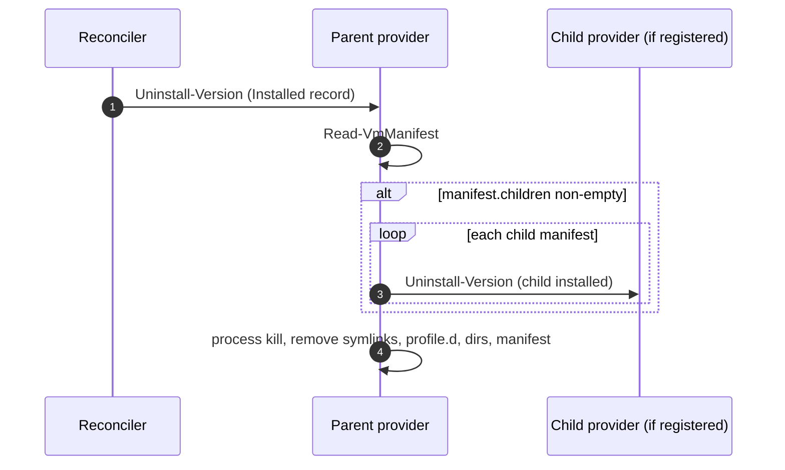
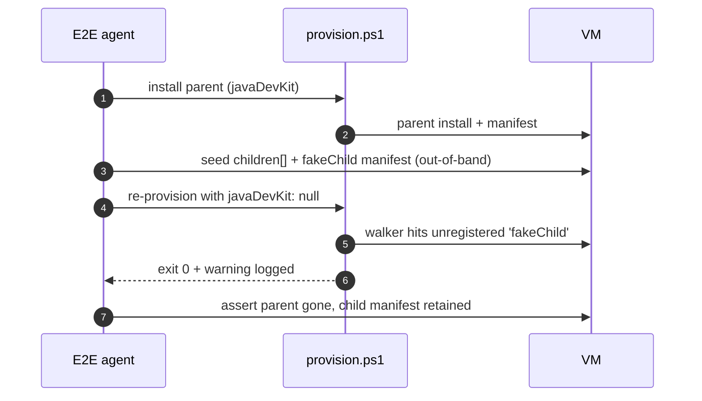

# Plan: Optional .NET Global Tool Installation (from NuGet)

See [problem.md](problem.md) for context, decisions, and acceptance
criteria. This plan turns those decisions into the smallest
committable steps that each carry their own tests.

## Index

- [Shape of the change](#shape-of-the-change)
- [Phase A - Nested-provider plumbing in the reconciler](#phase-a---nested-provider-plumbing-in-the-reconciler)
  - [Step 1 - Manifest `children` walker + nested-provider contract docs](#step-1---manifest-children-walker--nested-provider-contract-docs)
  - [Step 2 - E2E for unregistered-child fallback](#step-2---e2e-for-unregistered-child-fallback)
- [Phase B - DotnetToolsProvider (TBD)](#phase-b---dotnettoolsprovider-tbd)

## Shape of the change

The reconciler from [42 - dotnet sdk](../42%20-%20dotnet%20sdk/plan.md)
already dispatches per-toolchain providers and writes manifests with
an (empty) `children` array. This feature first lights up the
nested-provider contract on top of that plumbing (Phase A), then
ships the first real nested provider for .NET global tools (Phase B,
to be planned).

Phase A used to live in feature 42 as Phase D, but was moved here
because the walker is unobservable without a real nested provider to
exercise it - landing both together keeps the contract and its first
consumer in the same review.

---

## Phase A - Nested-provider plumbing in the reconciler

> **Status: landed in [feature 42](../42%20-%20dotnet%20sdk/plan.md#done-in-this-feature-but-scoped-for-feature-43).**
> Both steps below shipped alongside feature 42's commits. Phase B is
> the only remaining work on this feature.

Phase A makes the reconciler aware of nested children and ships E2E
for the one branch the happy-path nested-provider tests in Phase B
will not exercise. After Phase A the walker is wired but does nothing
visible until Phase B registers `DotnetToolsProvider`.

## Step 1 - Manifest `children` walker + nested-provider contract docs

> **Status: landed early in
> [feature 42](../42%20-%20dotnet%20sdk/plan.md#done-in-this-feature-but-scoped-for-feature-43).**
> The walker, the `ParentProvider` contract field, and the unit tests
> all shipped alongside feature 42's commits because the reconciler
> files were already open for editing there. The contract and
> rationale below remain the source of truth - Phase B should read
> them when registering its first nested provider, and reviewers can
> compare the implementation in feature 42 against this spec.

**Reason.** The manifest schema (from feature 42 Step 2) already has
`children`, but the walker is a no-op until a nested provider
exists. This step adds the walker logic and documents the contract
so the `DotnetToolsProvider` in Phase B drops in without re-touching
the reconciler.

**Files**

- `hyper-v/ubuntu/up/reconciler/Invoke-ToolchainReconciliation.ps1` -
  when uninstalling a record whose manifest's `children` array is
  non-empty, walk each child manifest and remove it via the
  registered child provider's `Uninstall-Version` before removing
  the parent.
- `hyper-v/ubuntu/up/reconciler/Get-Providers.ps1` - extend to
  support an optional `ParentProvider` field on a provider object,
  so a nested provider can declare which parent's lifecycle gates
  its own.
- `Tests/up/reconciler/Invoke-ToolchainReconciliation.Tests.ps1` -
  new cases:
  - Manifest with empty `children`: walker is a no-op.
  - Manifest with one child whose provider is registered: child's
    `Uninstall-Version` runs before parent's.
  - Manifest with one child whose provider is NOT registered:
    walker logs a warning and proceeds (the alternative - throwing -
    would leave the parent installed forever once its child
    provider is removed; the warning is the lesser evil).
- `docs/dev/implementation/43 - dotnet nuget/problem.md` - update the
  nested-provider expectation to reference this implementation
  landing point.
- `README.md` - add the nested-provider contract to the Reconciler
  subsection as a short paragraph with a forward link to the
  Phase B provider.

**Behaviour** As above; no behaviour-bearing public surface beyond
the walker.

**Tests (unit)** As enumerated.

**Mermaid**

**README** As above.

---

## Step 2 - E2E for unregistered-child fallback

> **Status: landed early in
> [feature 42](../42%20-%20dotnet%20sdk/plan.md#done-in-this-feature-but-scoped-for-feature-43).**
> The unregistered-child E2E harness shipped with Step 1's walker so
> the branch had live coverage from day one. The scenario below
> remains the contract documentation; the implementation lives in
> `Infrastructure-E2E/agent/e2e/vm-provisioning/`.

**Reason.** Step 1's walker has a "child provider not registered ->
warn and proceed" branch that the happy-path nested-provider E2E in
Phase B cannot exercise, because real cases will always register
both parent and child. The branch covers a real operational scenario
- a provider is removed from `Get-Providers` (deprecated, renamed,
feature reverted) but long-lived VMs still carry manifests that
reference it - so it needs live coverage rather than unit-only
coverage. One synthetic fixture is the smallest way to guard it on
real VMs.

Happy-path nested-provider E2E (parent+child both registered,
install / uninstall / version-change) is out of scope here and
lands with Phase B's `DotnetToolsProvider`.

**Files**

- `Infrastructure-E2E/agent/e2e/vm-provisioning/Invoke-NestedProviderUnregisteredChildAssertions.ps1`
  (new).
- `Infrastructure-E2E/agent/e2e/vm-provisioning/fixtures/nested-unregistered-child/parent-manifest.json`
  (new) - hand-written parent manifest whose `children` array names a
  provider that is not in `Get-Providers`. Used by the assertion script
  to seed the VM before the second provision.
- `README.md` - one-line pointer in the Reconciler subsection noting
  that the unregistered-child fallback is E2E-covered (so Phase B
  reviewers know not to duplicate it).

**Behaviour**

E2E scenario, three provisions on one VM:

1. **Install parent.** Provision with a `javaDevKit` entry (the
   smallest existing provider). Assert install dir and parent
   manifest present.
2. **Seed synthetic child reference.** Out-of-band (via the agent's
   existing SSH client), append a `children` entry to the parent
   manifest pointing at
   `/var/lib/infra-provisioner/manifests/fakeChild-1.0.0.json`, and
   write that child manifest from the fixture. The fixture's
   `provider` field names something never registered (e.g.
   `'fakeChild'`).
3. **Trigger uninstall.** Re-provision with `javaDevKit: null` to
   drive the parent uninstall through the walker.
4. **Assert.**
   - Provisioning exits 0 (the warn-and-continue branch did not
     escalate to a failure).
   - Provisioning log contains a warning naming `fakeChild` and the
     child manifest path.
   - Parent install dir, parent manifest, profile.d, symlinks all
     gone (parent uninstall completed after the walker returned).
   - Child manifest file is still present on disk (the walker has no
     authority to remove a manifest whose provider it cannot dispatch
     to; leaving it lets a future re-registration clean it up).

**Tests (E2E)** As enumerated above. Single `Describe` block in the
agent.

**Mermaid**

**README** As above.

---

## Phase B - DotnetToolsProvider (TBD)

Phase B is the original scope of this feature: the host-side
acquirer for `.nupkg` files, the guest-side `dotnet tool install`
dispatch, the `Assert-DotnetToolsField` validator, and the
`DotnetToolsProvider` that composes them. It is not yet broken into
steps - the planning pass for Phase B happens after Phase A merges,
so its step boundaries can reflect what Phase A actually shipped
(e.g. the exact shape of `ParentProvider` registration).

See [problem.md](problem.md) for the design decisions Phase B will
implement: Option B (host-prefetched `.nupkg` + `--add-source`
install), system-wide `--tool-path
/usr/local/share/dotnet/tools/`, per-tool `/usr/local/bin/`
symlinks, and exact-version pins only.
