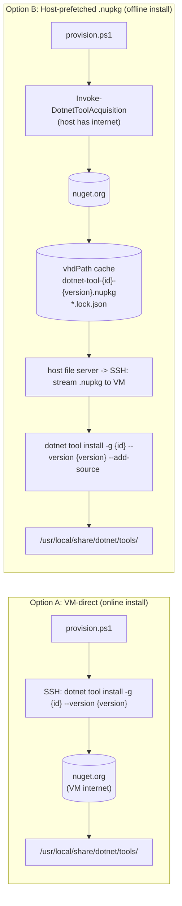
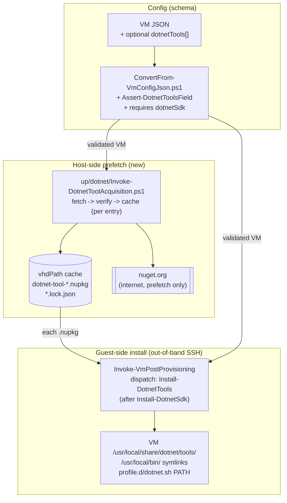
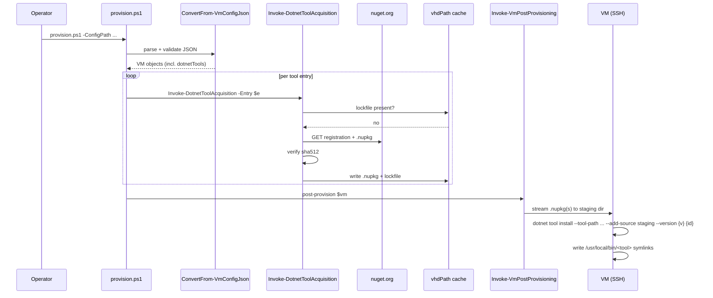

# Problem: Optional .NET Global Tool Installation (from NuGet)

## Index

- [For Laymen](#for-laymen)
- [Context](#context)
- [What Is Changing](#what-is-changing)
  - [New optional JSON field: `dotnetTools`](#new-optional-json-field-dotnettools)
  - [Two delivery options under consideration](#two-delivery-options-under-consideration)
  - [Recommendation](#recommendation)
  - [Guest-side system-wide install](#guest-side-system-wide-install)
- [Why Now](#why-now)
- [Affected Components](#affected-components)
- [Out of Scope](#out-of-scope)
- [Decisions Locked In](#decisions-locked-in)

---

## For Laymen

After the .NET SDK is in place (see
[`42 - dotnet sdk`](../42%20-%20dotnet%20sdk/problem.md)), some
workloads also need extra command-line tools that ship as NuGet
packages - `dotnet-reportgenerator-globaltool` for the SynergyOps CI
coverage report is the first concrete example. This feature adds an
opt-in field on a VM definition that lists such tools and installs
them system-wide so any later user (or service) on the VM can run
them. Per-VM opt-in, no impact on VMs that do not ask for it.

---

## Context

This feature also lights up the reconciler's nested-provider walker
(originally scoped to feature 42, moved here so the walker lands
alongside its first real consumer rather than as dead plumbing).
The walker reads the `children` array that feature 42 already writes
to every manifest. Phase A (the walker + unregistered-child E2E)
has since shipped alongside feature 42's commits - see
[feature 42's plan](../42%20-%20dotnet%20sdk/plan.md#done-in-this-feature-but-scoped-for-feature-43)
for the inventory. The contract documentation for the walker still
lives in [plan.md](plan.md) Phase A. Phase B (the
`DotnetToolsProvider` that consumes the walker) remains the
outstanding work on this feature.

`dotnet tool install -g <pkgId>` is the official way to install a
.NET global tool. The tool itself is a NuGet package; `dotnet`
fetches it from `nuget.org` (or any configured source), unpacks it
into `${DOTNET_TOOLS_ROOT}/.store/`, and writes a shim into
`${DOTNET_TOOLS_ROOT}` that invokes the tool via the runtime.

The immediate driver is `DotNet-Common`'s reusable workflow
`ci-dotnet.yml`, which asserts `reportgenerator --version` and fails
fast with a message pointing at `Infrastructure-GitHubRunners` when
the tool is missing. Once feature 42 puts the SDK on the box, this
feature puts the tools on the box.

`dotnet tool install` accepts `--tool-path <dir>` (system-wide
install location) and `--add-source <path-or-url>` (use a directory
or alternate feed instead of `nuget.org`). Both knobs matter to the
delivery choice below.

---

## What Is Changing

### New optional JSON field: `dotnetTools`

A VM definition gains one optional array field. Each entry pins one
NuGet package id and version. Absent or empty -> unchanged behaviour.

```json
{
  "vmName": "ci-runner-01",
  "...":    "...",
  "dotnetSdk":   { "channel": "8.0", "version": "8.0.404" },
  "dotnetTools": [
    { "id": "dotnet-reportgenerator-globaltool", "version": "5.4.4" }
  ]
}
```

| Sub-field | Allowed values | Notes |
|-----------|----------------|-------|
| `id`      | Any NuGet package id that ships as a .NET global tool | String. Validated as a non-empty NuGet id. |
| `version` | Exact NuGet version string | String. **Exact pin only** in v1 - no `"latest"`, no floating ranges. Reason: reproducibility; this is the same posture the JDK and SDK features take with their lockfiles. |

Validation lives in
[`ConvertFrom-VmConfigJson.ps1`](../../../../hyper-v/ubuntu/common/config/ConvertFrom-VmConfigJson.ps1)
via a new `Assert-DotnetToolsField.ps1` helper.

A `dotnetTools` entry on a VM without `dotnetSdk` is a validation
error - tools need the SDK to install or run. Cross-field validation
lives in the same helper.

### Two delivery options under consideration



|  | Option A: VM-direct | Option B: Host-prefetched |
|--|---------------------|---------------------------|
| Code volume | Smallest. One SSH invocation per tool. | Mirrors the JDK / SDK acquirer pattern - new `up/dotnet/Invoke-DotnetToolAcquisition.ps1` + lockfile + host-file-server delivery. |
| Reproducibility | Relies on `nuget.org` being up *and* the exact version still being listed at provision time. NuGet does support package unlisting, which would silently break a future re-provision. | Strong. Once a `.nupkg` is in `vhdPath` and pinned by a lockfile, re-provision works offline and yields the same bits forever. |
| Network footprint | VM downloads the `.nupkg` (and dependencies, if any tool grows them) through the Hyper-V NAT every time a fresh VM is built. | Host downloads once and caches; subsequent VMs read from `vhdPath`. Matches the NAT-bottleneck-avoidance rationale `Infrastructure-GitHubRunners` already cites for the actions-runner tarball. |
| Failure surface on a long-lived VM | Each `provision.ps1` re-run is a new network call. NuGet outage = provision fails. | Re-runs are local file copies after first acquisition. |
| Trust boundary | VM contacts `nuget.org` directly. | Only the host contacts `nuget.org`; VMs only ever see bytes that the host already SHA-verified. Smaller egress surface for the runner pool. |
| Consistency with existing patterns | Departs from JDK / SDK. | Matches JDK / SDK exactly. |
| Future air-gap support | Blocked. | Already works (this is the whole point of the host-cache pattern). |

### Recommendation

**Option B (host-prefetched).** Concretely:

1. Host-side acquirer `up/dotnet/Invoke-DotnetToolAcquisition.ps1`
   downloads `https://www.nuget.org/api/v2/package/{id}/{version}`,
   verifies the package's SHA-512 against `nuget.org`'s registration
   metadata, then verifies the **nuget.org repo countersignature** via
   `dotnet nuget verify` against a pinned trusted-signer entry for the
   nuget.org repo certificate, and writes it to
   `vhdPath/dotnet-tool-{id}-{version}.nupkg` plus a sidecar
   `dotnet-tool-{id}-{version}.lock.json`. Author-signature
   verification is deferred (see [Decisions Locked In](#decisions-locked-in)).
2. The cached `.nupkg`(s) are streamed to a VM-side staging dir via
   the existing host file server + SSH path used by `Install-Jdk` and
   the new `Install-DotnetSdk`.
3. `dotnet tool install --tool-path /usr/local/share/dotnet/tools
   --add-source <staging-dir> --version {version} {id}` runs on the
   VM, drawing the package from the local staging dir.

The cost (one new acquirer + one new install step + one lockfile
shape) is small, the consistency with the JDK and SDK features is
high, and the reproducibility / air-gap properties are strictly
better. The alternative (Option A) only wins on lines-of-code, and
only marginally - the SSH invocation in Option A is itself most of
the install step Option B already needs.

If a future tool turns out to have a complex transitive .nupkg graph
that the simple host-prefetch cannot satisfy, that tool can fall
back to Option A as an exception under the same field, without
re-architecting.

### Guest-side system-wide install

| Layer | Behaviour |
|-------|-----------|
| `--tool-path` | `/usr/local/share/dotnet/tools/` - a system-wide location outside any single user's `$HOME`, mirroring the `/opt/dotnet-{ver}/` posture of feature 42. |
| `PATH` for login shells | `/etc/profile.d/dotnet.sh` (introduced by feature 42) is extended to also prepend `/usr/local/share/dotnet/tools/` to `PATH`. One profile file, one source of truth. |
| `PATH` for non-login shells | Symlinks under `/usr/local/bin/` for each installed tool's shim, same trick `Install-Jdk` uses for `java`. Required so the runner service (a non-login systemd unit) sees `reportgenerator` on `PATH`. Command names are derived from `dotnet tool list --tool-path /usr/local/share/dotnet/tools/` after install, so the JSON schema does not need a manual `command` field. |
| Trigger | `Install-DotnetTools.ps1` step dispatched by `Invoke-VmPostProvisioning`, after `Install-DotnetSdk` (hard dependency) and before `Set-EnvironmentVariables`. |
| Idempotency | Skips `dotnet tool install` per entry if `/usr/local/share/dotnet/tools/.store/{id}/{version}/` already exists. Re-running `provision.ps1` is a no-op for the tools step in steady state. |
| Multi-tool ordering | Tools install in array order. Failure on one tool fails the step and the VM provisioning, same posture as the JDK install. |

---

## Why Now

- `DotNet-Common`'s `ci-dotnet.yml` asserts `reportgenerator
  --version` and fails the job if missing. Without this feature,
  every coverage-bearing CI run is red on day one.
- Feature 42 (.NET SDK) is the only hard prerequisite, so this
  feature is the natural follow-up that completes the .NET CI
  tooling story on the runner image.
- Choosing the delivery model now (host-prefetch vs VM-direct) and
  committing to it before more tools accrete avoids a later
  migration across two patterns.

---

## Affected Components



Sequence on a fresh host (cache miss) for a single tool:



---

## Out of Scope

- Floating / "latest" version pins. Reproducibility wins; if a tool
  version needs to move, edit the JSON.
- Per-user tool installs (`~/.dotnet/tools/`). All v1 installs are
  system-wide via `--tool-path`.
- Tools that are NOT distributed as .NET global tools (e.g. raw
  `dotnet add package` consumption, or .NET local tools defined in a
  `dotnet-tools.json` manifest). Different shape; different feature
  if ever needed.
- Custom NuGet sources / authenticated feeds. v1 fetches from
  `nuget.org` only.
- Uninstall path. Mirrors the JDK precedent - removal lands as a
  separate follow-up if and when a long-lived VM needs to shed a
  tool without rebuild.
- ARM / non-`linux-x64` builds.

---

## Decisions Locked In

1. **Schema shape - strict object form only.** Every `dotnetTools`
   entry must be an object with both `id` and `version`. No
   shorthand `"id@version"` string form. Matches the verbosity bar
   `javaDevKit` already set, keeps the parser single-path.
2. **Signature verification - repo countersignature in v1, author
   signature deferred.** Every package on `nuget.org` is
   repo-countersigned with a single well-known Microsoft cert, so
   `dotnet nuget verify` against one pinned trusted-signer entry
   gives uniform "served by nuget.org, untampered" coverage for free
   - strictly stronger than the SHA-512-from-registration check
   alone (which is also fetched from nuget.org and so trusts the
   same endpoint). Author-signature verification needs a per-author
   trust policy and is out of scope for v1.
3. **`/usr/local/bin/<tool>` names - derived, not declared.** After
   install, enumerate command names via `dotnet tool list
   --tool-path /usr/local/share/dotnet/tools/` and create one
   symlink per enumerated command. No `command` field on the JSON
   entry; the schema stays minimal.
