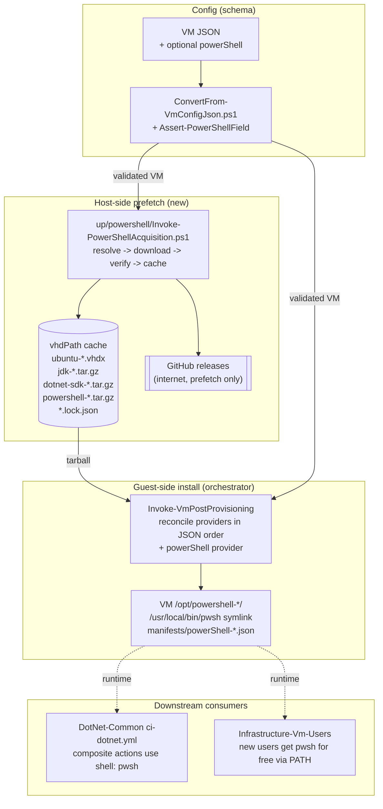

# Problem: PowerShell 7 Provider

## Index

- [For Laymen](#for-laymen)
- [Context](#context)
- [What Is Changing](#what-is-changing)
  - [New optional JSON field: `powerShell`](#new-optional-json-field-powershell)
  - [Version-string granularity](#version-string-granularity)
  - [Host-side prefetch and cache](#host-side-prefetch-and-cache)
  - [Guest-side system-wide install](#guest-side-system-wide-install)
- [Why Now](#why-now)
- [Affected Components](#affected-components)
- [Out of Scope](#out-of-scope)
- [Open Questions](#open-questions)

---

## For Laymen

We already opt VMs into a JDK or a .NET SDK by adding a block to the
VM's JSON definition. This feature does the same thing for
PowerShell 7 (`pwsh`). The motivation is the `DotNet-Common` reusable
CI workflow: every step is a composite action whose script runs under
`shell: pwsh`, and `pwsh` is not on the Ubuntu runner VMs today, so
those steps fail with "pwsh: command not found" the moment the
workflow reaches them. Per-VM opt-in via one new JSON field; no
impact on VMs that do not ask for it.

---

## Context

[42 - dotnet sdk](../42%20-%20dotnet%20sdk/problem.md) established the
declarative reconciliation framework: each toolchain is a provider
that implements `Get-DesiredVersions` / `Get-InstalledVersions` /
`Install-Version` / `Uninstall-Version`, manifests are written to
`/var/lib/infra-provisioner/manifests/{provider}-{version}.json`,
and the orchestrator inside
[`Invoke-VmPostProvisioning`](../../../../hyper-v/ubuntu/up/post/Invoke-VmPostProvisioning.ps1)
walks providers in JSON-declaration order. JDK migrated onto that
framework as part of feature 42. This feature adds PowerShell 7 as
the **fourth** provider on the same framework (after JDK, .NET SDK,
and .NET tools from [43 - dotnet nuget](../43%20-%20dotnet%20nuget/problem.md)).

Distribution source: Microsoft publishes per-release linux-x64
tarballs (`powershell-{version}-linux-x64.tar.gz`) on the
[PowerShell GitHub releases page](https://github.com/PowerShell/PowerShell/releases),
each with a SHA-256 checksum published alongside in
`hashes.sha256`. This is a direct analogue of the Adoptium Temurin
distribution model the JDK provider already consumes - a public
artifact host with versioned tarballs and a checksum file. No
authentication, no apt repository, no VM-side internet.

---

## What Is Changing

### New optional JSON field: `powerShell`

A VM definition gains one optional object field. Absent -> the
provider's `Get-DesiredVersions` returns `$null` and the orchestrator
skips PowerShell. Present -> the orchestrator reconciles the VM to
the requested version.

```json
{
  "vmName": "ci-runner-01",
  "...":    "...",
  "powerShell": {
    "version": "7.4.6"
  }
}
```

| Sub-field | Allowed values (initial scope) | Notes |
|-----------|--------------------------------|-------|
| `version` | See [granularity table](#version-string-granularity) | String only. Numeric `7` is rejected to avoid JSON quirks turning `7.0` into `7`. |

There is no `vendor` sub-field. PowerShell 7 has one upstream
(Microsoft); the JDK precedent for `vendor` exists because Adoptium
is one of several JDK distributors. Keeping the schema honest about
the one-source reality is preferable to a placeholder field.

Validation lives in
[`ConvertFrom-VmConfigJson.ps1`](../../../../hyper-v/ubuntu/common/config/ConvertFrom-VmConfigJson.ps1)
via a new `Assert-PowerShellField.ps1` helper, mirroring
`Assert-JavaDevKitField.ps1` and `Assert-DotnetSdkField.ps1`.

### Version-string granularity

| User writes | Meaning | Resolution behaviour |
|-------------|---------|----------------------|
| `"7"` | Latest GA on the `7.x` line | GitHub releases API query for newest `v7.*` non-preview tag |
| `"7.4"` | Latest GA on `7.4.x` | Same query, filtered to `v7.4.*` |
| `"7.4.6"` | Exact release | No resolution, fetched directly |

Resolution happens at prefetch time (host has internet). The resolved
full version is recorded in the sidecar lockfile next to the cached
tarball, so a re-provision without internet uses the same artifact,
and two VMs requesting `"7.4"` on the same day get the same build.

### Host-side prefetch and cache

| Aspect | Decision |
|--------|----------|
| Cache directory | Same `vhdPath` dir already used by `Invoke-DiskImageAcquisition`, `Invoke-JdkAcquisition`, and `Invoke-DotnetSdkAcquisition`. PowerShell tarballs sit alongside the rest. |
| File naming | `powershell-{resolvedVersion}-linux-x64.tar.gz` |
| Lockfile | `powershell-{requestedVersion}-linux-x64.lock.json`, content: `{ resolvedVersion, sha256, sourceUrl, downloadedUtc }` |
| Checksum | SHA-256 from the release's `hashes.sha256` file. Tarball re-downloaded if present but mismatched. |
| Architecture | `linux-x64` hardcoded in v1 (matches the existing amd64 Ubuntu base image). |
| Reuse across VMs | Two VMs requesting the same `requestedVersion` share one cached tarball and one lockfile. |

New module: `up/powershell/Invoke-PowerShellAcquisition.ps1`,
dispatched by
[`Invoke-VmAcquisitions.ps1`](../../../../hyper-v/ubuntu/up/acquire/Invoke-VmAcquisitions.ps1)
behind the `powerShell` opt-in guard, exactly like the JDK / .NET
SDK acquirers.

### Guest-side system-wide install

System-wide so `pwsh` is visible to every user later created by
`Infrastructure-Vm-Users` and to the GitHub Actions runner service
(a non-login systemd unit) without that repo / that service needing
to know about PowerShell.

| Layer | Behaviour |
|-------|-----------|
| Delivery | Tarball streamed onto the VM via the host file server + SSH path used by `Install-Jdk` and `Install-DotnetSdk` (no intermediate file on the VM disk, no cloud-init `runcmd`). |
| Extraction target | `/opt/powershell-{resolvedVersion}/` |
| `pwsh` on `PATH` | A `/usr/local/bin/pwsh` symlink into the install dir. `/usr/local/bin` is on the default `PATH` for both login and non-login shells (incl. systemd units) on Ubuntu, so no `profile.d` script is required - this is a deliberate departure from JDK / .NET SDK, where `JAVA_HOME` / `DOTNET_ROOT` env vars *also* need to be exported. `pwsh` has no analogous env var. |
| Provider step | `PowerShellProvider.Install-Version.ps1` and `.Uninstall-Version.ps1` dispatched by the orchestrator inside `Invoke-VmPostProvisioning`, ordered after the JDK and .NET SDK providers, before any future provider that depends on `pwsh`. |
| Idempotency | The orchestrator's `Get-InstalledVersions` reads `/var/lib/infra-provisioner/manifests/powerShell-*.json`; install is skipped when the manifest matches the desired version. Re-runs are no-ops in steady state. |
| Manifest | `{ schemaVersion: 1, provider: "powerShell", version, ownedPaths: ["/opt/powershell-{version}"], ownedSymlinks: [{ path: "/usr/local/bin/pwsh", target: "/opt/powershell-{version}/pwsh" }], ownedProfileScripts: [], children: [] }`. |

---

## Why Now

- The immediate blocker: `DotNet-Common`'s `ci-dotnet.yml` runs every
  composite action under `shell: pwsh` and fails with `pwsh: command
  not found` on the runner VMs. The SynergyOps .NET CI rollout cannot
  finish until `pwsh` is on the runner image.
- The reconciliation framework from feature 42 is the natural home -
  PowerShell is "software the box needs", same shape as JDK / .NET
  SDK. Adding it as a fourth provider is mechanical now that the
  contract exists.
- Doing it at provision time keeps the responsibility split clean:
  provisioner owns "software the box needs"; Vm-Users owns
  identities; downstream repos consume the result.

---

## Affected Components



---

## Out of Scope

- Architectures other than `linux-x64`. ARM / aarch64 VMs are not
  produced by this repo.
- PowerShell preview releases. v1 pins to GA tags only; if a preview
  is ever needed, the resolver gains a flag rather than the schema.
- Windows PowerShell 5.1. Out of scope categorically - these are
  Ubuntu VMs.
- Per-version coexistence on the same VM. v1 is one PowerShell per
  VM; the install path embeds the resolved version so multi-version
  is a future feature on the same layout.
- Pre-installing PowerShell modules / `PSGallery` packages. A future
  "PowerShell modules" provider can live alongside this one and
  depend on it, exactly as the .NET tools provider depends on the
  .NET SDK provider. Out of scope for v1.
- APT-based install via the Microsoft package repo. Rejected for the
  same reason `dotnet sdk` rejected it: requires VM internet at
  install time (defeating the host-cache reproducibility argument)
  and pulls in apt-update churn unrelated to PowerShell.

---

## Open Questions

1. Should the resolver follow GitHub's `latest` release pointer (which
   is currently the newest stable GA) or filter the full tag list and
   pick the highest non-preview tag itself? Current proposal: filter
   the tag list, so `"7.4"` and `"7"` both resolve deterministically
   on the same logic; `latest` is convenience surface that we never
   actually need.
2. Should `pwsh` be added to `/etc/shells`? Current proposal: no -
   nothing on these VMs uses `pwsh` as a login shell; the symlink
   alone is enough for scripts and the GitHub Actions runner.
3. Should the provider verify Microsoft's release signature
   (`hashes.sha256.asc`) in addition to the SHA-256? Current
   proposal: SHA-256 only in v1, matching the JDK / .NET SDK posture.
   Signature verification lands as a cross-provider follow-up if and
   when the trust model changes.
