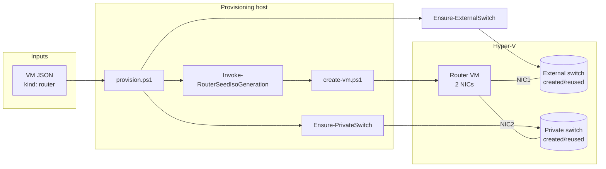
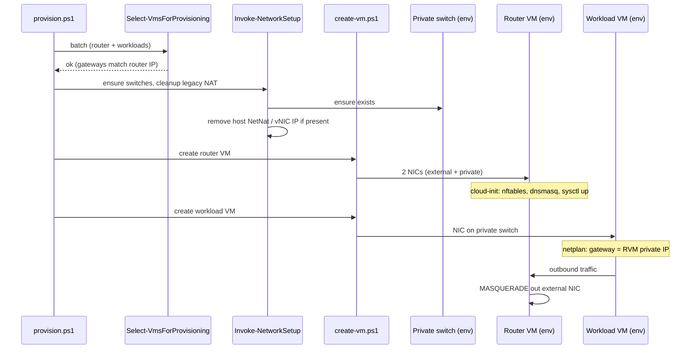
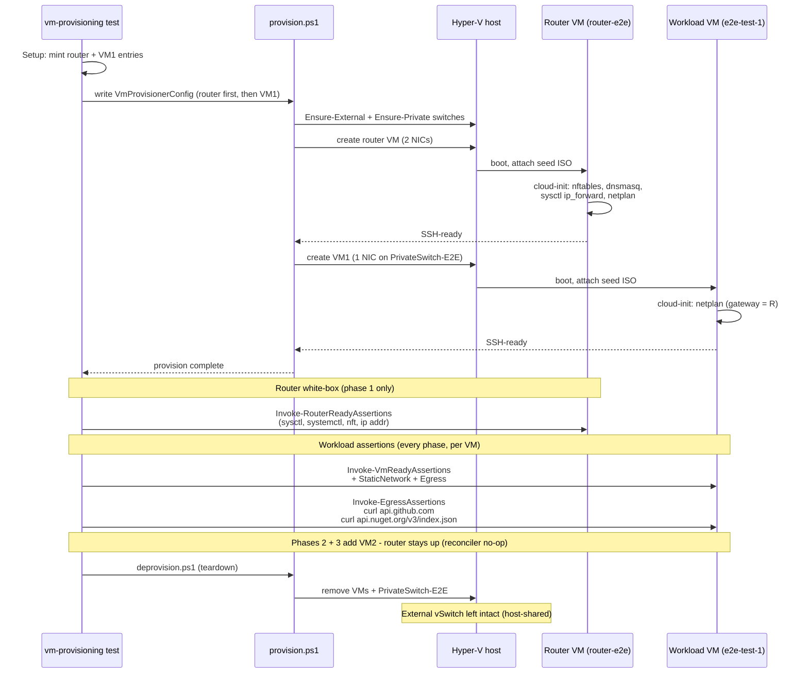

# 53 - NAT router VM - plan

Background and rationale: see [problem.md](./problem.md).

Inherits from problem.md: the
[Production migrates](./problem.md#what-needs-to-change) note that
teardown windows during cutover are acceptable. This plan does not
include parallel-run, blue-green or zero-downtime steps.

## Index

- [Step 1 - Provision a router VM](#step-1---provision-a-router-vm)
- [Step 2 - Route downstream VMs through the router VM](#step-2---route-downstream-vms-through-the-router-vm)
- [Step 3 - Focused router-VM end-to-end verification](#step-3---focused-router-vm-end-to-end-verification)

---

## Step 1 - Provision a router VM

**Reason.** Smallest committable slice that produces a working
router VM in isolation. After this step, the provisioner can take a
router VM definition and end up with a Hyper-V VM that has one NIC
on a host-bridged external switch, one NIC on a per-environment
Hyper-V Private switch, MASQUERADEs outbound, forwards DNS, and
survives reboot with all of that intact. No downstream VM uses it
yet; steps 2 and 3 wire consumers.

**Scope.**

- **VM config schema.** Add a `kind` field (default `"workload"`,
  new value `"router"`) to the VM JSON consumed by
  [`ConvertFrom-VmConfigJson.ps1`](../../../../hyper-v/ubuntu/common/config/ConvertFrom-VmConfigJson.ps1).
  Router VMs require:
  - `externalSwitchName` - host-bridged Hyper-V switch the router's
    upstream NIC attaches to. Created on demand by
    `Ensure-ExternalSwitch` when absent; reused when present.
  - `externalAdapterName` - physical NIC on the host that the
    External switch binds to. Required at schema time because the
    config-load layer does not know whether the switch already
    exists; if it does, the field is ignored at runtime.
    `Get-NetAdapter` on the host shows the available names.
  - `privateSwitchName`, `privateIpAddress`, `subnetMask` - the
    router's private-side NIC, which downstream VMs (step 2) treat
    as their gateway.
  - Standard fields for the management IP on the external NIC
    (`ipAddress`, `gateway`, `subnetMask`, `dns`).
  - No `dotnet`/`jdk`/`dotnetTools` blocks - a router VM is
    intentionally minimal.
- **Private switch creation.** Add
  `hyper-v/ubuntu/up/network/Ensure-PrivateSwitch.ps1` exporting
  `Ensure-PrivateSwitch -Name <name>`. Idempotent. Creates a Hyper-V
  Private switch if absent; reuses an existing one of type
  `Private`; throws if a switch of the same name exists with a
  different type. Does **not** assign a host vNIC IP and does
  **not** create a NetNat - those concerns move to the router VM.
- **External switch creation.** Add
  `hyper-v/ubuntu/up/network/Ensure-ExternalSwitch.ps1` exporting
  `Ensure-ExternalSwitch -Name <name> -NetAdapterName <adapter>`.
  Idempotent. Creates a Hyper-V External switch bound to the named
  physical NIC if absent (`-AllowManagementOS` on, so the host keeps
  its existing connectivity through the adapter); reuses an
  existing one of type `External`; throws if a switch of the same
  name exists with a different type or if the named adapter is
  missing. Sibling of `Ensure-PrivateSwitch`; both are called from
  the router-VM branch of `Invoke-NetworkSetup`.
- **Dual-NIC attachment.** Extend
  [`create-vm.ps1`](../../../../hyper-v/ubuntu/up/vm/create-vm.ps1)
  so router VMs are created with two adapters: the default one
  connected to the external switch, a second one added via
  `Add-VMNetworkAdapter -SwitchName <privateSwitchName>`. Order is
  stable so cloud-init can pin per-NIC config by MAC.
- **Router cloud-init seed.** Add
  `hyper-v/ubuntu/up/seed/Invoke-RouterSeedIsoGeneration.ps1` as a
  sibling of
  [`generate-seed-iso.ps1`](../../../../hyper-v/ubuntu/up/seed/generate-seed-iso.ps1).
  It reuses
  [`New-StaticNetplanYaml`](../../../../hyper-v/ubuntu/up/seed/New-StaticNetplanYaml.ps1)
  for both NICs (one match block per MAC) and emits a `user-data`
  carrying:
  - `packages:` `nftables`, `dnsmasq`.
  - `write_files:` `/etc/sysctl.d/99-router.conf` with
    `net.ipv4.ip_forward = 1`.
  - `write_files:` `/etc/nftables.conf` with `inet filter` FORWARD
    accepting traffic from the private NIC and `ip nat` POSTROUTING
    MASQUERADE on the external NIC. Ruleset is generated, not
    hand-edited at first boot.
  - `write_files:` `/etc/dnsmasq.d/router.conf` binding dnsmasq to
    the private NIC IP, `no-resolv`, upstream resolvers taken from
    the router VM's own `dns` field.
  - `runcmd:` apply sysctl, enable + start `nftables.service` and
    `dnsmasq.service`, run `netplan apply`. Order matters:
    sysctl before nftables (forwarding must be on before traffic
    is matched), nftables before dnsmasq (so dnsmasq's bind to the
    private NIC sees the NIC up).
- **Provisioning pipeline routing.** In
  [`provision.ps1`](../../../../hyper-v/ubuntu/provision.ps1) (or
  the dispatcher it sources), branch by `kind`: router VMs go
  through the router-seed path; existing VMs are unchanged.

**Tests.**

- `Tests/up/network/Ensure-PrivateSwitch.Tests.ps1` (unit) - create
  when absent, reuse when present, throw on wrong type.
- `Tests/up/network/Ensure-ExternalSwitch.Tests.ps1` (unit) - create
  bound to the named adapter when absent, reuse when present, throw
  on wrong type, throw when the named adapter is missing.
- `Tests/up/seed/Invoke-RouterSeedIsoGeneration.Tests.ps1` (unit) -
  fixture-based assertions on `user-data`: packages list, sysctl
  payload, nftables ruleset matches a known-good template
  (string-equal against a fixture under
  `Tests/up/seed/fixtures/router-nftables.conf`), dnsmasq config
  matches a fixture, runcmd order is sysctl -> nftables -> dnsmasq
  -> netplan.
- `Tests/up/vm/create-vm.Tests.ps1` (extend) - router VMs get
  exactly two NICs on the expected switches; non-router VMs
  unchanged (single-NIC path still passes).
- `Tests/common/config/ConvertFrom-VmConfigJson.Tests.ps1` (extend)
  - `kind: router` requires the router-specific fields; missing
  `privateSwitchName` raises with a clear message; `kind:
  workload` (and the implicit default) require none of them.

**README.** Add a "Router VM" subsection under VM kinds (or the
nearest existing structural equivalent): NIC layout, the cloud-init
components it lands, idempotency guarantees of switch and seed.
Link from the doc index.

**Diagram.**

---

## Step 2 - Route downstream VMs through the router VM

**Reason.** After step 1 the router VM is a working gateway with no
clients. This step makes downstream VMs join the per-environment
private switch and use the router VM as their gateway, so a
provisioning run can produce a router + downstream pair where the
downstream reaches the upstream network through the router.
Replaces the host vNIC + `New-NetNat` topology described in
[Today's workaround](./problem.md#todays-workaround).

**Scope.**

- **Environment field on workload VMs.** Add `environment` (or
  `privateSwitchName`, mirroring the router VM's field for
  symmetry - pick one and use it consistently) to the workload VM
  JSON. Identifies which private switch the VM attaches to.
- **Preflight consistency.** Extend
  [`Select-VmsForProvisioning.ps1`](../../../../hyper-v/ubuntu/up/config/Select-VmsForProvisioning.ps1)
  so that, within a batch:
  - VMs in the same environment share `gateway` and `subnetMask`.
  - Each environment with workload VMs has exactly one router VM
    whose `privateIpAddress` equals the workloads' `gateway`.
  - A router VM with no workloads in the same batch is permitted
    (boot the router first, then add workloads later).
- **Network setup.** Update
  [`Invoke-NetworkSetup`](../../../../hyper-v/ubuntu/up/network/setup-network.ps1):
  - Stop creating the singleton Internal switch and the host vNIC
    IP assignment for environments that have a router VM.
  - Stop creating `New-NetNat` for those environments.
  - Idempotent cleanup: if a previous run left a NetNat rule named
    after the legacy convention, remove it. If a host vNIC still
    carries the gateway IP, remove that IP. Safe to re-run.
  - Reuse the private switch produced by step 1's
    `Ensure-PrivateSwitch`. The function is called once per
    environment per batch.
- **Workload NIC attachment.**
  [`create-vm.ps1`](../../../../hyper-v/ubuntu/up/vm/create-vm.ps1)
  connects workload VMs to their environment's private switch
  rather than the singleton `$SwitchName`. The legacy
  `-SwitchName` parameter is replaced (or repurposed) at the
  dispatcher level so call sites pass the per-VM switch name.
- **No netplan change.** Workload VMs' netplan still uses
  `gateway` and `dns` from their JSON. Because the router VM's
  private NIC IP is now what `gateway` points to, no template
  change is needed -
  [`New-StaticNetplanYaml`](../../../../hyper-v/ubuntu/up/seed/New-StaticNetplanYaml.ps1)
  remains gateway-agnostic, which existing tests will keep
  proving.

**Tests.**

- `Tests/up/config/Select-VmsForProvisioning.Tests.ps1` (extend) -
  reject mixed gateways within one environment; reject workload
  VMs whose `gateway` does not match any router VM's
  `privateIpAddress`; accept a router-only batch.
- `Tests/up/network/setup-network.Tests.ps1` (extend) - for an
  environment with a router VM, `Invoke-NetworkSetup` does not
  call `New-NetNat`, does not create an Internal switch, and
  removes leftover legacy state if present (idempotent cleanup).
- `Tests/up/vm/create-vm.Tests.ps1` (extend) - workload VM
  connects to the per-environment private switch named in its
  config.
- Existing `New-StaticNetplanYaml` tests run unchanged - this
  step does not touch netplan generation, proving the change is
  scoped.

**README.** Rewrite the networking section to describe the new
topology: per-environment Private switches, router VM as gateway
and DNS forwarder, host external switch the only host-side
networking concern. Replace any singleton-NAT diagram with the
multi-environment topology already drawn in
[problem.md - What needs to change](./problem.md#what-needs-to-change).

**Diagram.**

---

## Step 3 - Focused router-VM end-to-end verification

**Reason.** This is the gate from
[problem.md - What needs to change](./problem.md#what-needs-to-change)
("verified by a focused end-to-end test"). Unit tests in steps 1
and 2 prove the seed and the wiring are right on paper. They
cannot prove the router VM actually MASQUERADEs, that dnsmasq
actually resolves, or that the configuration survives a reboot.
This step is the gate that lets production migration proceed as
a separate operator-driven event.

**Scope.** Fold the router VM into the main end-to-end flow
(`agent/e2e/vm-provisioning/` in Infrastructure-E2E) rather than
landing a separate scenario. Step 2 made every workload batch
require a router VM (preflight rejects workload-only batches), so
the existing `vm-provisioning` scenario - and the
`runner-lifecycle` scenario that wraps it - need a router VM in
front of their workloads to even pass preflight. Adding it there
also gives per-deployment regression coverage via the polling
agent without doubling agent runtime.

- **Router VM provisioned before workloads.**
  `Invoke-VmProvisioningSetup` mints a router VM definition
  (`router-e2e`, `kind: router`) on a per-environment Private
  switch (`PrivateSwitch-E2E`). The router carries an upstream
  NIC on the host's External vSwitch (operator-supplied via
  `TestVm.routerExternalIp`) and a downstream NIC on the Private
  switch with `privateIpAddress: 10.99.0.1`. Workload VMs
  (`e2e-test-1`, `e2e-test-2`) carry constant private IPs
  (`10.99.0.10` and `.11`) and route through the router.
  `Write-VmProvisionerConfig` prepends the same router entry to
  every phase's VmProvisionerConfig write so the provisioner
  walks the array router-first and phases 2/3 see the router as
  unchanged (reconciler no-op).

- **Per-workload egress assertion.**
  `Invoke-EgressAssertions.ps1` SSHes into the workload VM and
  fetches two real production endpoints with
  `curl -fsS --max-time 30`:
    - `https://api.github.com` - GitHub Actions runner
      registration depends on this.
    - `https://api.nuget.org/v3/index.json` - NuGet host-side
      `.nupkg` prefetch and tool install depend on this.
  Each endpoint maps to an actual downstream dependency, so a
  regression in cert trust, DNS path, or MTU surfaces against the
  same surface the real tests use. The assertion is dispatched
  from every `Invoke-WithVmSshClient` block that opens a workload
  SSH session - phases 1, 2a (VM1 + VM2), 2b (VM1), 3a (VM1),
  3b (VM1 + VM2). Two endpoints is the sweet spot:
  `api.adoptium.net` / `builds.dotnet.microsoft.com` only matter
  when the VM has `javaDevKit` / `dotnetSdk`, and the install
  steps catch endpoint-specific failures with named errors anyway.

- **Router-readiness assertion.**
  `Invoke-RouterReadyAssertions.ps1` runs once in phase 1 after
  the first `provision.ps1` returns: white-box on the router VM
  pinning `net.ipv4.ip_forward=1`, `systemctl is-active nftables`
  / `dnsmasq`, the MASQUERADE rule on `ext0`, the FORWARD accept
  rule for `priv0 -> ext0`, and the configured private IP bound
  on `priv0`. Phases 2 and 3 do not re-run it - the router stays
  up across phases, its entry is byte-identical in every
  VmProvisionerConfig write, and the reconciler takes the no-op
  branch.

- **Teardown.** `Invoke-VmTeardownAssertions.ps1` now checks
  three VMs (router + VM1 + VM2) are gone, their disk artefacts
  are removed, `PrivateSwitch-E2E` is gone (exclusive to this
  test, no guard needed), and the External vSwitch is **still
  present** (host-shared - other consumers attach to it; the
  test must never tear it down). The legacy `E2E-VmLAN` switch +
  `E2E-VmLAN-NAT` checks are removed.

- **Operator-config shape.** `TestVm` in the E2EConfig vault
  payload (and the param block of `Start-VmProvisioningTest.ps1`
  / `Start-VmUsersTest.ps1`) carries:
  - `routerExternalIp` - router upstream NIC IP (was VM1's IP).
  - `externalSubnetMask` / `externalGateway` - upstream LAN
    config for the router (were workload-VM fields).
  - `externalSwitchName` / `externalAdapterName` - host's
    External vSwitch and its underlying NIC.
  - `dns`, `vmConfigPath`, `vhdPath`, `ubuntuVersion` -
    unchanged.
  Workload IPs (`ipAddress`, `subnetMask`, `gateway`) drop out
  of operator config entirely.

**Tests.** This step **is** the test. No supporting unit tests
are added unless the router-entry composition grows a non-trivial
helper, in which case that helper gets a sibling unit test in the
same commit (in Infrastructure-E2E, alongside the test file).

**README.** No change in this repo. The suite is owned by
Infrastructure-E2E; the run instructions and operator-facing
contract live with it there. Surfacing it again here would
duplicate the source of truth and rot the moment the E2E layout
changes.

**Diagram.**

