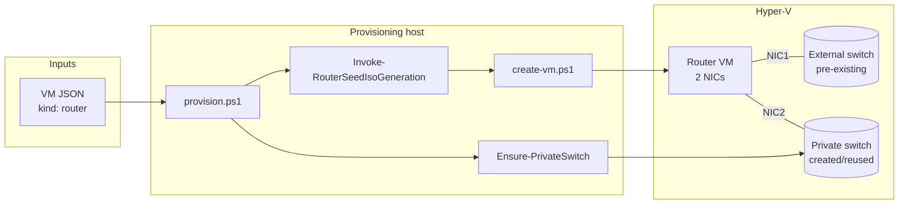
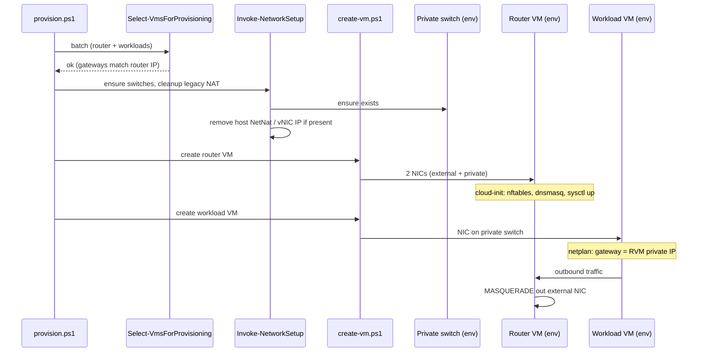
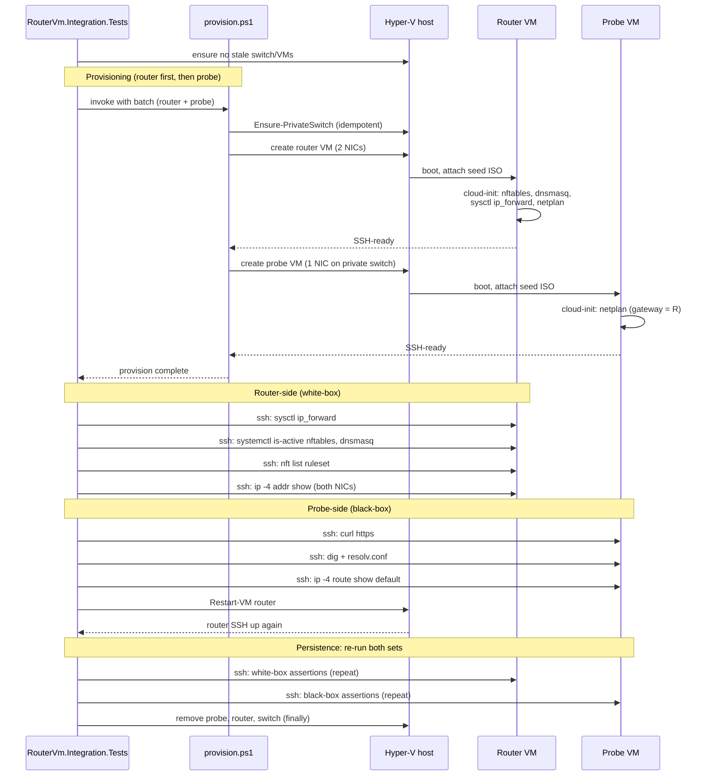

# 53 - NAT router VM - plan

Background and rationale: see [problem.md](./problem.md).

Inherits from problem.md: the
[Production migrates](./problem.md#what-needs-to-change) note that
teardown windows during cutover are acceptable. This plan does not
include parallel-run, blue-green or zero-downtime steps.

## Index

- [Step 1 - Provision a router VM](#step-1---provision-a-router-vm)
- [Step 2 - Route downstream VMs through the router VM](#step-2---route-downstream-vms-through-the-router-vm)
- [Step 3 - Focused router-VM end-to-end verification](#step-3---focused-router-vm-end-to-end-verification)

---

## Step 1 - Provision a router VM

**Reason.** Smallest committable slice that produces a working
router VM in isolation. After this step, the provisioner can take a
router VM definition and end up with a Hyper-V VM that has one NIC
on a host-bridged external switch, one NIC on a per-environment
Hyper-V Private switch, MASQUERADEs outbound, forwards DNS, and
survives reboot with all of that intact. No downstream VM uses it
yet; steps 2 and 3 wire consumers.

**Scope.**

- **VM config schema.** Add a `kind` field (default `"workload"`,
  new value `"router"`) to the VM JSON consumed by
  [`ConvertFrom-VmConfigJson.ps1`](../../../../hyper-v/ubuntu/common/config/ConvertFrom-VmConfigJson.ps1).
  Router VMs require:
  - `externalSwitchName` - existing host-bridged switch this
    feature does not create. Assumed to already exist on the host.
  - `privateSwitchName`, `privateIpAddress`, `subnetMask` - the
    router's private-side NIC, which downstream VMs (step 2) treat
    as their gateway.
  - Standard fields for the management IP on the external NIC
    (`ipAddress`, `gateway`, `subnetMask`, `dns`).
  - No `dotnet`/`jdk`/`dotnetTools` blocks - a router VM is
    intentionally minimal.
- **Private switch creation.** Add
  `hyper-v/ubuntu/up/network/Ensure-PrivateSwitch.ps1` exporting
  `Ensure-PrivateSwitch -Name <name>`. Idempotent. Creates a Hyper-V
  Private switch if absent; reuses an existing one of type
  `Private`; throws if a switch of the same name exists with a
  different type. Does **not** assign a host vNIC IP and does
  **not** create a NetNat - those concerns move to the router VM.
- **Dual-NIC attachment.** Extend
  [`create-vm.ps1`](../../../../hyper-v/ubuntu/up/vm/create-vm.ps1)
  so router VMs are created with two adapters: the default one
  connected to the external switch, a second one added via
  `Add-VMNetworkAdapter -SwitchName <privateSwitchName>`. Order is
  stable so cloud-init can pin per-NIC config by MAC.
- **Router cloud-init seed.** Add
  `hyper-v/ubuntu/up/seed/Invoke-RouterSeedIsoGeneration.ps1` as a
  sibling of
  [`generate-seed-iso.ps1`](../../../../hyper-v/ubuntu/up/seed/generate-seed-iso.ps1).
  It reuses
  [`New-StaticNetplanYaml`](../../../../hyper-v/ubuntu/up/seed/New-StaticNetplanYaml.ps1)
  for both NICs (one match block per MAC) and emits a `user-data`
  carrying:
  - `packages:` `nftables`, `dnsmasq`.
  - `write_files:` `/etc/sysctl.d/99-router.conf` with
    `net.ipv4.ip_forward = 1`.
  - `write_files:` `/etc/nftables.conf` with `inet filter` FORWARD
    accepting traffic from the private NIC and `ip nat` POSTROUTING
    MASQUERADE on the external NIC. Ruleset is generated, not
    hand-edited at first boot.
  - `write_files:` `/etc/dnsmasq.d/router.conf` binding dnsmasq to
    the private NIC IP, `no-resolv`, upstream resolvers taken from
    the router VM's own `dns` field.
  - `runcmd:` apply sysctl, enable + start `nftables.service` and
    `dnsmasq.service`, run `netplan apply`. Order matters:
    sysctl before nftables (forwarding must be on before traffic
    is matched), nftables before dnsmasq (so dnsmasq's bind to the
    private NIC sees the NIC up).
- **Provisioning pipeline routing.** In
  [`provision.ps1`](../../../../hyper-v/ubuntu/provision.ps1) (or
  the dispatcher it sources), branch by `kind`: router VMs go
  through the router-seed path; existing VMs are unchanged.

**Tests.**

- `Tests/up/network/Ensure-PrivateSwitch.Tests.ps1` (unit) - create
  when absent, reuse when present, throw on wrong type.
- `Tests/up/seed/Invoke-RouterSeedIsoGeneration.Tests.ps1` (unit) -
  fixture-based assertions on `user-data`: packages list, sysctl
  payload, nftables ruleset matches a known-good template
  (string-equal against a fixture under
  `Tests/up/seed/fixtures/router-nftables.conf`), dnsmasq config
  matches a fixture, runcmd order is sysctl -> nftables -> dnsmasq
  -> netplan.
- `Tests/up/vm/create-vm.Tests.ps1` (extend) - router VMs get
  exactly two NICs on the expected switches; non-router VMs
  unchanged (single-NIC path still passes).
- `Tests/common/config/ConvertFrom-VmConfigJson.Tests.ps1` (extend)
  - `kind: router` requires the router-specific fields; missing
  `privateSwitchName` raises with a clear message; `kind:
  workload` (and the implicit default) require none of them.

**README.** Add a "Router VM" subsection under VM kinds (or the
nearest existing structural equivalent): NIC layout, the cloud-init
components it lands, idempotency guarantees of switch and seed.
Link from the doc index.

**Diagram.**

---

## Step 2 - Route downstream VMs through the router VM

**Reason.** After step 1 the router VM is a working gateway with no
clients. This step makes downstream VMs join the per-environment
private switch and use the router VM as their gateway, so a
provisioning run can produce a router + downstream pair where the
downstream reaches the upstream network through the router.
Replaces the host vNIC + `New-NetNat` topology described in
[Today's workaround](./problem.md#todays-workaround).

**Scope.**

- **Environment field on workload VMs.** Add `environment` (or
  `privateSwitchName`, mirroring the router VM's field for
  symmetry - pick one and use it consistently) to the workload VM
  JSON. Identifies which private switch the VM attaches to.
- **Preflight consistency.** Extend
  [`Select-VmsForProvisioning.ps1`](../../../../hyper-v/ubuntu/up/config/Select-VmsForProvisioning.ps1)
  so that, within a batch:
  - VMs in the same environment share `gateway` and `subnetMask`.
  - Each environment with workload VMs has exactly one router VM
    whose `privateIpAddress` equals the workloads' `gateway`.
  - A router VM with no workloads in the same batch is permitted
    (boot the router first, then add workloads later).
- **Network setup.** Update
  [`Invoke-NetworkSetup`](../../../../hyper-v/ubuntu/up/network/setup-network.ps1):
  - Stop creating the singleton Internal switch and the host vNIC
    IP assignment for environments that have a router VM.
  - Stop creating `New-NetNat` for those environments.
  - Idempotent cleanup: if a previous run left a NetNat rule named
    after the legacy convention, remove it. If a host vNIC still
    carries the gateway IP, remove that IP. Safe to re-run.
  - Reuse the private switch produced by step 1's
    `Ensure-PrivateSwitch`. The function is called once per
    environment per batch.
- **Workload NIC attachment.**
  [`create-vm.ps1`](../../../../hyper-v/ubuntu/up/vm/create-vm.ps1)
  connects workload VMs to their environment's private switch
  rather than the singleton `$SwitchName`. The legacy
  `-SwitchName` parameter is replaced (or repurposed) at the
  dispatcher level so call sites pass the per-VM switch name.
- **No netplan change.** Workload VMs' netplan still uses
  `gateway` and `dns` from their JSON. Because the router VM's
  private NIC IP is now what `gateway` points to, no template
  change is needed -
  [`New-StaticNetplanYaml`](../../../../hyper-v/ubuntu/up/seed/New-StaticNetplanYaml.ps1)
  remains gateway-agnostic, which existing tests will keep
  proving.

**Tests.**

- `Tests/up/config/Select-VmsForProvisioning.Tests.ps1` (extend) -
  reject mixed gateways within one environment; reject workload
  VMs whose `gateway` does not match any router VM's
  `privateIpAddress`; accept a router-only batch.
- `Tests/up/network/setup-network.Tests.ps1` (extend) - for an
  environment with a router VM, `Invoke-NetworkSetup` does not
  call `New-NetNat`, does not create an Internal switch, and
  removes leftover legacy state if present (idempotent cleanup).
- `Tests/up/vm/create-vm.Tests.ps1` (extend) - workload VM
  connects to the per-environment private switch named in its
  config.
- Existing `New-StaticNetplanYaml` tests run unchanged - this
  step does not touch netplan generation, proving the change is
  scoped.

**README.** Rewrite the networking section to describe the new
topology: per-environment Private switches, router VM as gateway
and DNS forwarder, host external switch the only host-side
networking concern. Replace any singleton-NAT diagram with the
multi-environment topology already drawn in
[problem.md - What needs to change](./problem.md#what-needs-to-change).

**Diagram.**

---

## Step 3 - Focused router-VM end-to-end verification

**Reason.** This is the gate from
[problem.md - What needs to change](./problem.md#what-needs-to-change)
("verified by a focused end-to-end test"). Unit tests in steps 1
and 2 prove the seed and the wiring are right on paper. They
cannot prove the router VM actually MASQUERADEs, that dnsmasq
actually resolves, or that the configuration survives a reboot.
This step is the gate that lets production migration proceed as
a separate operator-driven event.

**Scope.**

- **Probe VM config.** Add a minimal workload VM definition under
  `Tests/Integration/fixtures/` (Ubuntu cloud image, 1 vCPU,
  ~512 MB RAM, single private-switch NIC). Name is neutral
  (`minimal-ubuntu` or similar) - no test-framework names in
  paths that production code might read.
- **Throwaway environment.** Test harness sets up:
  - A private switch named with a unique suffix
    (e.g. `vm-prov-test-<guid>`).
  - A router VM definition pointing at that switch.
  - The probe VM definition pointing at that switch with
    `gateway` = router VM's private IP.
- **Pester integration test.** Add
  `Tests/Integration/RouterVm.Integration.Tests.ps1` that:
  1. Provisions the router VM and the probe VM via the live
     `provision.ps1` (this is an integration test - no mocking
     Hyper-V or cloud-init).
  2. SSHes into the **router VM** and asserts (white-box - pins
     the router's internal state so a failure in step 3
     diagnoses itself instead of forcing manual triage):
     - `sysctl -n net.ipv4.ip_forward` returns `1`.
     - `systemctl is-active nftables` and
       `systemctl is-active dnsmasq` both return `active`.
     - `nft list ruleset` contains the expected MASQUERADE rule on
       the external NIC and a FORWARD accept rule for traffic
       sourced on the private NIC (string-grep against
       interface names from the router's config).
     - `ip -4 addr show` lists the configured private IP on the
       private NIC and a non-link-local upstream IP on the
       external NIC (the latter just has to be routable; the
       specific address depends on the host's upstream).
  3. SSHes into the **probe VM** and asserts (black-box -
     end-to-end traffic flow):
     - `curl -fsS https://www.google.com -o /dev/null` returns 0
       (egress works).
     - `dig +short example.com @127.0.0.53` and the resolver
       chain via `/etc/resolv.conf` lead to the router VM's
       private IP (DNS forwarding works).
     - `ip -4 route show default` lists the router VM's private
       IP as the default gateway (proves the probe is on the
       intended switch and not coincidentally reaching the
       internet via some fallback).
  4. Reboots the router VM (`Restart-VM` on the host), waits for
     SSH-ready, re-runs **both** the router-side and probe-side
     assertion sets (proves nftables, dnsmasq, IPv4 forwarding,
     and NIC config all survive reboot - the
     `runcmd`-vs-systemd-unit distinction matters here).
  5. Tears down both VMs and the private switch in a `finally`
     block. Idempotent: a stale switch or VM from a previous
     aborted run is removed before setup proceeds.
- **Operator entry point.** Add a small wrapper script
  `scripts/Invoke-RouterVmE2E.ps1` that runs Pester against the
  integration test file. Documented in README so developers can
  run it pre-merge on the workstation.

**Tests.** This step **is** the test. No supporting unit tests are
added unless probe-fixture composition is non-trivial enough to
warrant one. If the harness grows a non-trivial helper, that
helper gets a sibling unit test in the same commit.

**README.** Add "End-to-end verification" section: how to run
`scripts/Invoke-RouterVmE2E.ps1` locally, expected duration,
prerequisites (external switch present, Hyper-V available),
teardown behaviour on failure.

**Diagram.**

