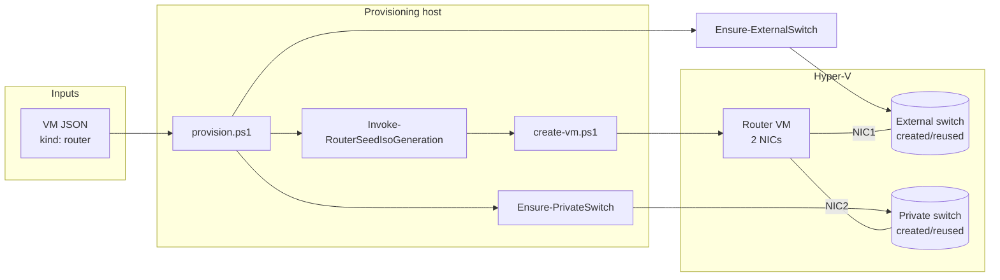
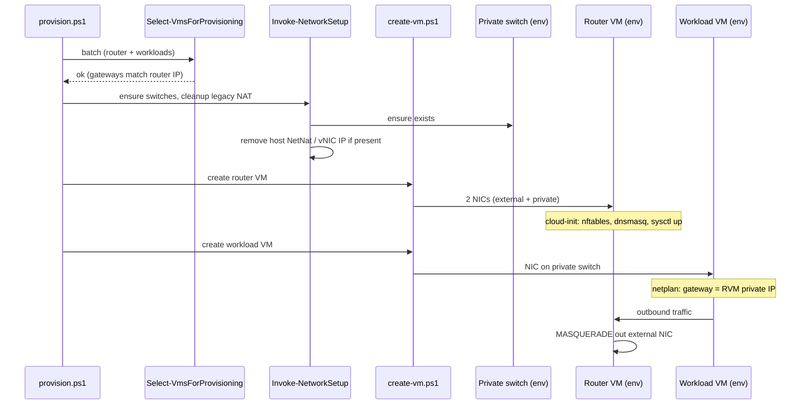
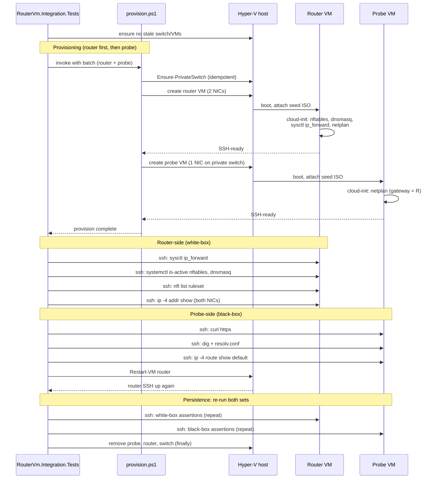

# 53 - NAT router VM - plan

Background and rationale: see [problem.md](./problem.md).

Inherits from problem.md: the
[Production migrates](./problem.md#what-needs-to-change) note that
teardown windows during cutover are acceptable. This plan does not
include parallel-run, blue-green or zero-downtime steps.

## Index

- [Step 1 - Provision a router VM](#step-1---provision-a-router-vm)
- [Step 2 - Route downstream VMs through the router VM](#step-2---route-downstream-vms-through-the-router-vm)
- [Step 3 - Focused router-VM end-to-end verification](#step-3---focused-router-vm-end-to-end-verification)

---

## Step 1 - Provision a router VM

**Reason.** Smallest committable slice that produces a working
router VM in isolation. After this step, the provisioner can take a
router VM definition and end up with a Hyper-V VM that has one NIC
on a host-bridged external switch, one NIC on a per-environment
Hyper-V Private switch, MASQUERADEs outbound, forwards DNS, and
survives reboot with all of that intact. No downstream VM uses it
yet; steps 2 and 3 wire consumers.

**Scope.**

- **VM config schema.** Add a `kind` field (default `"workload"`,
  new value `"router"`) to the VM JSON consumed by
  [`ConvertFrom-VmConfigJson.ps1`](../../../../hyper-v/ubuntu/common/config/ConvertFrom-VmConfigJson.ps1).
  Router VMs require:
  - `externalSwitchName` - host-bridged Hyper-V switch the router's
    upstream NIC attaches to. Created on demand by
    `Ensure-ExternalSwitch` when absent; reused when present.
  - `externalAdapterName` - physical NIC on the host that the
    External switch binds to. Required at schema time because the
    config-load layer does not know whether the switch already
    exists; if it does, the field is ignored at runtime.
    `Get-NetAdapter` on the host shows the available names.
  - `privateSwitchName`, `privateIpAddress`, `subnetMask` - the
    router's private-side NIC, which downstream VMs (step 2) treat
    as their gateway.
  - Standard fields for the management IP on the external NIC
    (`ipAddress`, `gateway`, `subnetMask`, `dns`).
  - No `dotnet`/`jdk`/`dotnetTools` blocks - a router VM is
    intentionally minimal.
- **Private switch creation.** Add
  `hyper-v/ubuntu/up/network/Ensure-PrivateSwitch.ps1` exporting
  `Ensure-PrivateSwitch -Name <name>`. Idempotent. Creates a Hyper-V
  Private switch if absent; reuses an existing one of type
  `Private`; throws if a switch of the same name exists with a
  different type. Does **not** assign a host vNIC IP and does
  **not** create a NetNat - those concerns move to the router VM.
- **External switch creation.** Add
  `hyper-v/ubuntu/up/network/Ensure-ExternalSwitch.ps1` exporting
  `Ensure-ExternalSwitch -Name <name> -NetAdapterName <adapter>`.
  Idempotent. Creates a Hyper-V External switch bound to the named
  physical NIC if absent (`-AllowManagementOS` on, so the host keeps
  its existing connectivity through the adapter); reuses an
  existing one of type `External`; throws if a switch of the same
  name exists with a different type or if the named adapter is
  missing. Sibling of `Ensure-PrivateSwitch`; both are called from
  the router-VM branch of `Invoke-NetworkSetup`.
- **Dual-NIC attachment.** Extend
  [`create-vm.ps1`](../../../../hyper-v/ubuntu/up/vm/create-vm.ps1)
  so router VMs are created with two adapters: the default one
  connected to the external switch, a second one added via
  `Add-VMNetworkAdapter -SwitchName <privateSwitchName>`. Order is
  stable so cloud-init can pin per-NIC config by MAC.
- **Router cloud-init seed.** Add
  `hyper-v/ubuntu/up/seed/Invoke-RouterSeedIsoGeneration.ps1` as a
  sibling of
  [`generate-seed-iso.ps1`](../../../../hyper-v/ubuntu/up/seed/generate-seed-iso.ps1).
  It reuses
  [`New-StaticNetplanYaml`](../../../../hyper-v/ubuntu/up/seed/New-StaticNetplanYaml.ps1)
  for both NICs (one match block per MAC) and emits a `user-data`
  carrying:
  - `packages:` `nftables`, `dnsmasq`.
  - `write_files:` `/etc/sysctl.d/99-router.conf` with
    `net.ipv4.ip_forward = 1`.
  - `write_files:` `/etc/nftables.conf` with `inet filter` FORWARD
    accepting traffic from the private NIC and `ip nat` POSTROUTING
    MASQUERADE on the external NIC. Ruleset is generated, not
    hand-edited at first boot.
  - `write_files:` `/etc/dnsmasq.d/router.conf` binding dnsmasq to
    the private NIC IP, `no-resolv`, upstream resolvers taken from
    the router VM's own `dns` field.
  - `runcmd:` apply sysctl, enable + start `nftables.service` and
    `dnsmasq.service`, run `netplan apply`. Order matters:
    sysctl before nftables (forwarding must be on before traffic
    is matched), nftables before dnsmasq (so dnsmasq's bind to the
    private NIC sees the NIC up).
- **Provisioning pipeline routing.** In
  [`provision.ps1`](../../../../hyper-v/ubuntu/provision.ps1) (or
  the dispatcher it sources), branch by `kind`: router VMs go
  through the router-seed path; existing VMs are unchanged.

**Tests.**

- `Tests/up/network/Ensure-PrivateSwitch.Tests.ps1` (unit) - create
  when absent, reuse when present, throw on wrong type.
- `Tests/up/network/Ensure-ExternalSwitch.Tests.ps1` (unit) - create
  bound to the named adapter when absent, reuse when present, throw
  on wrong type, throw when the named adapter is missing.
- `Tests/up/seed/Invoke-RouterSeedIsoGeneration.Tests.ps1` (unit) -
  fixture-based assertions on `user-data`: packages list, sysctl
  payload, nftables ruleset matches a known-good template
  (string-equal against a fixture under
  `Tests/up/seed/fixtures/router-nftables.conf`), dnsmasq config
  matches a fixture, runcmd order is sysctl -> nftables -> dnsmasq
  -> netplan.
- `Tests/up/vm/create-vm.Tests.ps1` (extend) - router VMs get
  exactly two NICs on the expected switches; non-router VMs
  unchanged (single-NIC path still passes).
- `Tests/common/config/ConvertFrom-VmConfigJson.Tests.ps1` (extend)
  - `kind: router` requires the router-specific fields; missing
  `privateSwitchName` raises with a clear message; `kind:
  workload` (and the implicit default) require none of them.

**README.** Add a "Router VM" subsection under VM kinds (or the
nearest existing structural equivalent): NIC layout, the cloud-init
components it lands, idempotency guarantees of switch and seed.
Link from the doc index.

**Diagram.**

---

## Step 2 - Route downstream VMs through the router VM

**Reason.** After step 1 the router VM is a working gateway with no
clients. This step makes downstream VMs join the per-environment
private switch and use the router VM as their gateway, so a
provisioning run can produce a router + downstream pair where the
downstream reaches the upstream network through the router.
Replaces the host vNIC + `New-NetNat` topology described in
[Today's workaround](./problem.md#todays-workaround).

**Scope.**

- **Environment field on workload VMs.** Add `environment` (or
  `privateSwitchName`, mirroring the router VM's field for
  symmetry - pick one and use it consistently) to the workload VM
  JSON. Identifies which private switch the VM attaches to.
- **Preflight consistency.** Extend
  [`Select-VmsForProvisioning.ps1`](../../../../hyper-v/ubuntu/up/config/Select-VmsForProvisioning.ps1)
  so that, within a batch:
  - VMs in the same environment share `gateway` and `subnetMask`.
  - Each environment with workload VMs has exactly one router VM
    whose `privateIpAddress` equals the workloads' `gateway`.
  - A router VM with no workloads in the same batch is permitted
    (boot the router first, then add workloads later).
- **Network setup.** Update
  [`Invoke-NetworkSetup`](../../../../hyper-v/ubuntu/up/network/setup-network.ps1):
  - Stop creating the singleton Internal switch and the host vNIC
    IP assignment for environments that have a router VM.
  - Stop creating `New-NetNat` for those environments.
  - Idempotent cleanup: if a previous run left a NetNat rule named
    after the legacy convention, remove it. If a host vNIC still
    carries the gateway IP, remove that IP. Safe to re-run.
  - Reuse the private switch produced by step 1's
    `Ensure-PrivateSwitch`. The function is called once per
    environment per batch.
- **Workload NIC attachment.**
  [`create-vm.ps1`](../../../../hyper-v/ubuntu/up/vm/create-vm.ps1)
  connects workload VMs to their environment's private switch
  rather than the singleton `$SwitchName`. The legacy
  `-SwitchName` parameter is replaced (or repurposed) at the
  dispatcher level so call sites pass the per-VM switch name.
- **No netplan change.** Workload VMs' netplan still uses
  `gateway` and `dns` from their JSON. Because the router VM's
  private NIC IP is now what `gateway` points to, no template
  change is needed -
  [`New-StaticNetplanYaml`](../../../../hyper-v/ubuntu/up/seed/New-StaticNetplanYaml.ps1)
  remains gateway-agnostic, which existing tests will keep
  proving.

**Tests.**

- `Tests/up/config/Select-VmsForProvisioning.Tests.ps1` (extend) -
  reject mixed gateways within one environment; reject workload
  VMs whose `gateway` does not match any router VM's
  `privateIpAddress`; accept a router-only batch.
- `Tests/up/network/setup-network.Tests.ps1` (extend) - for an
  environment with a router VM, `Invoke-NetworkSetup` does not
  call `New-NetNat`, does not create an Internal switch, and
  removes leftover legacy state if present (idempotent cleanup).
- `Tests/up/vm/create-vm.Tests.ps1` (extend) - workload VM
  connects to the per-environment private switch named in its
  config.
- Existing `New-StaticNetplanYaml` tests run unchanged - this
  step does not touch netplan generation, proving the change is
  scoped.

**README.** Rewrite the networking section to describe the new
topology: per-environment Private switches, router VM as gateway
and DNS forwarder, host external switch the only host-side
networking concern. Replace any singleton-NAT diagram with the
multi-environment topology already drawn in
[problem.md - What needs to change](./problem.md#what-needs-to-change).

**Diagram.**

---

## Step 3 - Focused router-VM end-to-end verification

**Reason.** This is the gate from
[problem.md - What needs to change](./problem.md#what-needs-to-change)
("verified by a focused end-to-end test"). Unit tests in steps 1
and 2 prove the seed and the wiring are right on paper. They
cannot prove the router VM actually MASQUERADEs, that dnsmasq
actually resolves, or that the configuration survives a reboot.
This step is the gate that lets production migration proceed as
a separate operator-driven event.

**Scope.** The suite lives in Infrastructure-E2E alongside the
other end-to-end provisioning tests (the polyrepo's established
home for tests that drive `provision.ps1` cross-repo). It follows
the same script-orchestrator pattern as the existing
`vm-provisioning` and `vm-users` scenarios: one entry-point script
that builds the test environment and an orchestrator that
dot-sources per-concern setup, assertion, and teardown files. This
step of this plan is about commissioning that suite; only the
README pointer lands in this repo.

- **Test suite location.** `agent/e2e/router-vm/` in
  Infrastructure-E2E:
  - `Start-RouterVmTest.ps1` - parameter entry point (operator-
    facing). Builds the `Config` PSCustomObject and calls
    `Invoke-RouterVmTest`.
  - `Invoke-RouterVmTest.ps1` - orchestrator. Defines the scenario
    constants (router / probe VM names, per-environment Private
    switch name, probe-base fixture), dot-sources all the per-
    concern files, and runs the dispatch: Setup, router-side
    assertions, probe-side assertions, reboot persistence,
    Teardown (finally).
  - `Invoke-NoLeftoverRouterVmsAssertions.ps1` - pre-flight: fails
    if either VM is still in Hyper-V from a previous run.
  - `Invoke-RouterVmSetup.ps1` - builds the router + probe VM
    definitions, writes the test VmProvisionerConfig to the vault,
    calls `provision.ps1` cross-repo.
  - `Invoke-RouterReadyAssertions.ps1` - router-side white-box
    (sysctl, systemctl, nft, NIC addresses).
  - `Invoke-ProbeReachabilityAssertions.ps1` - probe-side black-box
    (default route, HTTPS egress, DNS via the router,
    resolv.conf).
  - `Invoke-RouterRebootPersistenceAssertions.ps1` - reboots the
    router and re-calls the two assertion sets above.
  - `Invoke-RouterVmTeardown.ps1` - deprovisions, removes the vault
    entry, calls Teardown assertions.
  - `Invoke-RouterVmTeardownAssertions.ps1` - post-condition: both
    VMs gone, per-environment Private switch gone, vault entry
    gone, External vSwitch still present (host-shared resource
    the test must not remove).
  - `fixtures/minimal-ubuntu.json` - minimal workload VM
    definition (Ubuntu cloud image, 1 vCPU, ~1 GB RAM, single
    private-switch NIC). Neutral name - no test-framework names
    in paths that production code might read.

- **Throwaway environment.** Setup composes:
  - The per-environment Private switch named `vm-prov-test-e2e`.
  - A router VM definition (`router-e2e`) attached to that switch
    with a per-run password.
  - The probe VM definition (`probe-e2e`) attached to that switch
    with `gateway` and `dns` both pointing at the router VM's
    private IP, and its own per-run password.

- **Behavioural coverage** (what the assertion files together pin
  down):
  - Router-side, post-provisioning: `sysctl -n net.ipv4.ip_forward`
    returns `1`; `systemctl is-active nftables` and `dnsmasq` both
    return `active`; `nft list ruleset` contains the MASQUERADE
    rule on `ext0` and the FORWARD accept rule for `priv0 -> ext0`;
    `ip -4 addr show` lists the configured private IP on `priv0`
    and a non-link-local upstream IP on `ext0`.
  - Probe-side, post-provisioning: `ip -4 route show default` lists
    the router VM's private IP as the default gateway; `curl -fsS
    https://www.google.com -o /dev/null` returns 0; `dig +short
    example.com @<router-private-ip>` returns an A record;
    `/etc/resolv.conf` lists the router's private IP as a
    nameserver.
  - Reboot persistence: `Restart-VM` on the router, then the same
    router-side and probe-side assertions are re-run verbatim
    (proves nftables, dnsmasq, IPv4 forwarding, and NIC config
    survive reboot - the `runcmd`-vs-systemd-unit distinction
    matters here).

**Tests.** This step **is** the test. No supporting unit tests are
added unless probe-fixture composition is non-trivial enough to
warrant one. If the harness grows a non-trivial helper, that
helper gets a sibling unit test in the same commit (in
Infrastructure-E2E, alongside the test file).

**README.** No change in this repo. The suite is owned by
Infrastructure-E2E; the run instructions and operator-facing
contract live with it there. Surfacing it again here would
duplicate the source of truth and rot the moment the E2E layout
changes.

**Diagram.**

