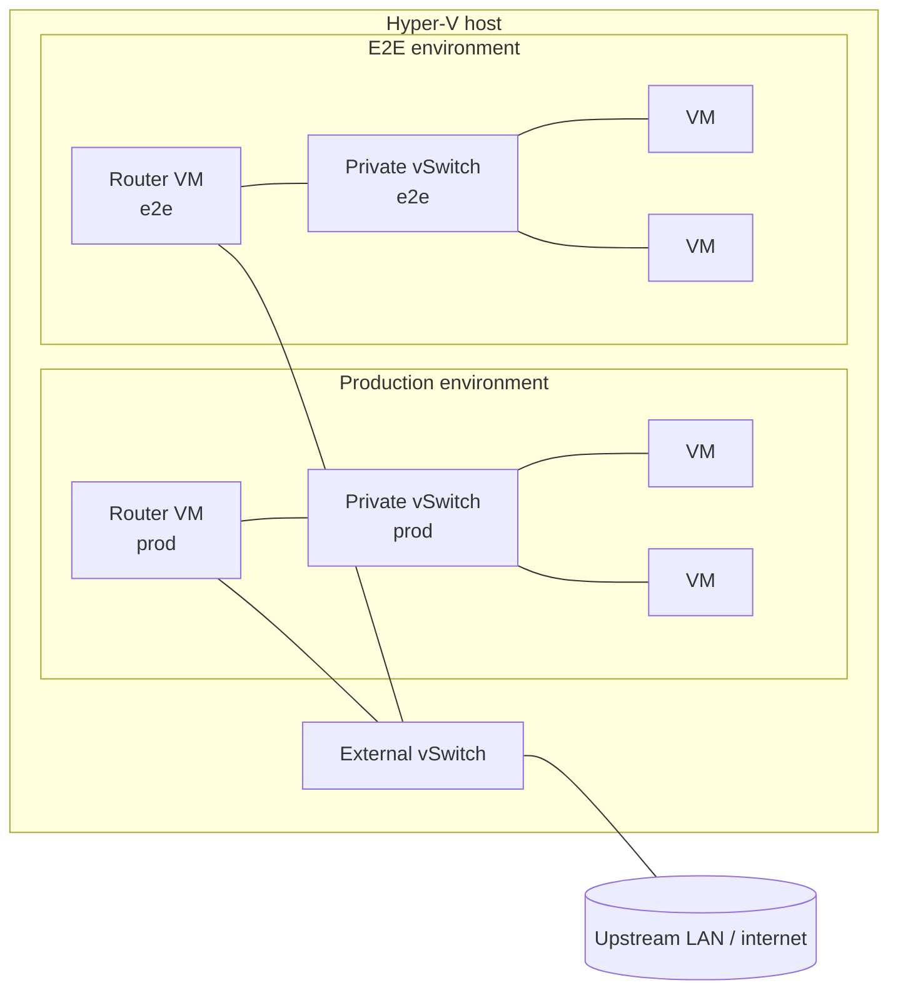

# 53 - NAT router VM

## Index

- [For laymen](#for-laymen)
- [The constraint](#the-constraint)
- [Today's workaround](#todays-workaround)
- [Why this blocks us](#why-this-blocks-us)
- [What needs to change](#what-needs-to-change)
- [Solution approach](#solution-approach)
- [Out of scope](#out-of-scope)

## For laymen

Production VMs reach the internet through a piece of plumbing built
into Windows itself: a host-level "NAT" that translates VM traffic
to the host's address. Windows *will* let you register more than
one such NAT, but only one of them actually carries traffic out to
the internet, and production owns that slot. Any additional NAT we
register works as private routing between the host and its VMs and
stops there - VMs behind it have no way to install packages, pull
container images, register with GitHub, or reach any other external
service.

In practice that means **the end-to-end test environment has no
internet**. We work around this today by **pre-downloading
everything on the host and shipping it to E2E VMs** over a private
file channel: JDKs, the .NET SDK, NuGet packages, the GitHub runner
binary, even small profile snippets - every artifact a VM needs is
fetched, verified and cached on the host, then streamed to the VM
over SSH after first boot. Every new tool or package the VMs need
has to be plumbed through that pipeline, which has accumulated over
several features and is now the default delivery mechanism rather
than an exception.

This feature replaces reliance on the host's single NAT slot with a
small Linux VM that does the gateway job. Because the gateway is
now a VM with its own NIC on the upstream network, we can have
several of them - one per isolated environment - and **E2E VMs get
real internet egress for the first time**, alongside production.
That is the prerequisite for later retiring the host-as-shipper
pipeline; this feature does not retire it, it just unblocks the
ability to.

## The constraint

Windows exposes NAT through `New-NetNat`. Multiple `New-NetNat`
entries **can** coexist on the same host - registering a second
one does not fail - but **only one of them carries traffic out to
the upstream network**. Additional NATs route correctly between the
host and their attached private switch, so VMs behind them can
reach the host and each other, but their outbound packets do not
make it past the host: there is no internet egress. The host
currently runs one working NAT, attached to the production Hyper-V
virtual switch, and that one slot is spoken for.

Adjacent host-level options do not fix this:

- **Internet Connection Sharing (ICS)** is singleton-per-host and
  conflicts with `New-NetNat` for the same egress role.
- **Routing and Remote Access (RRAS)** can in principle host more
  than one NAT interface with real egress, but it is
  configuration-heavy, GUI-first, and not part of any current
  automation in the fleet.

So in practice the host can offer exactly one network with working
outbound NAT, and it is already production's.

## Today's workaround

Because E2E VMs cannot reach the internet, the provisioner has been
wired - over multiple features - to fetch artifacts on the host and
stream them into the VM after first boot. The pattern is now
pervasive enough that there are reusable primitives built
specifically for it (`Add-VmFileServerFile`, `Expand-VmTarball`,
`Invoke-WithVmFileServer`). Today's inventory:

- **Language toolchains and SDKs**
  - JDK tarballs (Adoptium / Temurin, ~100-200 MB):
    [`hyper-v/ubuntu/up/jdk/Invoke-JdkAcquisition.ps1`](../../../../hyper-v/ubuntu/up/jdk/Invoke-JdkAcquisition.ps1)
    fetches host-side, post-provisioning installs over SSH.
    Justified in [20 - java dev kit](../20%20-%20java%20dev%20kit/problem.md)
    and [31 - jdk uninstall flag](../31%20-%20jdk%20uninstall%20flag/problem.md).
  - .NET SDK tarballs (~200-400 MB):
    [`hyper-v/ubuntu/up/dotnet/Invoke-DotnetSdkAcquisition.ps1`](../../../../hyper-v/ubuntu/up/dotnet/Invoke-DotnetSdkAcquisition.ps1),
    same pattern. Justified in
    [42 - dotnet sdk](../42%20-%20dotnet%20sdk/problem.md).
  - .NET global tools as individual `.nupkg` files:
    [`hyper-v/ubuntu/up/dotnet/Invoke-DotnetToolAcquisition.ps1`](../../../../hyper-v/ubuntu/up/dotnet/Invoke-DotnetToolAcquisition.ps1),
    SHA-512 verified host-side. Justified in
    [43 - dotnet nuget](../43%20-%20dotnet%20nuget/problem.md).

- **Configuration payloads**
  - Cloud-init seed ISO (static netplan, user-data, network-config
    disable flag) baked on the host and attached as a DVD drive.
    See [40 - static network config](../40%20-%20static%20network%20config/problem.md).

- **Small things**
  - `/etc/profile.d/jdk.sh`, `/etc/profile.d/dotnet.sh` and similar
    snippets are generated host-side and pushed over SSH rather
    than written by a VM-side script.
  - Arbitrary files listed in a VM's `files:` array travel through
    the same host file server + SSH `curl` path
    ([`Invoke-VmPostProvisioning.ps1`](../../../../hyper-v/ubuntu/up/post/Invoke-VmPostProvisioning.ps1)).

- **Cross-repo**
  - [`Infrastructure-VM-Ansible`](../../../../../Infrastructure-VM-Ansible)'s
    `runner_binary` role pulls the GitHub Actions runner binary
    from the same host file server.

The cost compounds: every new feature that wants to land software
on a VM gets routed through this pipeline. Anything that could
otherwise be a one-line `apt install` or `dotnet tool install`
becomes a host prefetch + verify + cache + file-server + SSH
extract. The pipeline is well-built, but it exists only because
the VM cannot reach the internet.

## Why this blocks us

There are two costs to today's constraint, both load-bearing:

**Cost 1 - E2E cannot mirror production 1-to-1.** The end-to-end
goal is to exercise the production deployment flow against an
isolated test environment that behaves identically. "Identically"
means the test VMs sit behind a NAT with the same semantics as
production - no inbound from the internet, outbound through a
gateway, DNS via that gateway. With only one host NAT providing
real egress, the options are all bad:

1. **Share the production NAT.** Test traffic and production
   traffic cross the same gateway. Misconfiguration in a test run
   can disturb production. Not 1-to-1, and not isolated.
2. **Create a second `New-NetNat` for the test switch.** The NAT
   registers, but its VMs have no internet egress. This is the
   state today, and it is why the host-shipping workaround
   exists. Not 1-to-1 with production's networking either.
3. **Skip NAT in test (external switch, LAN-bridged).** Test VMs
   get LAN IPs directly. No NAT in the path, so any code path that
   depends on NAT semantics is exercised in production but not in
   test. Not 1-to-1.
4. **Skip the test environment entirely.** Not acceptable.

**Cost 2 - a per-artifact tax on every new feature.** Because the
host-shipping pipeline ([Today's workaround](#todays-workaround))
is the only way to land software on an E2E VM, every new tool,
package, or even small file ends up plumbed through host prefetch +
verify + cache + file server + SSH extract. The pipeline is good
at what it does, but the work would not exist at all if the VMs
could fetch their own dependencies. The tax is recurring and lands
on every feature that touches VM software.

What is missing in both cases is a **gateway that is not the
host** - something the provisioner can stand up as many times as
there are environments, each owning its own private network with
real outbound egress.

## What needs to change

Introduce a **router VM** as a persistent piece of infrastructure
that the provisioner can produce on demand, one per isolated
environment. The router VM:

- Has **two NICs**: one on an external (host-bridged) switch
  facing the upstream LAN, one on a private Hyper-V switch facing
  the environment's VMs.
- **MASQUERADEs** traffic from the private NIC out through the
  external NIC, so downstream VMs reach the internet through the
  router VM rather than through `New-NetNat`.
- **Forwards DNS** so downstream VMs resolve names through the
  router VM, matching how they resolve through the host NAT today.
- Is **provisioned through the same patterns** as every other VM in
  the fleet (Infrastructure-Vm-Provisioner, Infrastructure-VM-Ansible),
  so it does not become a hand-tended pet.
- Is **verified by a focused end-to-end test** that stands up the
  router VM plus one small probe VM on a throwaway private switch
  and asserts the gateway behaves correctly: the probe can reach
  the upstream network (e.g. `curl` an external HTTPS endpoint),
  DNS resolves through the router VM, the default route points at
  it, and IPv4 forwarding survives a router-VM reboot. The probe
  VM is itself a normal downstream provision, so a green run also
  smoke-tests that a VM behind the new gateway can do what VMs are
  expected to do. This test is part of this feature - we verify
  the router VM works before production migrates onto it.

Once this exists:

- **Production migrates** from the Windows host NAT to a router VM
  on its private switch. The host NAT slot is freed. Teardown of
  current production VMs during the migration window is acceptable
  (they are not yet in active use), so the plan does not need a
  parallel-run, blue-green, or zero-downtime cutover strategy.
- **End-to-end** stands up its own private switch + router VM,
  fully isolated from production, with the same NAT semantics.
- Future environments are a configuration change, not a host-level
  redesign.

Topology after this feature lands:

## Solution approach

Candidates considered for the router VM's OS / config model:

| Option | License / cost | Fit | Why not chosen |
|---|---|---|---|
| **Plain Debian or Alpine + nftables MASQUERADE + a DNS forwarder** | Open source, free | Exact match: a generic Linux VM doing NAT + DNS forward; one Ansible role | Chosen |
| **[VyOS](https://vyos.io/)** rolling release | Open source; LTS images are paid | Purpose-built network OS with commit/rollback config | Introduces a second config language (VyOS CLI) for a role that is one nft ruleset and one DNS forwarder; cost outweighs benefit at this scope |
| **[OPNsense](https://opnsense.org/) / [pfSense CE](https://www.pfsense.org/)** | Open source, free CE editions | Full firewall + router appliance, web UI | GUI-first configuration fights idempotent script automation; far more surface than this feature needs |
| **[OpenWrt](https://openwrt.org/) x86_64** | Open source, free | Lightweight, scriptable via UCI | Viable but unusual on a server fleet; UCI is another config dialect; no existing team experience |
| **[MikroTik RouterOS CHR](https://help.mikrotik.com/docs/spaces/ROS/pages/18350234/Cloud+Hosted+Router+CHR)** | Closed source; free tier capped at 1 Mbps | Per-environment routers, GUI + CLI | Free tier throughput cap is unworkable; closed source |
| **Windows host RRAS** | Built-in, free | Could host multiple NATs on the host | Not a VM, GUI-first, keeps the host as the gateway - the exact coupling this feature is removing |

**Chosen direction: plain Linux VM + nftables + DNS forwarder**,
provisioned through the existing Infrastructure-Vm-Provisioner and
Infrastructure-VM-Ansible patterns. Reasons:

- **Same substrate as the rest of the fleet.** No new image type,
  no new config language. The router VM is built, configured and
  retired by the same tooling that handles every other VM, so it
  cannot drift into a hand-tended pet.
- **Minimal surface.** The router's job is two rules: MASQUERADE
  out of the external NIC, forward DNS. A purpose-built network
  OS gives features we do not need at a maintenance cost we do not
  want to pay.

## Out of scope

- **Retiring the host-shipping pipeline.** Once VMs have real
  egress through the router VM, the JDK / .NET SDK / NuGet / runner
  binary acquisition scripts can be replaced with the VM doing its
  own `apt` / `curl` / `dotnet tool install`. Large distro mirrors
  may still be worth keeping host-side as a cache for speed and
  reproducibility, but the per-artifact host pipeline goes away.
  Tracked as a later feature; this one delivers the prerequisite
  (working VM egress) without touching the acquisition code, so
  production can be migrated without changing client-side
  assumptions.
- **Migrating existing production VMs onto the new router VM.**
  The migration of production is part of rolling this feature out
  but the steps live in the plan, not the problem statement.
- **Mainline E2E harness changes** beyond what this feature needs.
  The focused router-VM E2E (router + probe VM, gateway-behaviour
  assertions) **is** in scope - it is how we verify the router VM
  works before production migrates. The larger mainline harness
  that drives the production deployment flow through test VMs is
  a separate concern; it consumes the router VM this feature
  delivers but its own changes belong to that harness's roadmap.
- **Replacing the host's external switch** or any other healthy
  host-level networking. Only the host NAT role moves.
- **IPv6, multi-homing, VPN, or site-to-site routing.** The router
  VM is a single-purpose NAT+DNS gateway for one private switch.
