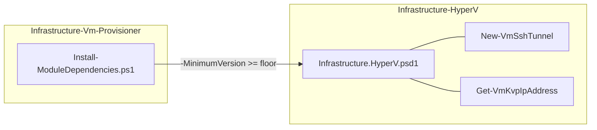
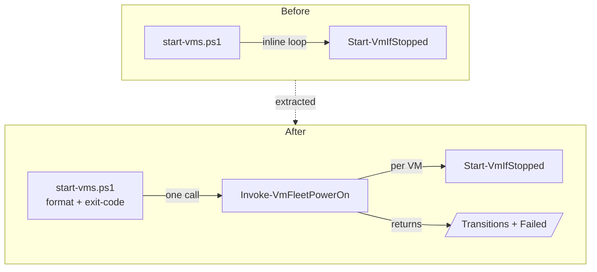
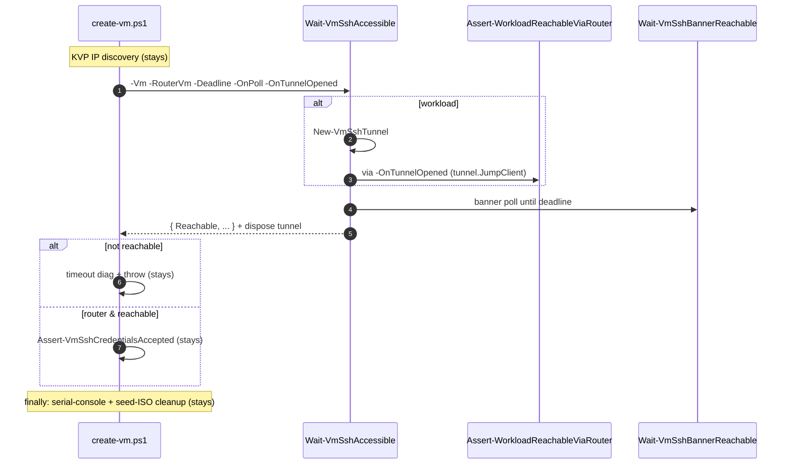
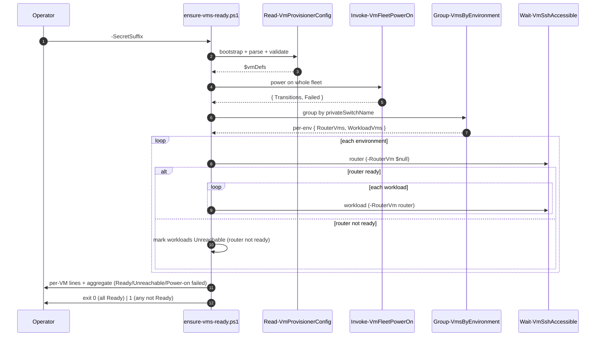

# Plan: Bring the Configured VM Fleet Back to SSH-Ready After a Host Reboot

See [problem.md](problem.md) for context, the readiness definition, the
off-the-shelf survey, and rationale.

## Index

- [Step 1 - Confirm Infrastructure.HyperV dependency floor](#step-1---confirm-infrastructurehyperv-dependency-floor)
- [Step 2 - Extract `Invoke-VmFleetPowerOn` and retrofit `start-vms.ps1`](#step-2---extract-invoke-vmfleetpoweron-and-retrofit-start-vmsps1)
- [Step 3 - Add `Wait-VmSshAccessible` shared reachability helper](#step-3---add-wait-vmsshaccessible-shared-reachability-helper)
- [Step 4 - Retrofit `create-vm.ps1` onto `Wait-VmSshAccessible`](#step-4---retrofit-create-vmps1-onto-wait-vmsshaccessible)
- [Step 5 - Add `ensure-vms-ready.ps1` entry-point](#step-5---add-ensure-vms-readyps1-entry-point)

---

## Step 1 - Confirm Infrastructure.HyperV dependency floor

**Reason:** Step 3 and Step 5 import-resolve `New-VmSshTunnel` and
`Get-VmKvpIpAddress` from `Infrastructure.HyperV` at provision-time, so
its `-MinimumVersion` floor must already ship both before those steps
can run on a clean machine. (`Wait-VmSshBannerReachable` is a repo-local
helper under `common/ssh/`, not a HyperV cmdlet, so it imposes no floor.)
Splitting the
version pin from the behavioural changes keeps diffs focused, mirroring
[38 - start vms Step 1](../38%20-%20start%20vms/plan.md#step-1---confirm-infrastructurehyperv-dependency-floor).

**Decisions locked**

- Read the
  [HyperV psd1](../../../../../Infrastructure-HyperV/Infrastructure.HyperV/Infrastructure.HyperV.psd1)
  `ModuleVersion` at implementation time. These cmdlets are already
  consumed by `create-vm.ps1` today, so the floor is almost certainly
  high enough already - if so this step is a no-op confirmation with
  the audit trail in the commit message. Bump only if the floor in
  [Install-ModuleDependencies.ps1](../../../../hyper-v/ubuntu/Install-ModuleDependencies.ps1)
  is behind the version that ships all three.
- Keep `-MinimumVersion` (not `RequiredVersion`); uniform pin style with
  every other module in `Install-ModuleDependencies.ps1`.

**Files**

- [hyper-v/ubuntu/Install-ModuleDependencies.ps1](../../../../hyper-v/ubuntu/Install-ModuleDependencies.ps1) -
  raise the `Infrastructure.HyperV` `-MinimumVersion` only if behind;
  otherwise no edit.

**Tests (unit, mocked)**

- None - the floor is a configuration value, not logic. Steps 2-5
  exercise the cmdlets it brings in.

**README update**

- None unless the README pins a HyperV version explicitly (it does not).

**Mermaid**



---

## Step 2 - Extract `Invoke-VmFleetPowerOn` and retrofit `start-vms.ps1`

**Reason:** Lands the power-on helper described in
[problem.md - Shared power-on fleet helper](problem.md#shared-power-on-fleet-helper-invoke-vmfleetpoweron).
`start-vms.ps1` is the only current caller, so extraction + retrofit
land in one bisectable commit: the new helper owns the per-VM loop, and
`start-vms.ps1` shrinks to a formatting/exit-code shell over it. Doing
this before Step 5 stops `ensure-vms-ready.ps1` from becoming a third
inline copy of the `Start-VmIfStopped` loop - the single-source-of-truth
move [38 - start vms](../38%20-%20start%20vms/plan.md) made for the
vault bootstrap.

**Decisions locked**

- File path:
  `hyper-v/ubuntu/common/power/Invoke-VmFleetPowerOn.ps1`. A new
  `common/power/` folder (no existing home for power-lifecycle helpers);
  groups with future power helpers (e.g. a stop counterpart).
- Signature: `Invoke-VmFleetPowerOn -VmDefs <object[]>`. Returns
  `[PSCustomObject]@{ Transitions = @(...); Failed = @(...) }` where
  each `Transitions` element is the `Start-VmIfStopped` object
  (`{ VmName, EntryState, Action }`) and each `Failed` element is
  `{ VmName, Reason }`. The helper does **no** `Write-Host` and **no**
  `exit` - presentation and exit-code stay with the caller, so
  `ensure-vms-ready.ps1` can fold power-on failures into its own
  readiness aggregate.
- Both accumulators initialise to `@()` outside the loop and append
  inside; never `$x = if (...) {...}` (yields `$null`/scalar under
  strict mode). See [[feedback-pester5-empty-array-mock]].
- One `try`/`catch` per VM around `Start-VmIfStopped`; a single failure
  is recorded and the loop continues. Lifted verbatim from
  [start-vms.ps1:85-103](../../../../hyper-v/ubuntu/start-vms.ps1).
- `start-vms.ps1` retrofit: the loop body (lines 85-103) becomes
  `$result = Invoke-VmFleetPowerOn -VmDefs $vmDefs`, then its existing
  summary lines read from `$result.Transitions` / `$result.Failed`.
  Synopsis, summary text, and `exit ($failed.Count -gt 0 ? 1 : 0)` are
  unchanged - output stays byte-for-byte identical.
- `Where-Object` bucket counts in `start-vms.ps1` keep their `@(...)`
  wrap before `.Count`. See [[feedback-pester5-single-match-count]].

**Files**

- `hyper-v/ubuntu/common/power/Invoke-VmFleetPowerOn.ps1` (new) -
  function with the `.NOTES` "do not run directly, dot-sourced" header
  every `common/` helper carries.
- [hyper-v/ubuntu/start-vms.ps1](../../../../hyper-v/ubuntu/start-vms.ps1) -
  dot-source the helper, replace the loop with one call, read the
  buckets off the returned object.
- `Tests/common/power/Invoke-VmFleetPowerOn.Tests.ps1` (new).
- [Tests/start-vms.Tests.ps1](../../../../Tests/start-vms.Tests.ps1) -
  move any assertion that drove the inline `Start-VmIfStopped` loop
  onto the helper suite; the start-vms suite now mocks
  `Invoke-VmFleetPowerOn` and asserts the formatting + exit-code
  contract it still owns.

**Tests (unit, mocked)**

`Invoke-VmFleetPowerOn` suite - mock `Start-VmIfStopped`:

- 3 VMs returning `Started` / `Resumed` / `AlreadyRunning`:
  `Start-VmIfStopped` invoked once per `vmName` in input order;
  `Transitions` has 3 entries, `Failed` empty.
- One VM throws: the remaining calls still fire (loop not stranded);
  `Failed` has one `{ VmName, Reason }` with the original message;
  `Transitions` has the rest.
- All VMs throw: `Transitions` empty, `Failed` has every VM.
- Single-VM input still returns arrays (not unwrapped scalars) for both
  buckets - locks the strict-mode unrolling trap
  ([[feedback-pester5-single-match-count]]).
- Empty `-VmDefs`: returns both buckets empty, no `Start-VmIfStopped`
  call (`-AllowEmptyCollection`).

`start-vms.ps1` suite - mock `Invoke-VmFleetPowerOn`, `exit`, stub
`Install-ModuleDependencies.ps1` and `Read-VmProvisionerConfig`:

- Given a fixture `{ Transitions; Failed }`, the summary lines and the
  aggregate `Started/Resumed/Already running/Failed` counts match
  today's output; exit 0 when `Failed` empty, exit 1 otherwise.
- `Invoke-VmFleetPowerOn` invoked exactly once with the VM defs from
  `Read-VmProvisionerConfig`.

**README update**

- None - operator behaviour of `start-vms.ps1` is unchanged.

**Mermaid**



---

## Step 3 - Add `Wait-VmSshAccessible` shared reachability helper

**Reason:** Lands the reachability core described in
[problem.md - Shared reachability helper](problem.md#shared-reachability-helper-wait-vmsshaccessible)
as a standalone file with its own suite, **before** `create-vm.ps1` is
migrated onto it. Sequencing the helper first means Step 4 is a pure
delegation diff guarded by the existing provisioning tests, and any
regression in the extracted logic bisects to this commit rather than
being entangled with the call-site move.

**Decisions locked**

- File path: `hyper-v/ubuntu/common/ssh/Wait-VmSshAccessible.ps1`. A new
  `common/ssh/` folder for SSH-reachability helpers (sibling to
  `common/config/`, `common/network/`).
- Signature per the
  [problem.md sketch](problem.md#shared-reachability-helper-wait-vmsshaccessible):
  `-Vm`, `-RouterVm` (nullable), `-Deadline`, `-PollIntervalSeconds`
  (default 10, matching create-vm), `-OnPoll`, `-OnTunnelOpened`.
  Returns `{ Reachable; ProbeIp; ProbePort; ElapsedSeconds }`.
- Topology branch:
  - `RouterVm` present (workload): open `New-VmSshTunnel`
    (`-TargetIp $Vm.ipAddress`, `-JumpHostIp $RouterVm.ipAddress`,
    `-JumpUsername`/`-JumpPassword` from the router def); probe
    `tunnel.LocalHost:tunnel.LocalPort`.
  - `RouterVm` `$null` (router / standalone): probe `$Vm.ipAddress:22`.
- After the forward opens and **before** the banner poll, invoke
  `-OnTunnelOpened` (if supplied) passing the tunnel object. This is the
  seam `create-vm.ps1` uses in Step 4 to run its router-side diag gate
  against `tunnel.JumpClient`; the helper itself stays diag-free.
- The gate is `Wait-VmSshBannerReachable -IpAddress $probeIp
  -Port $probePort -Deadline $Deadline -PollIntervalSeconds
  $PollIntervalSeconds -OnPoll $OnPoll`. The `-OnPoll` hook carries the
  caller's Hyper-V "is the VM still Running" early-exit, exactly as
  create-vm does today - that concern stays out of the generic waiter.
- Tunnel disposal in a `finally` so it is torn down whether the poll
  succeeds, times out, or `-OnTunnelOpened` throws. Disposal is
  idempotent and a no-op on the router branch (no tunnel opened).
- The helper does **not** own: KVP IP discovery, the diag bundle,
  serial-console capture, phase timing, the router credential gate
  (`Assert-VmSshCredentialsAccepted`). Those stay in `create-vm.ps1`
  per [problem.md - Out of Scope of the helper](problem.md#shared-reachability-helper-wait-vmsshaccessible).
- `Deadline` is a parameter (caller owns the budget) rather than an
  internal timeout, so create-vm keeps its 10-minute first-boot budget
  while `ensure-vms-ready.ps1` can pass a shorter reboot-recovery one.

**Files**

- `hyper-v/ubuntu/common/ssh/Wait-VmSshAccessible.ps1` (new) - function
  with the dot-source-only `.NOTES` header.
- `Tests/common/ssh/Wait-VmSshAccessible.Tests.ps1` (new).

**Tests (unit, mocked)**

Mock `New-VmSshTunnel` (returns a fake tunnel object with a recording
`Dispose` and a sentinel `JumpClient`) and `Wait-VmSshBannerReachable`.

- Workload (`RouterVm` set), banner reachable: `New-VmSshTunnel` invoked
  once with the router's IP/creds (asserted via `ParameterFilter` on the
  **named** args, not `$PSBoundParameters` - see
  [[feedback-pester-parameterfilter-named-vars]]); the probe targets the
  tunnel's `LocalHost`/`LocalPort`; result `Reachable = $true`;
  `Dispose` called once.
- Router / standalone (`RouterVm` `$null`): `New-VmSshTunnel` **not**
  invoked; the probe targets `$Vm.ipAddress` port 22; `Dispose` not
  called.
- `-OnTunnelOpened` supplied (workload): invoked exactly once, after the
  tunnel opens and before `Wait-VmSshBannerReachable`, receiving the
  tunnel object (assert it saw the sentinel `JumpClient`). Not invoked
  on the router branch.
- `-OnTunnelOpened` omitted: banner poll still runs (the lean
  `ensure-vms-ready` path).
- Banner poll returns `$false` (timeout): result `Reachable = $false`;
  tunnel still disposed; no throw from the helper (the caller decides
  what a non-ready result means).
- `-OnTunnelOpened` throws: exception propagates **and** the tunnel is
  disposed (finally ran) - asserts the diag gate failure does not leak
  the forward.
- `-OnPoll` is threaded into `Wait-VmSshBannerReachable` unchanged
  (assert the same scriptblock instance is forwarded).
- `ElapsedSeconds` is populated on both reachable and timeout results.

**README update**

- None at this step; the helper is internal plumbing. The operator-facing
  README change lands with the entry-point in Step 5.

**Mermaid**

```mermaid
flowchart TD
    Call([Caller]) --> Fn[Wait-VmSshAccessible]
    Fn --> RB{RouterVm given?}
    RB -- yes --> TUN[New-VmSshTunnel<br/>probe = localhost:LocalPort]
    TUN --> OTO[/-OnTunnelOpened tunnel/<br/>optional: router-side gate]
    RB -- no --> DIR[probe = Vm.ipAddress:22]
    OTO --> POLL[Wait-VmSshBannerReachable<br/>-Deadline -OnPoll]
    DIR --> POLL
    POLL --> FIN[finally: dispose tunnel if opened]
    FIN --> OUT[/Reachable, ProbeIp, ProbePort, ElapsedSeconds/]
```

---

## Step 4 - Retrofit `create-vm.ps1` onto `Wait-VmSshAccessible`

**Reason:** Migrates the first real consumer onto the helper from
Step 3, making `Wait-VmSshAccessible` the single source of truth for
"SSH-accessible" per
[problem.md - Acceptance Criteria](problem.md#acceptance-criteria). This
is the highest-risk change in the feature: `create-vm.ps1` is the most
load-bearing path in the repo. It lands as its own commit, scoped to the
tunnel+banner sub-block only, with the existing provisioning behaviour
and tests as the regression net.

**Decisions locked**

- Replace the inline tunnel creation + router-side gate + banner poll
  ([create-vm.ps1](../../../../hyper-v/ubuntu/up/vm/create-vm.ps1))
  with a single `Wait-VmSshAccessible` call. The KVP IP discovery block,
  the timeout-diag-and-throw block, the router credential gate, and the
  `finally` serial-console + seed-ISO cleanup all **stay** in
  `create-vm.ps1`.
- The helper is dot-sourced by `provision.ps1` (create-vm's loader),
  alphabetised in the existing `common/ssh/` group, **not** by
  `create-vm.ps1` itself: create-vm.ps1 dot-sources nothing and pulls
  every helper through provision.ps1's chain, so that is the single
  place its dependency floor is declared.
- Mapping of today's behaviour onto the call:
  - `$hasRouter` -> pass `-RouterVm $Vm._RouterVm` (else `$null`).
  - The router-side gate (`Assert-WorkloadReachableViaRouter` + its
    diag bundle) moves **into** an `-OnTunnelOpened` scriptblock so it
    runs against the helper-owned tunnel's `JumpClient` (read off the
    `$tunnel` param the helper passes in). The scriptblock closes over
    `$Vm` via `.GetNewClosure()` - it needs the def for the field reads
    and the `Invoke-VmRuntimeDiag -Vm $Vm` capture - while the inner
    per-poll guard it builds closes over a plain string `$vmName`, the
    same shape as the banner-poll guard below.
  - The `$onPollVmState` "VM no longer Running" closure (closing over a
    plain string `$vmName`) passes through as `-OnPoll` unchanged.
  - `Wait-VmSshAccessible` returns `Reachable`; create-vm keeps the
    `if (-not $sshReady)` timeout diag + throw, now keyed on
    `$result.Reachable`.
- Tunnel disposal moves into the helper's `finally`; create-vm's own
  `finally` loses the `$sshTunnel.Dispose()` line but keeps
  `Stop-SerialConsoleCapture` and `Remove-VmSeedIso`. The "tear the
  tunnel down before seed-ISO cleanup" ordering is preserved because the
  helper disposes on return, before create-vm's seed cleanup runs.
- `Invoke-WithSubStepTimer`, `Format-ElapsedBudgetWithGradient`, and the
  10-minute `$deadline` stay in create-vm and wrap the helper call - the
  helper receives the already-computed `$deadline`.
- The `Polling SSH on <vm> ...` label sits immediately before the
  banner dots the helper paints. Since the helper owns the banner poll,
  the label is printed as the last act of the `-OnTunnelOpened` gate for
  workloads (after the gate's own output block) and directly before the
  helper call for routers (no gate output to follow). This keeps the
  operator output byte-identical for both kinds.
- No behaviour change for either VM kind: workloads still get the
  router-side diag gate then the tunnelled banner poll; routers still
  get the direct banner poll then the credential gate.

**Files**

- [hyper-v/ubuntu/up/vm/create-vm.ps1](../../../../hyper-v/ubuntu/up/vm/create-vm.ps1) -
  collapse the tunnel/gate/poll block into the `Wait-VmSshAccessible`
  call described above; drop the now-helper-owned tunnel disposal from
  the `finally`.
- [hyper-v/ubuntu/provision.ps1](../../../../hyper-v/ubuntu/provision.ps1) -
  dot-source `common/ssh/Wait-VmSshAccessible.ps1`, alphabetised in the
  existing `common/ssh/` group (between `Assert-VmSshCredentialsAccepted`
  and `Wait-VmSshBannerReachable`). provision.ps1 is create-vm's loader,
  so the new dependency is declared here, not in create-vm.ps1.
- [Tests/up/vm/Invoke-VmCreation.Tests.ps1](../../../../Tests/up/vm/Invoke-VmCreation.Tests.ps1) -
  the existing dot-sourceable behavioural suite. Drop the now-internal
  `New-VmSshTunnel` / `Wait-VmSshBannerReachable` stubs+spies; stub+mock
  `Wait-VmSshAccessible` returning a `Reachable` result object and assert
  the delegation contract (`-RouterVm`, `-OnTunnelOpened`, `-OnPoll`).
  The router-side-gate body is exercised by capturing the
  `-OnTunnelOpened` scriptblock from the mock and firing it against a
  fake tunnel; because a `.GetNewClosure()` block binds to its own module
  scope (resolving neither the per-It mocks nor the dot-sourced stubs),
  the test rebinds it with `[scriptblock]::Create($gate.ToString())` to
  the test session state and supplies the one closure variable it reads
  (`$Vm`). Tunnel-lifecycle + banner-poll behaviour are covered by
  Step 3's `Wait-VmSshAccessible.Tests.ps1`.

**Tests (unit, mocked)**

- `Wait-VmSshAccessible` invoked once per VM with `-RouterVm
  $Vm._RouterVm` for workloads and `$null` for routers
  (`ParameterFilter` on named args).
- Workload path: the `-OnTunnelOpened` scriptblock passed by create-vm,
  when invoked with a fake tunnel, calls `Assert-WorkloadReachableViaRouter`
  with the tunnel's `JumpClient`; on its failure the runtime-diag
  capture still fires before the throw propagates.
- A `Reachable = $false` result triggers the existing timeout headline +
  `Invoke-VmRuntimeDiag` + throw.
- Router path: after a reachable result, `Assert-VmSshCredentialsAccepted`
  still runs; for workloads it does not.
- `finally` still calls `Stop-SerialConsoleCapture` and `Remove-VmSeedIso`
  whether the poll succeeds or throws; create-vm no longer calls
  `$sshTunnel.Dispose()` directly.

**README update**

- None - provisioning behaviour and operator output are unchanged.

**Mermaid**



---

## Step 5 - Add `ensure-vms-ready.ps1` entry-point

**Reason:** Lands the feature itself - the
[robust, reusable host-reboot recovery action](problem.md#context).
With Steps 2-4 in place it is a thin orchestrator: bootstrap, power the
fleet on via `Invoke-VmFleetPowerOn`, then walk each environment
router-first calling `Wait-VmSshAccessible`, aggregate, exit-code.

**Decisions locked**

- File path: `hyper-v/ubuntu/ensure-vms-ready.ps1`, at the same level as
  `provision.ps1` / `start-vms.ps1` / `deprovision.ps1`.
- Param block: `[CmdletBinding()] param([Parameter(Mandatory)]
  [ValidateNotNullOrEmpty()] [string] $SecretSuffix)` - identical
  contract to every sibling entry-point. `Set-StrictMode -Version
  Latest`, `$ErrorActionPreference = 'Stop'`.
- Dot-sources: `Install-ModuleDependencies.ps1`,
  `common/config/Read-VmProvisionerConfig.ps1`,
  `common/config/Group-VmsByEnvironment.ps1`,
  `common/power/Invoke-VmFleetPowerOn.ps1`,
  `common/ssh/Wait-VmSshAccessible.ps1`,
  `common/network/Resolve-ExistingRouterIp.ps1` (alphabetised within
  the existing dot-source group).
- Flow:
  1. `$vmDefs = Read-VmProvisionerConfig -SecretSuffix $SecretSuffix`.
  2. `$powerOn = Invoke-VmFleetPowerOn -VmDefs $vmDefs`. VMs in
     `$powerOn.Failed` are marked `Power-on failed` and excluded from
     the readiness wait (a VM Hyper-V would not start cannot become
     reachable).
  3. For each environment from `Group-VmsByEnvironment -VmDefs $vmDefs`,
     apply [router-first ordering](problem.md#router-first-readiness-ordering):
     - **Routers first.** Resolve a non-static router IP via
       `Resolve-ExistingRouterIp` (its existing KVP path). Compute a
       per-VM `$deadline` (reboot-recovery budget, a named constant -
       shorter than create-vm's 10-minute first-boot budget; default
       proposed: 5 minutes, revisit on first real run). Call
       `Wait-VmSshAccessible -Vm $router -RouterVm $null -Deadline
       $deadline -OnPoll <vm-state guard>`. A router that fails power-on
       or is unreachable marks **itself** `Unreachable` and **its
       workloads** `Unreachable (router not ready)` without a tunnel
       attempt.
     - **Workloads second.** Only when the router is ready, each
       workload that powered on gets `Wait-VmSshAccessible -Vm $workload
       -RouterVm $router -Deadline $deadline`, no `-OnTunnelOpened` (lean
       path, no diag bundle).
  4. Print one readiness line per VM and a final aggregate
     `Ready: N, Unreachable: M, Power-on failed: K`.
  5. `exit` non-zero if any VM is not `Ready`, else 0. Never `throw`
     past the orchestration loop.
- Accumulators initialise to `@()`; `Where-Object` results wrapped in
  `@(...)` before `.Count`
  ([[feedback-pester5-single-match-count]], [[feedback-pester5-empty-array-mock]]).
- The `-OnPoll` VM-state guard closes over a plain `$vmName` string via
  `.GetNewClosure()`, matching create-vm's pattern.
- No `-VmName` filter, no parallelism, no provisioning - all per
  [problem.md - Out of Scope](problem.md#out-of-scope).

**Files**

- `hyper-v/ubuntu/ensure-vms-ready.ps1` (new) - the entry-point.
- `Tests/ensure-vms-ready.Tests.ps1` (new).
- [README.md](../../../../README.md) - operator-facing section (below).

**Tests (unit, mocked)**

Stub `Install-ModuleDependencies.ps1` (load nothing); mock
`Read-VmProvisionerConfig`, `Invoke-VmFleetPowerOn`,
`Group-VmsByEnvironment`, `Resolve-ExistingRouterIp`,
`Wait-VmSshAccessible`, and `exit`. Dot-source the script with the mocks
in scope (the `start-vms.Tests.ps1` pattern).

- Happy path, one env (1 router + 2 workloads), all power on, all
  reachable: power-on runs once; the router's `Wait-VmSshAccessible`
  fires **before** either workload's; routers get `-RouterVm $null`,
  workloads get `-RouterVm <router>`; aggregate
  `Ready: 3, Unreachable: 0, Power-on failed: 0`; exit 0.
- Router unreachable: the router's `Wait-VmSshAccessible` returns
  `Reachable = $false`; **no** workload `Wait-VmSshAccessible` call is
  made for that env (short-circuit); workloads reported
  `Unreachable (router not ready)`; exit 1.
- Router fails power-on (`$powerOn.Failed` contains it): no readiness
  call for the router or its workloads; all reported (router
  `Power-on failed`, workloads `Unreachable (router not ready)`);
  exit 1.
- One workload unreachable, router + other workload ready: only that
  workload is `Unreachable`; the rest `Ready`; loop completes; exit 1.
- A workload fails power-on: it is excluded from the wait and reported
  `Power-on failed`; siblings still processed.
- Multi-environment: each env waited router-first independently; a dead
  router in env A does not stop env B from being readied.
- Standalone VMs (env group with `RouterVms` empty): each workload
  probed with `-RouterVm $null` (direct), no short-circuit.
- Re-run / already-ready fleet: `Invoke-VmFleetPowerOn` returns all
  `AlreadyRunning`, every `Wait-VmSshAccessible` returns reachable;
  aggregate all `Ready`; exit 0 (idempotent no-op).
- `Read-VmProvisionerConfig` throws (missing/empty vault): propagates;
  no power-on, no readiness calls. The "Run setup-secrets.ps1 first"
  wording is inherited, not re-implemented.
- Avoid `<angle-bracket>` tokens in `It`/`Context` names
  ([[feedback-pester-angle-brackets]]).

**README update**

This step ships the operator-facing surface, so the README change lands
here in the same commit.

- [README.md](../../../../README.md) - add `## ensure-vms-ready.ps1`
  **after** `## start-vms.ps1` (lifecycle order
  `provision -> start-vms -> ensure-vms-ready -> deprovision`).
- Section body: the readiness definition (powered + booted + `SSH-`
  banner answering; not a credentialed login); the router-first
  behaviour (routers readied before their workloads, a dead router
  short-circuits its workloads); the per-VM failure policy (one bad VM
  does not strand the rest, exit 1 surfaces any non-ready VM); one usage
  example `\.\hyper-v\ubuntu\ensure-vms-ready.ps1 -SecretSuffix Production`.
  One sentence contrasting it with `start-vms.ps1` (power-on only, the
  lighter path for an operator about to RDP rather than SSH).
- Index: add the `ensure-vms-ready.ps1` anchor between the `start-vms`
  and `deprovision` entries.
- Quick-start: add a numbered step between the start/provision step and
  the teardown step, e.g. `# Bring the fleet back to ready after a host
  reboot` with the one-line example.

**Mermaid**


